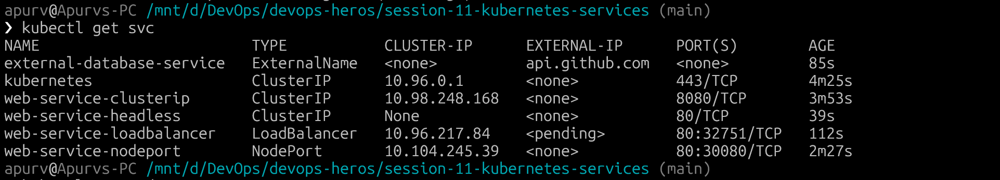
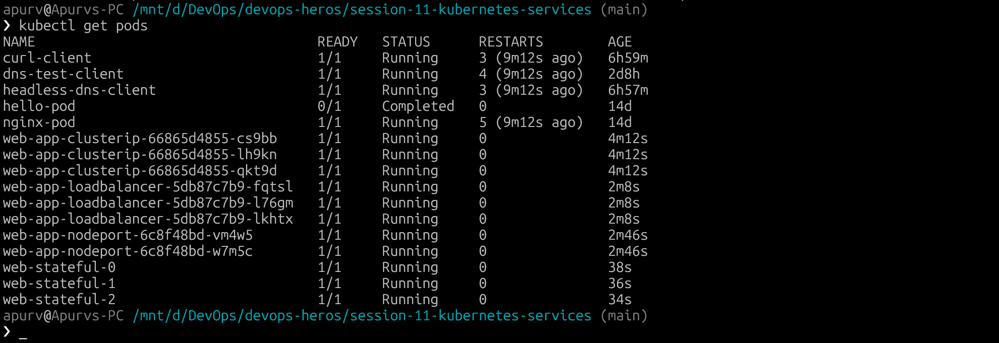
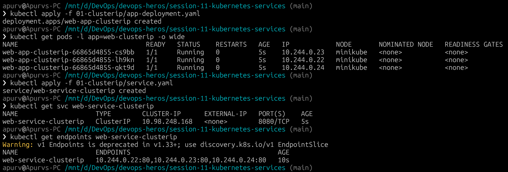
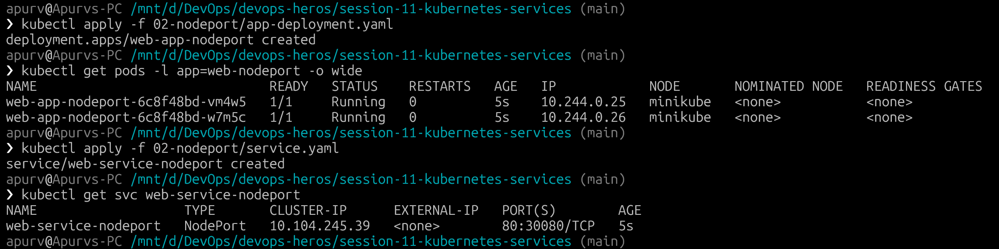
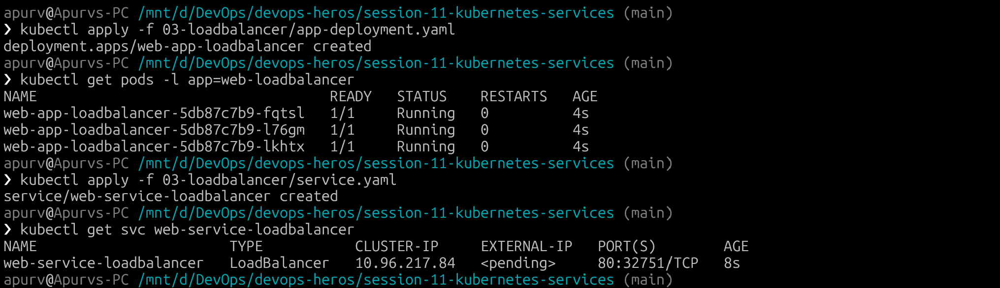
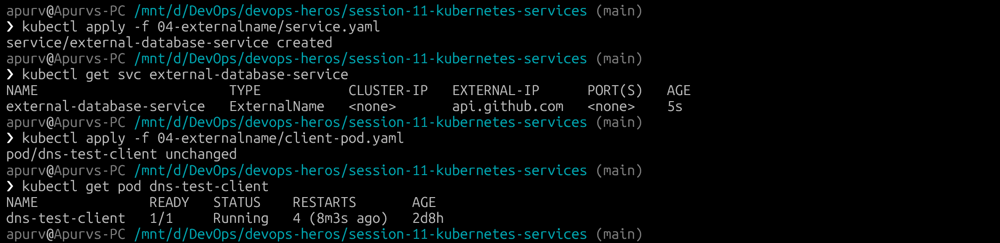
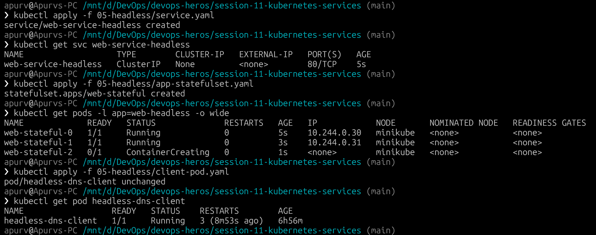

# Session 11: Kubernetes Services

## All Services and Pods

## 1. ClusterIP Service

ClusterIP is the default Kubernetes Service type. It provides a stable virtual IP and DNS name that can be reached from inside the cluster. Kubernetes routes requests to healthy Pods selected by the Service.

## 2. NodePort Service

NodePort exposes a Service on the same port on every worker node. 

## 3. LoadBalancer Service

LoadBalancer requests an external load balancer from the cloud provider. Kubernetes also creates the ClusterIP and NodePort routing layers underneath it.

## 4. ExternalName Service

ExternalName does not select Pods and does not receive a ClusterIP. CoreDNS returns a CNAME record that points the internal Service name to an external DNS name.

## 5. Headless Service 

A Headless Service sets clusterIP: None. It does not provide one virtual IP or load balance through kube-proxy. Instead, CoreDNS returns the IP addresses of all matching Pods.

