# Kubernetes Volumes — Complete Documentation

## 1. Volumes

By default, data written inside a container lives on the container's writable layer. This layer is:

- Ephemeral — it is destroyed when the container is removed.
- Coupled to the container— other containers in the same Pod cannot access it.

Kubernetes Volumes solve both problems by providing a directory that is:

- Accessible to all containers in a Pod.
- Capable of outliving individual containers (and, with persistent volumes, even the Pod itself).

```text
┌─────────────────────────────┐
│           Pod               │
│  ┌──────────┐  ┌──────────┐ │
│  │Container │  │Container │ │
│  │    A     │  │    B     │ │
│  └────┬─────┘  └────┬─────┘ │
│       │              │      │
│       └──────┬───────┘      │
│              ▼              │
│        [ Volume ]           │
│     (shared storage)        │
└─────────────────────────────┘
```

---

## 2. emptyDir

### What Is It?

`emptyDir` creates an empty directory on the node when the Pod is scheduled. It lives for the lifetime of the Pod (not the container).

### Key Characteristics

| Property | Value |
| :--- | :--- |
| Lifetime | Same as the Pod |
| Shared between containers? | Yes (within the same Pod) |
| Data survives container restart? | Yes |
| Data survives Pod deletion? | No |
| Backing medium | Node disk (default) or RAM (medium: Memory) |

### Use Cases

- Scratch space for sorting / computation.
- Sharing files between sidecar containers (e.g., log collector + app).
- Cache directory that can be lost without harm.

## 3. hostPath

### What Is It?

`hostPath` mounts a file or directory from the host node's filesystem directly into the Pod.

### Key Characteristics

| Property | Value |
| :--- | :--- |
| Lifetime | Persists on the node even after Pod deletion |
| Shared between Pods on same node? | Yes |
| Portable across nodes? | No |
| Production-ready? | Generally not recommended |

### hostPath Types

| Type | Behavior |
| :--- | :--- |
| `""` (empty) | No checks performed |
| `DirectoryOrCreate` | Creates directory if missing |
| `Directory` | Must already exist |
| `FileOrCreate` | Creates file if missing |
| `File` | Must already exist |
| `Socket` | Must be a UNIX socket |

### Use Cases

- Accessing Docker socket (`/var/run/docker.sock`).
- Node-level log access.
- Development/testing on single-node clusters (e.g., Minikube).

## 4. PersistentVolume (PV)

### What Is It?

A `PersistentVolume` is a cluster-level storage resource provisioned by an administrator (or dynamically by a StorageClass). It is independent of any individual Pod.

### Key Characteristics

| Property | Value |
| :--- | :--- |
| Scope | Cluster-wide (not namespaced) |
| Lifecycle | Independent of Pods |
| Created by | Admin (static) or StorageClass (dynamic) |

### Access Modes

| Mode | Short | Description |
| :--- | :--- | :--- |
| ReadWriteOnce | `RWO` | Mounted read-write by a **single node** |
| ReadOnlyMany | `ROX` | Mounted read-only by **many nodes** |
| ReadWriteMany | `RWX` | Mounted read-write by **many nodes** |
| ReadWriteOncePod | `RWOP` | Mounted read-write by a **single Pod** |

### Reclaim Policies

| Policy | Behavior |
| :--- | :--- |
| `Retain` | PV is kept after PVC deletion; data preserved for manual recovery |
| `Delete` | PV and underlying storage are deleted when PVC is released |
| `Recycle` | *(Deprecated)* Basic scrub (`rm -rf /thevolume/*`) |

### PV Lifecycle States

```text
Available ──► Bound ──► Released ──► (Retain / Delete)
                │
                └─ A PVC is bound to this PV
```

---

## 5. PersistentVolumeClaim (PVC)

### What Is It?

A `PersistentVolumeClaim` is a request for storage by a user. It is the Pod's way of asking for a PersistentVolume.

### Key Characteristics

| Property | Value |
| :--- | :--- |
| Scope | Namespaced |
| Binds to | A matching PV (by capacity, access mode, StorageClass) |
| Created by | Developer / application team |

### How Binding Works

```text
PVC created
    │
    ├── Looks for a PV that matches:
    │     • Access mode
    │     • Storage capacity (≥ requested)
    │     • StorageClass (if specified)
    │
    ├── Match found → STATUS = Bound
    │
    └── No match → STATUS = Pending
```
## 6. StorageClass

### What Is It?

A `StorageClass` defines a "class" of storage — essentially a template that tells Kubernetes *how* to provision volumes dynamically.

### Key Characteristics

| Property | Value |
| :--- | :--- |
| Scope | Cluster-wide (not namespaced) |
| Purpose | Automate PV creation |
| Key fields | `provisioner`, `reclaimPolicy`, `volumeBindingMode`, `parameters` |

### Volume Binding Modes

| Mode | Behavior |
| :--- | :--- |
| `Immediate` | PV provisioned as soon as PVC is created |
| `WaitForFirstConsumer` | PV provisioned only when a Pod using the PVC is scheduled |

### Checking Default StorageClass

```bash
kubectl get storageclass
```
### Cloud Provider StorageClasses

| Provider | Provisioner | Example StorageClass |
| :--- | :--- | :--- |
| AWS EBS | `ebs.csi.aws.com` | `gp3`, `io1` |
| GCP PD | `pd.csi.storage.gke.io` | `standard`, `ssd` |
| Azure Disk | `disk.csi.azure.com` | `managed-premium` |

## 7. Dynamic Provisioning

### What Is It?

Dynamic provisioning automatically creates a PersistentVolume when a PersistentVolumeClaim references a StorageClass. The admin no longer needs to pre-create PVs manually.

### How It Works

```text
Developer creates PVC
        │
        ├── PVC specifies storageClassName: "standard"
        │
        ▼
StorageClass "standard"
        │
        ├── provisioner: k8s.io/minikube-hostpath
        │
        ▼
Provisioner creates PV automatically
        │
        ▼
PVC binds to auto-created PV
        │
        ▼
Pod mounts the PVC
```

### Without Dynamic Provisioning (Manual)

```text
100 developers need storage
        │
        ▼
Admin creates 100 PVs manually  ← tedious & error-prone
        │
        ▼
100 PVCs bind to 100 PVs
```

### With Dynamic Provisioning

```text
100 developers need storage
        │
        ▼
100 PVCs reference StorageClass
        │
        ▼
100 PVs created automatically  ← zero admin intervention
```

## Practical Examples

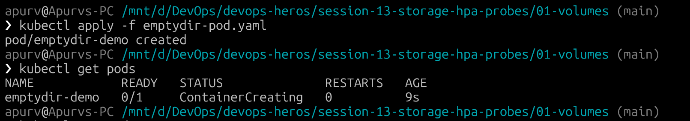

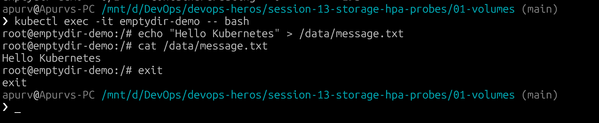

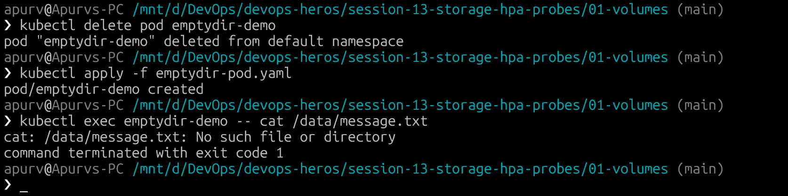

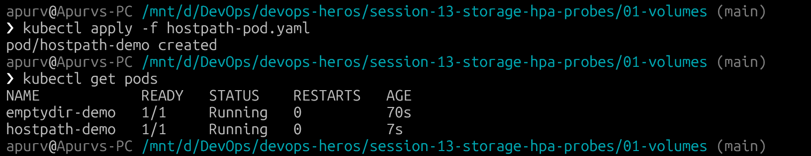


# HPA Hands-On — Deployment, Scaling & Load Testing

## Deploy the Application

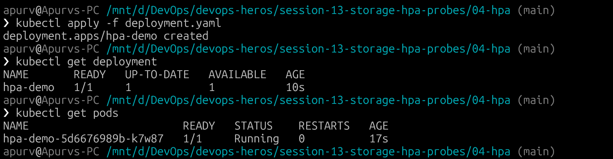

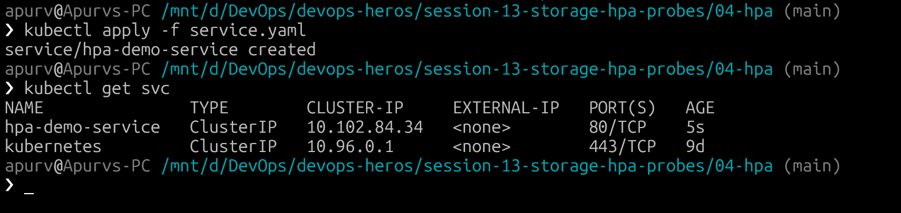

---

## Configure HPA

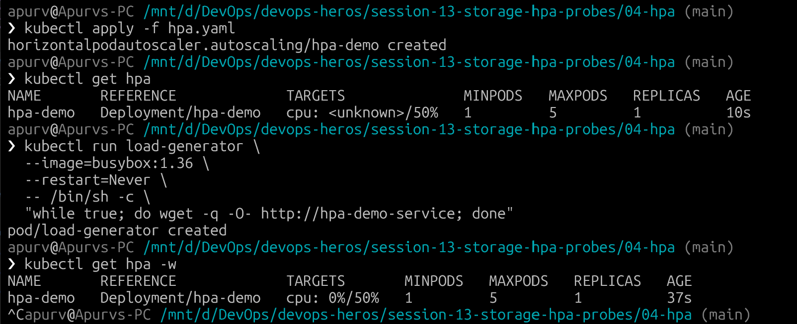

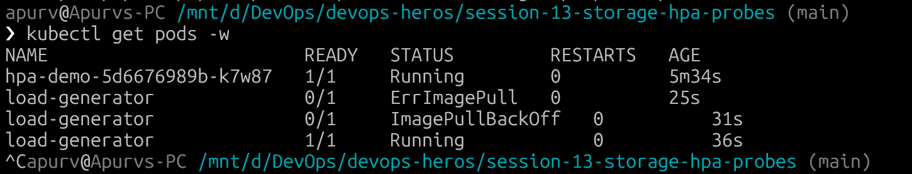

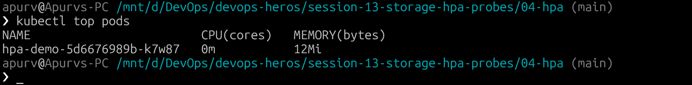

---

## Verify HPA

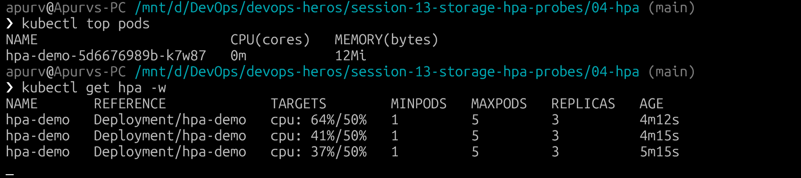

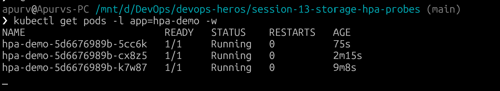

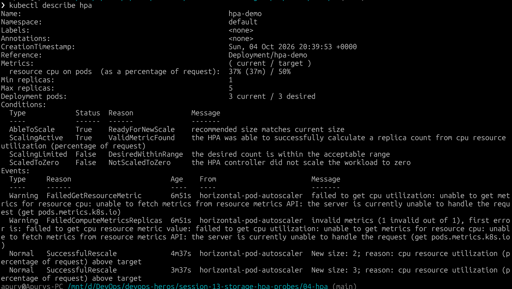

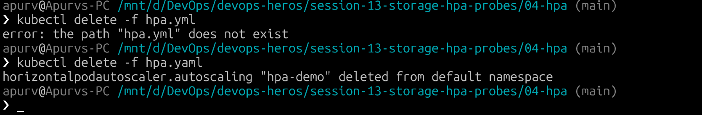


# Mini Project: Production-Ready Kubernetes Web App

## 1. Project Overview

This mini-project deploys a **production-grade web application** on Kubernetes combining three fundamental pillars of cloud-native infrastructure:

| Pillar | Implementation |
| :--- | :--- |
| **State Persistence** | PVC (`web-data`, 500Mi) ensuring data at `/data` survives Pod deletions |
| **Elastic Scaling** | HPA scaling between 2–5 replicas based on 50% CPU utilization |
| **Health Diagnostics** | Startup, Readiness, and Liveness probes for complete app health monitoring |

---

## 2. Architecture

```text
                           [ Service: web-service ]
                                      │ (Port 80)
                ┌─────────────────────┼─────────────────────┐
                │                     │                     │
                ▼                     ▼                     ▼
          [ Pod: web-app-1 ]    [ Pod: web-app-2 ]    [ Pod: web-app-N ]
          ├─ Startup Probe      ├─ Startup Probe      ├─ Startup Probe
          ├─ Readiness Probe    ├─ Readiness Probe    ├─ Readiness Probe
          ├─ Liveness Probe     ├─ Liveness Probe     ├─ Liveness Probe
          └─ CPU: 100m/200m     └─ CPU: 100m/200m     └─ CPU: 100m/200m
                │                     │                     │
                └─────────────────────┼─────────────────────┘
                                      │
                                      ▼
                        [ HPA: web-app-hpa (50% CPU) ]
                                      ▲
                                      │ pulls metrics
                              [ Metrics Server ]

      Pod ──► VolumeMount: /data ──► PVC: web-data (500Mi)
                                          │
                                    StorageClass: standard
                                          │
                                    Dynamic Provisioning
```

---

## 3. Project Structure

```text
03-mini-project/
├── namespace.yaml          # Dedicated namespace: production-webapp
├── pvc.yaml                # 500Mi ReadWriteOnce storage claim (dynamic provisioning)
├── deployment.yaml         # 2 replicas, all 3 probes, volume mounts, resource limits
├── service.yaml            # ClusterIP service exposing port 80
├── hpa.yaml                # Autoscaler (min: 2, max: 5, target: 50% CPU)
├── load-generator.yaml     # Load generator pod for stress testing
└── README.md               # This documentation
```

---

## 5. Step-by-Step Deployment

### Step 1: Create Namespace

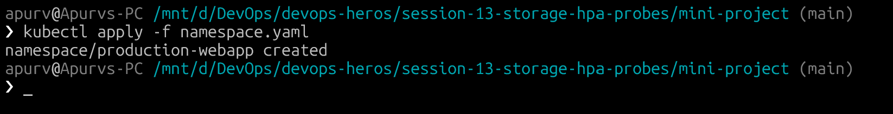

### Step 2: Create PersistentVolumeClaim

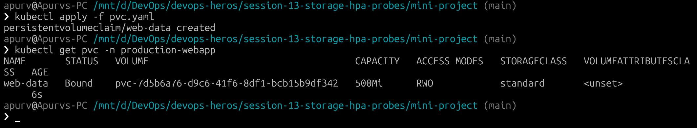

### Step 3: Deploy Application

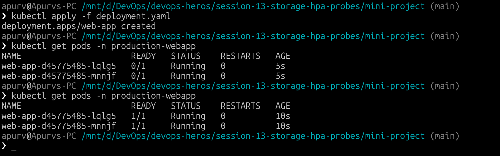

### Step 4: Create Service

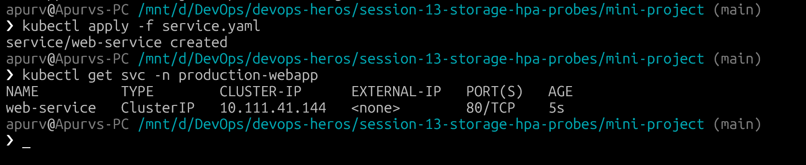

### Step 5: Deploy HPA

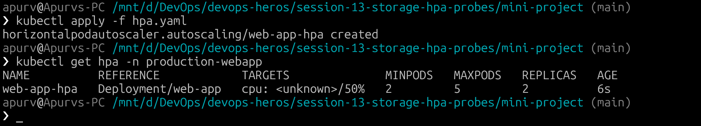
---

## 6. Verification Tasks

### Task 1: Verify Storage Persistence

**Write data to a Pod:**

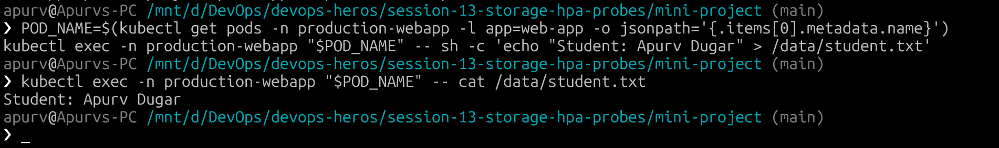

**Delete the Pod and verify data survives:**

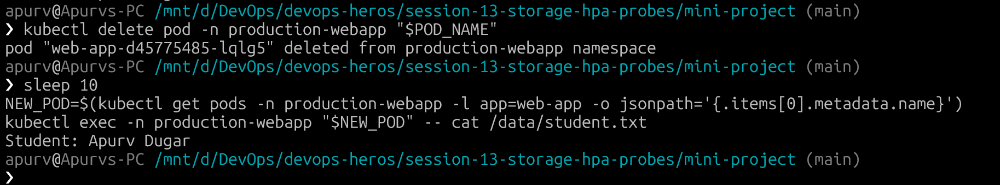

---

### Task 2: Verify Service Connectivity

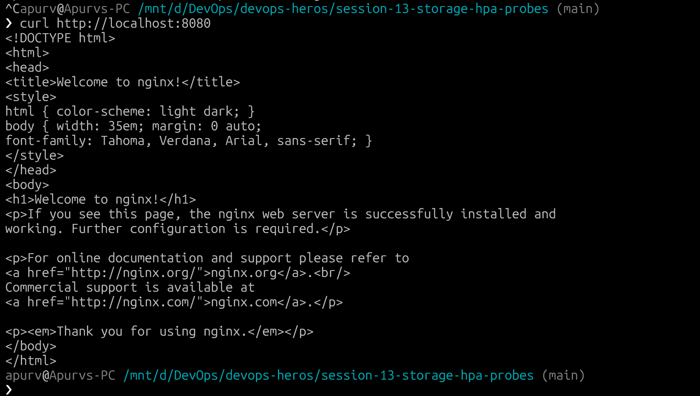

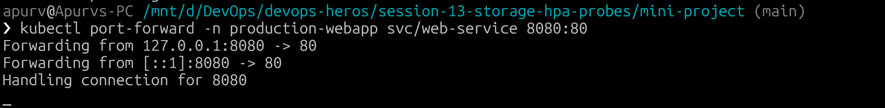

---

### Task 3: Verify Probes

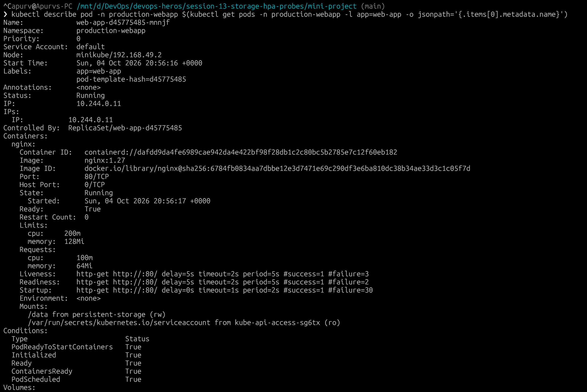
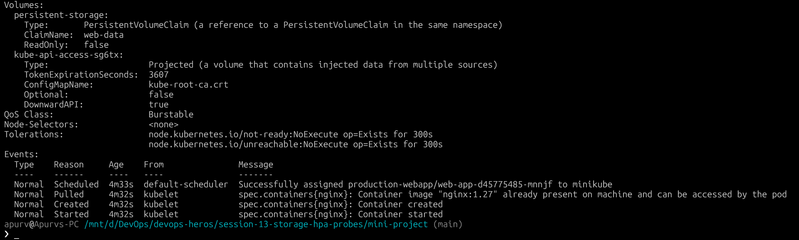

**Probe behavior summary:**

| Probe | Question | Failure Action |
| :--- | :--- | :--- |
| **Startup** | Has the app finished starting? | Restarts container (blocks other probes) |
| **Readiness** | Can the Pod receive user traffic? | Removes Pod from Service Endpoints (no restart) |
| **Liveness** | Is the container alive? | Restarts container |

---

### Task 4: Trigger HPA Elastic Scaling

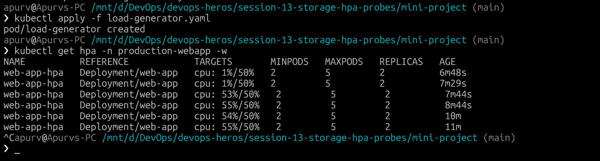

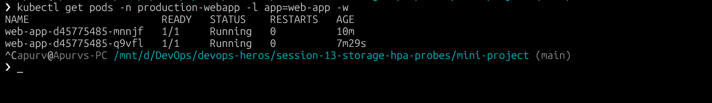

---

**Stop load and observe scale-down:**

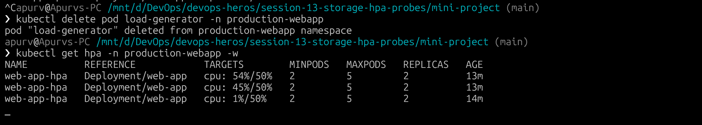

---

## 7. Useful Commands

```bash
# Namespace
kubectl get all -n production-webapp

# Storage
kubectl get pvc -n production-webapp
kubectl describe pvc web-data -n production-webapp

# Pods & Probes
kubectl get pods -n production-webapp
kubectl describe pod <pod-name> -n production-webapp
kubectl logs <pod-name> -n production-webapp

# HPA
kubectl get hpa -n production-webapp
kubectl describe hpa web-app-hpa -n production-webapp
kubectl top pods -n production-webapp

# Debugging
kubectl get events -n production-webapp --sort-by=.lastTimestamp
```

---

## Cleanup

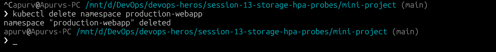

---

## 10. Key Learnings

```text
┌─────────────────────────────────────────────────────┐
│              Production-Ready K8s App               │
├─────────────────┬───────────────┬───────────────────┤
│   Persistence   │   Scaling     │   Health          │
├─────────────────┼───────────────┼───────────────────┤
│ PVC + SC        │ HPA           │ Startup Probe     │
│ Dynamic Prov.   │ CPU metrics   │ Readiness Probe   │
│ Data survives   │ Auto scale    │ Liveness Probe    │
│ Pod restarts    │ 2 → 5 replicas│ Self-healing      │
└─────────────────┴───────────────┴───────────────────┘
```

---
