# Kubernetes Troubleshooting Commands

When an application fails in Kubernetes, we don't guess. We follow the clues step by step using these core commands.

---

## Quick Toolkit Overview

```text
┌────────────────────────────────────────────────────────┐
│                   Troubleshooting Flow                 │
├─────────────────┬──────────────────────────────────────┤
│ Quick glance    │ kubectl get, kubectl get -o wide     │
│ Deep inspection │ kubectl describe                     │
│ Application log │ kubectl logs                         │
│ Inside the pod  │ kubectl exec                         │
│ Cluster history │ kubectl events / kubectl get events  │
│ API Reference   │ kubectl explain                      │
│ Resource usage  │ kubectl top                          │
└─────────────────┴──────────────────────────────────────┘
```

---

## Practical Implementation

1. **kubectl get** and **kubectl get -o wide :**

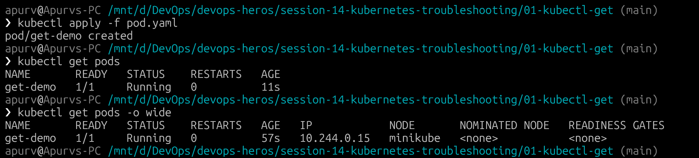

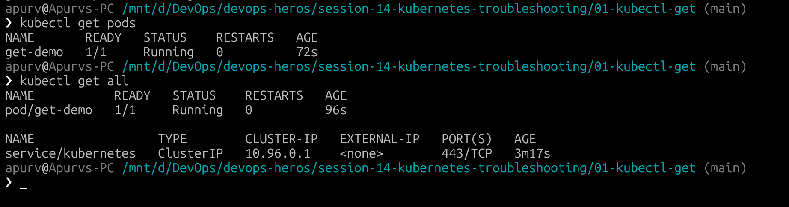

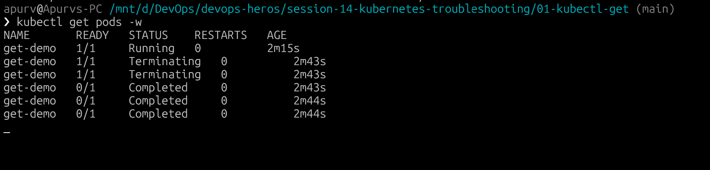
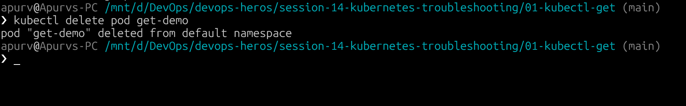

Useful Commands

```bash
kubectl get pods
kubectl get pods -o wide
kubectl get all
kubectl get nodes
kubectl get services
kubectl get deployments
kubectl get pods -w
```

---

2. **kubectl describe :**

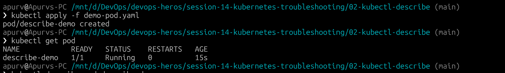

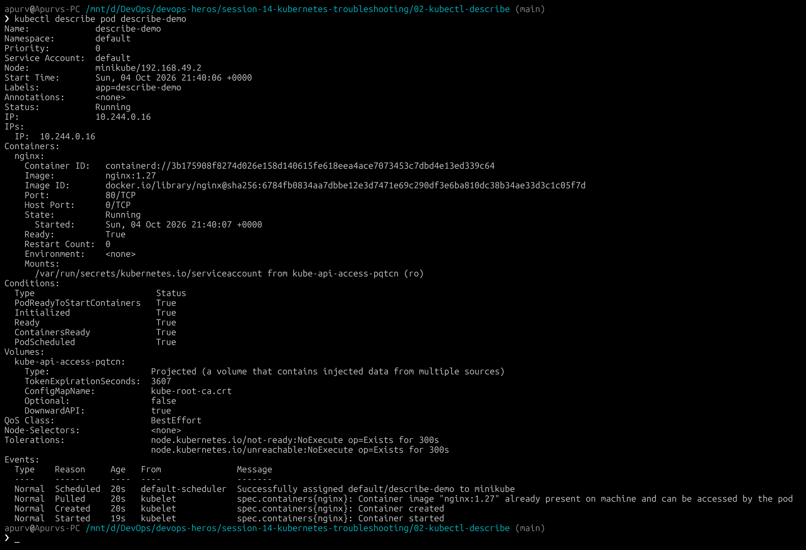

Describe Other Resources

**Deployment:**
```bash
kubectl describe deployment <deployment-name>
```

**Service:**
```bash
kubectl describe service <service-name>
```

**Node:**
```bash
kubectl describe node <node-name>
```

3. **kubectl logs :**

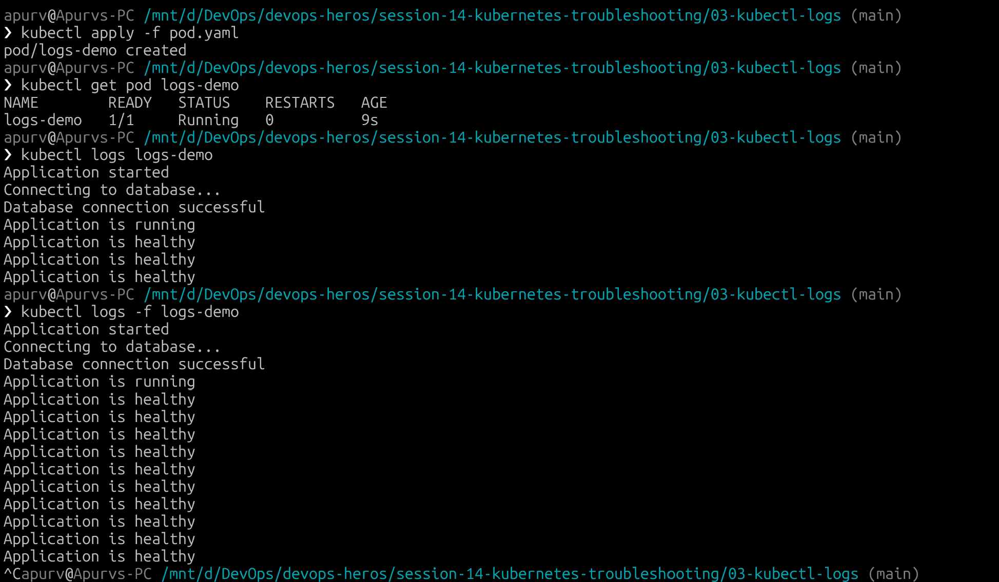

If a Pod has multiple containers:

```
kubectl logs <pod-name> -c <container-name>
```
Example:

```
kubectl logs my-pod -c backend
```

Useful Commands
```bash
kubectl logs logs-demo
kubectl logs -f logs-demo
kubectl logs logs-demo --previous
kubectl logs logs-demo -c app
```

4. **kubetcl exec :**

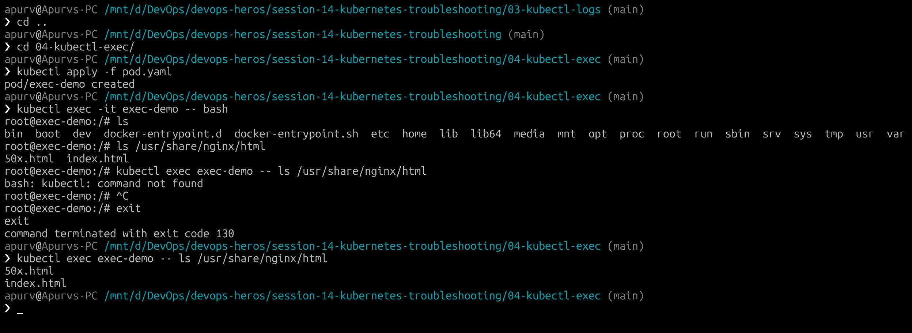

Useful Commands

```bash
kubectl exec -it exec-demo -- bash
kubectl exec exec-demo -- hostname
kubectl exec exec-demo -- ls
kubectl exec exec-demo -- cat /etc/hosts
```

---

5. **kubectl events :**

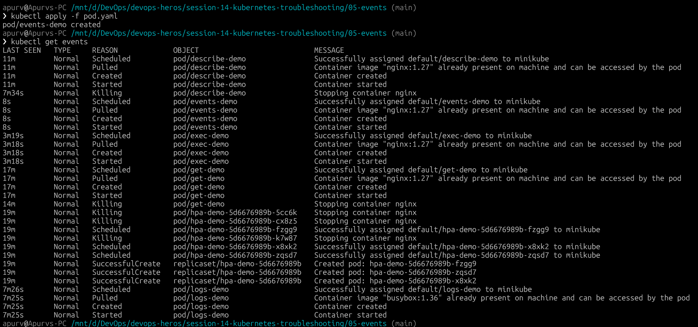

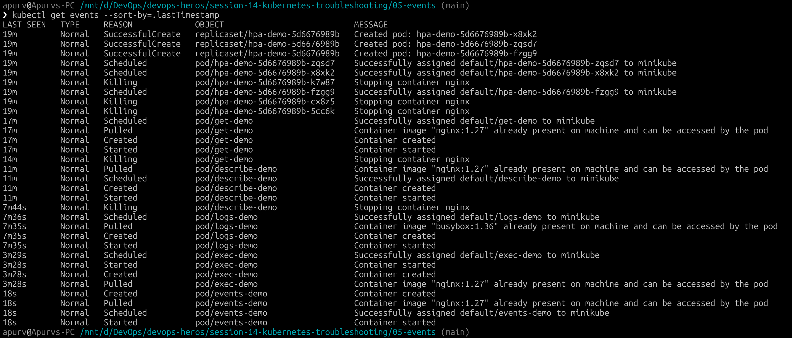

Useful Commands

```bash
kubectl get events
kubectl get events --sort-by=.lastTimestamp
kubectl events
kubectl events --watch
kubectl describe pod events-demo
```

---

## Quick Rule of Thumb

```text
STATUS wrong?     ──► kubectl describe pod <name>
App crashing?     ──► kubectl logs <name> --previous
Network issue?    ──► kubectl get endpoints <svc> & kubectl exec
High load/OOM?    ──► kubectl top pods
```

# Troubleshooting Common Issues

When things break in Kubernetes, the pod status tells you **what happened**, but the logs and events tell you **why**.

---

## The 5-Step Process

```text
1. Observe     ──► Check status with kubectl get pods
2. Investigate ──► Read events with kubectl describe pod
3. Check Logs  ──► Read application output with kubectl logs
4. Fix         ──► Update YAML or cluster configuration
5. Verify      ──► Confirm the pod reaches Running (1/1)
```

---

## 1. CrashLoopBackOff

### The Problem
The container starts up, runs into an error, exits, and Kubernetes keeps trying to restart it.


### Investigation


### Fix & Verification


## 2. ./screenshots/imagePullBackOff & Err./screenshots/imagePull

### The Problem
Kubernetes tries to download the container ./screenshots/image from the registry, but fails and backs off.


### Investigation


### Root Cause
- Typo in the ./screenshots/image name or tag.
- ./screenshots/image is in a private registry and Kubernetes doesn't have the `./screenshots/imagePullSecrets`.
- Docker Hub rate limit or registry is down.

### Fix & Verification
Fix the ./screenshots/image name/tag in the YAML:

```yaml
spec:
  containers:
    - name: app
      ./screenshots/image: nginx:1.27
```

Apply and verify:


---

## 3. Pending Pods

### The Problem
The pod is created, but the scheduler cannot find any node to run it on.


### Investigation


Check the **Events** section for scheduler warnings:
```text
Warning  FailedScheduling  0/1 nodes are available: 1 node(s) didn't match Pod's node selector.
```
Or:
```text
Warning  FailedScheduling  0/1 nodes are available: 1 Insufficient cpu, 1 Insufficient memory.
```

### Root Cause
- Pod requested more CPU or memory than the nodes have available.
- `nodeSelector` or `nodeAffinity` doesn't match any node in the cluster.
- Node is tainted and the pod doesn't have a matching toleration.
- The pod is waiting for a PersistentVolumeClaim to bind.

### Fix & Verification
Adjust the resource requests or remove the invalid node selector:

```yaml
resources:
  requests:
    cpu: 100m
    memory: 128Mi
```

Apply and verify:


---

## 4. ContainerCreating & Config Errors

### The Problem
Pod stays stuck in `ContainerCreating` or fails with `CreateContainerConfigError`.

### Investigation


### Root Cause
The pod references a ConfigMap, Secret, or PVC that does not exist in the same namespace.

### Fix & Verification
Create the missing resource first:
```bash
kubectl create configmap app-config --from-literal=ENV=prod
```
The pod will automatically detect it and transition to `Running`.

---

## 5. Service Connectivity & Missing Endpoints

### The Problem
The service is created and has a ClusterIP, but nobody can connect to it.

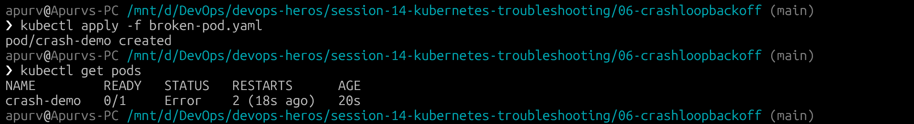

### Investigation
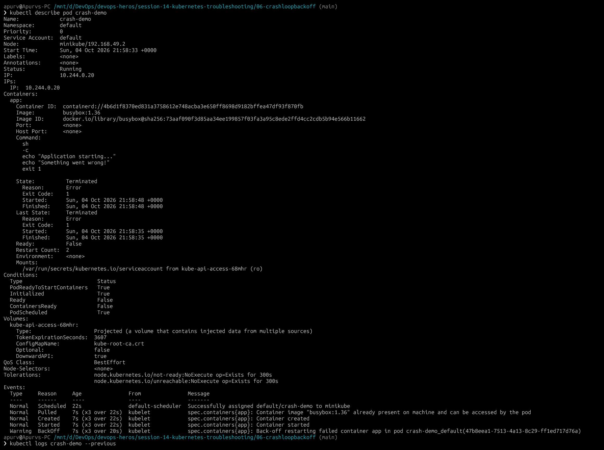

### Root Cause
The Service selector does not match the Pod labels. For example:
- Pod label: `app: web`
- Service selector: `app: frontend`

Because the labels don't match, the Service doesn't know which pods to route traffic to.

### Fix & Verification
Change the Service selector so it matches the Pod labels:

```yaml
spec:
  selector:
    app: web
```

---

## 6. DNS Issues

### The Problem
Pods cannot find services by name (e.g. `curl http://backend-service` fails with `Could not resolve host`).

### Investigation

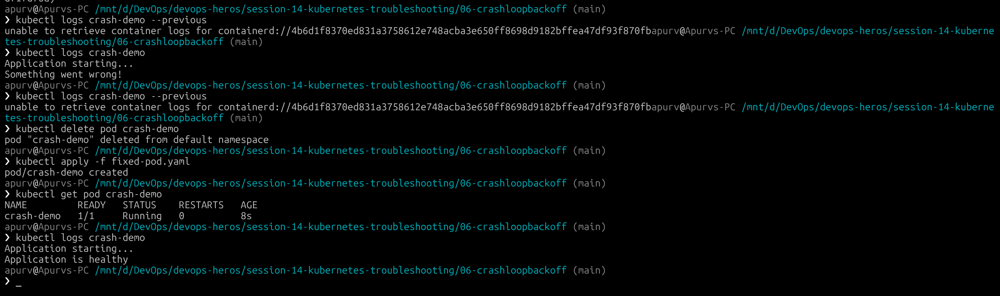

### Root Cause
- Calling a service in another namespace without using the full domain name (`<svc>.<namespace>.svc.cluster.local`).
- CoreDNS pods are down or crashing in `kube-system`.

### Fix & Verification
- Use FQDN for cross-namespace communication: `backend-service.prod.svc.cluster.local`.

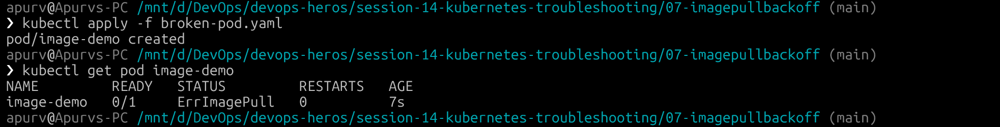
---

## 7. Pod Networking Issues

### The Problem
Pods cannot ping each other across nodes or connect to external networks.

### Investigation
```bash
# Check CNI pods
kubectl get pods -n kube-system

# Check pod IPs
kubectl get pods -o wide
```

### Root Cause
- CNI plugin (Flannel/Calico/Weave) crashed or failed to start.
- Node firewall is blocking inter-node traffic.

### Fix & Verification
Restart the CNI daemonset and ensure firewall ports are open.

---

## 8. Configuration & Probe Issues

### The Problem
The pod status is `Running`, but `READY` says `0/1`, and it randomly restarts every few minutes.

```text
NAME       READY   STATUS    RESTARTS
web-app    0/1     Running   3
```

### Investigation
```bash
kubectl describe pod web-app
```
Look at **Events**:
```text
Warning  Unhealthy  kubelet  Readiness probe failed: HTTP probe failed with statuscode: 404
Warning  Unhealthy  kubelet  Liveness probe failed: HTTP probe failed with statuscode: 404
```

### Root Cause
The probe is checking a path (like `/healthz`) that the application doesn't have, or checking the wrong port.
- **Readiness probe fails** ➔ Pod removed from Service endpoints (no traffic).
- **Liveness probe fails** ➔ Kubernetes kills and restarts the container.

### Fix & Verification
Update the probe path to a valid route (e.g., `/`):

```yaml
readinessProbe:
  httpGet:
    path: /
    port: 80
```

---

## Summary

| Symptom | Where to Look | Root Cause |
| :--- | :--- | :--- |
| **CrashLoopBackOff** | `kubectl logs --previous` | App crashed, missing env var or bad command |
| **./screenshots/imagePullBackOff** | `kubectl describe pod` (Events) | Wrong tag, typo, or missing private repo secret |
| **Pending** | `kubectl describe pod` (Events) | Not enough CPU/RAM, wrong node selector |
| **Endpoints `<none>`** | `kubectl describe svc` | Selector doesn't match pod labels |
| **READY 0/1** | `kubectl describe pod` (Events) | Readiness probe failing (wrong path or port) |
| **Exit Code 137** | `kubectl describe pod` (State) | OOMKilled (exceeded memory limit) |


# Kubernetes Troubleshooting Challenge

## 1. Project Overview

In this project, we have a simple Nginx application running in Kubernetes:
- **Deployment** (`troubleshooting-app`) with 2 replicas
- **Service** (`troubleshooting-service`) exposing port 80
- **A Broken Pod** (`project-broken-pod`) that fails to start
- **A Broken Service** challenge where traffic stops reaching the pods

Our job is to inspect the cluster, figure out what broke, fix the issues, and verify everything is working.

---

## 2. Architecture

```text
                    Kubernetes Cluster
                            │
                            ▼
                  ┌───────────────────┐
                  │      Service      │
                  └─────────┬─────────┘
                            │
                     Service Selector
                            │
              ┌─────────────┴─────────────┐
              │                           │
              ▼                           ▼
            Pod 1                       Pod 2
              │                           │
              └─────────────┬─────────────┘
                            │
                        Nginx App
```

---

## 3. Project Structure

```text
03-mini-project/
├── deployment.yaml    # 2 replicas of nginx
├── service.yaml       # ClusterIP service
├── broken-pod.yaml    # Pod with invalid image tag
└── README.md          # This documentation
```

---

## 4. Step-by-Step Deployment & Checks

### Step 1: Deploy the App & Service


### Step 2: Check Pods & Endpoints


### Step 3: Test HTTP Connectivity


---

## 5. Challenge 1: Troubleshoot the Broken Pod

We deployed `broken-pod.yaml`:


### Questions & Answers

**Question 1: What is the Pod status?**  
`ImagePullBackOff` (it started at `ErrImagePull`).

**Question 2: What is the actual error?**  
Failed to pull image `nginx:this-tag-does-not-exist`. The registry returned `NotFound`.

**Question 3: Which command helped you find the reason?**  
`kubectl describe pod project-broken-pod` (looking at the Events section).

**Question 4: What is wrong with the image?**  
The tag `this-tag-does-not-exist` does not exist on Docker Hub.

**Question 5: How would you fix it?**  
Change the image tag to a valid one, like `nginx:1.27`.

---

## 6. Challenge 2: Service Selector Problem

We intentionally changed the Service selector to `app: wrong-app`

### What Happened?
When checking the service endpoints:


### Finding the Root Cause
1. Check pod labels: `kubectl get pods --show-labels` (shows `app=troubleshooting-app`).
2. Check service selector: `kubectl describe svc troubleshooting-service` (shows `app=wrong-app`).
3. Because the selector doesn't match the pod labels, the service has zero endpoints and all user traffic fails.

### Fix & Verification

We fixed the selector back to `app: troubleshooting-app`:


---

## 7. Troubleshooting Summary Table

| Problem | What I Saw | Command I Used | Root Cause | Fix |
| :--- | :--- | :--- | :--- | :--- |
| **Broken Pod** | `ImagePullBackOff` | `kubectl describe pod project-broken-pod` | Image tag `nginx:this-tag-does-not-exist` does not exist | Updated image to `nginx:1.27` |
| **Service Problem** | `ENDPOINTS: <none>` | `kubectl get endpoints`, `kubectl describe svc` | Service selector `app=wrong-app` did not match pod label | Changed selector back to `app=troubleshooting-app` |
| **CrashLoopBackOff** | Pod restart loop | `kubectl logs --previous` | App crashed on startup | Fixed config / entrypoint command |

---

## 8. Review Questions

**1. What does `kubectl get` tell us?**  
It gives a quick high-level status of resources — whether pods are Running, Pending, or in Error, how many replicas are ready, and how many times they restarted.

**2. What is the difference between `get` and `describe`?**  
`get` gives a brief table overview. `describe` gives the full detailed breakdown: container state, resource limits, mount points, and all recent cluster events.

**3. Why do we use `kubectl logs`?**  
To see what the application itself is outputting (error messages, stack traces, missing config alerts).

**4. When would you use `kubectl exec`?**  
When you need to get inside a container to test things directly — like running `curl` on internal endpoints, checking DNS in `/etc/resolv.conf`, or seeing if a mounted file exists.

**5. What does `CrashLoopBackOff` mean?**  
The container starts up, crashes, and stops. Kubernetes tries restarting it repeatedly with an increasing waiting time (backoff).

**6. What does `ImagePullBackOff` mean?**  
Kubernetes tried downloading the container image, but couldn't find it (typo, non-existent tag, or missing private registry credentials).

**7. Why can a Pod remain `Pending`?**  
The scheduler couldn't find a node that fits the pod's requirements — usually due to not enough CPU/RAM, an unmatched `nodeSelector`, or waiting for a storage volume.

**8. Why can a Service have no endpoints?**  
The Service selector doesn't match the labels on any running pod, or the pods exist but are failing their readiness probes.

**9. What is the relationship between a Service selector and Pod labels?**  
The Service selector acts like a query. Any pod with matching labels automatically gets its IP added to the Service's Endpoints list.

**10. What is Kubernetes DNS?**  
An internal DNS service (CoreDNS) that lets pods find services using names (like `http://web-service`) instead of hardcoding IP addresses that change whenever pods restart.

---
