# Helm Commands Guide

Helm is the package manager for Kubernetes. Instead of managing individual, static YAML files, Helm lets us bundle our configurations into reusable charts, manage environment-specific values, and control releases with versioning, upgrades, and rollbacks.

---

## Command Quick Reference

```text
┌────────────────────────────────────────────────────────┐
│                   Helm CLI Workflow                    │
├─────────────────┬──────────────────────────────────────┤
│ Chart creation  │ helm create                          │
│ Repository mgmt │ helm repo add / list / update        │
│ Discovery       │ helm search repo / hub               │
│ Deployment      │ helm install / upgrade               │
│ Inspection      │ helm list / status / get             │
│ Version control │ helm history / rollback              │
│ Cleanup         │ helm uninstall                       │
└─────────────────┴──────────────────────────────────────┘
```

---


## 1. Creating & Managing Repositories

### `helm repo`
Manage repositories containing public or private packaged Helm charts.

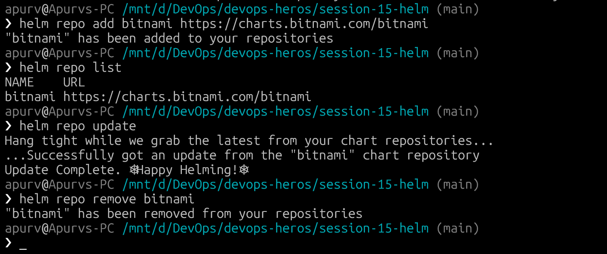

---

### `helm search`
Search for packages inside configured repositories or on the Artifact Hub.

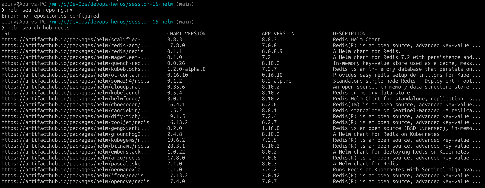

---

## 2. Chart Creation

### `helm create`
Scaffolds a new directory with the default Helm chart structure.

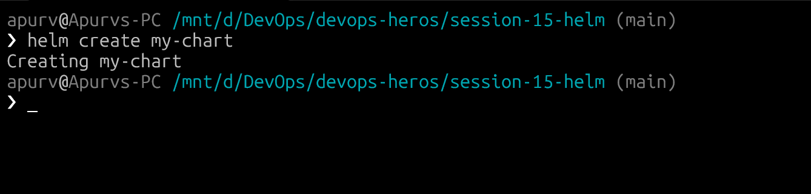

---

## 3. Installing & Inspecting Releases

### `helm install`
Deploys a Helm chart onto the Kubernetes cluster as a new release.

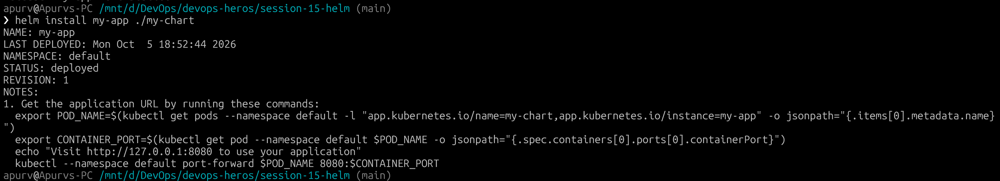

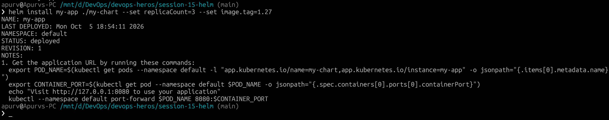

---

### `helm list`
Lists all deployed releases in the current namespace.

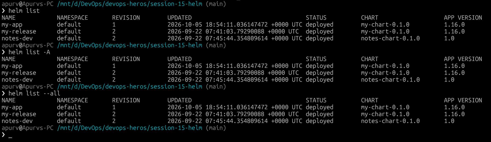
---

### `helm status`
Shows the current status, last deployment time, namespace, and rendered notes of a release.

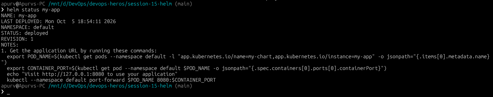
---

### `helm get`
Fetches extended information about an installed release directly from the cluster state secrets.

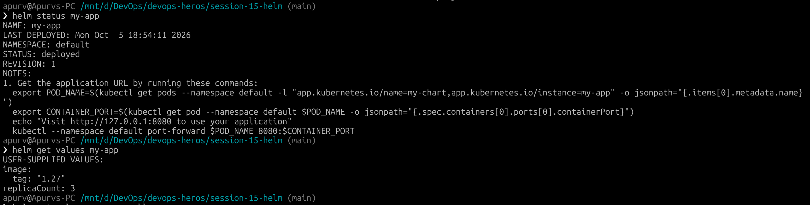
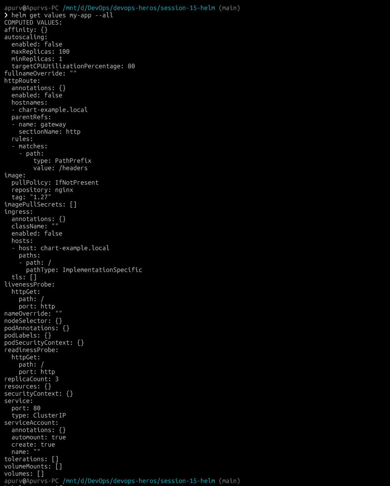
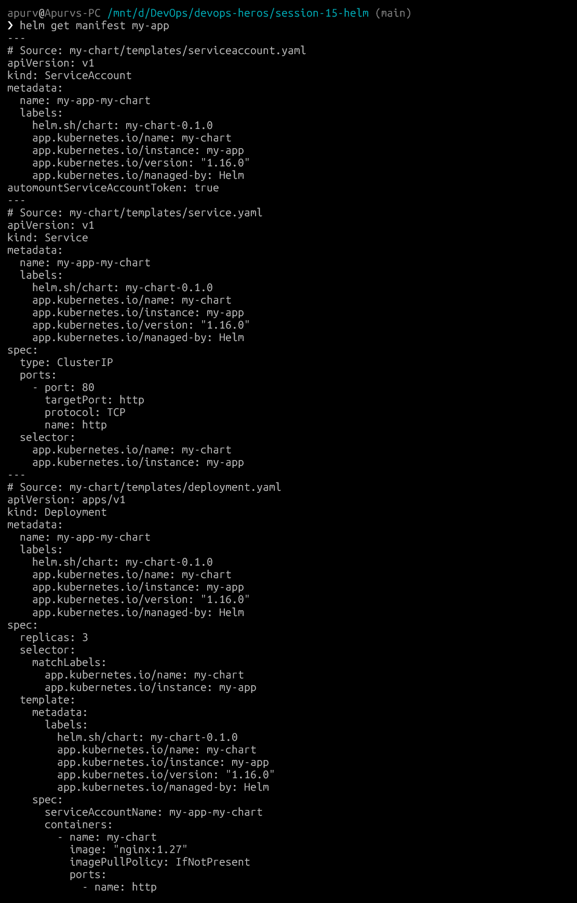
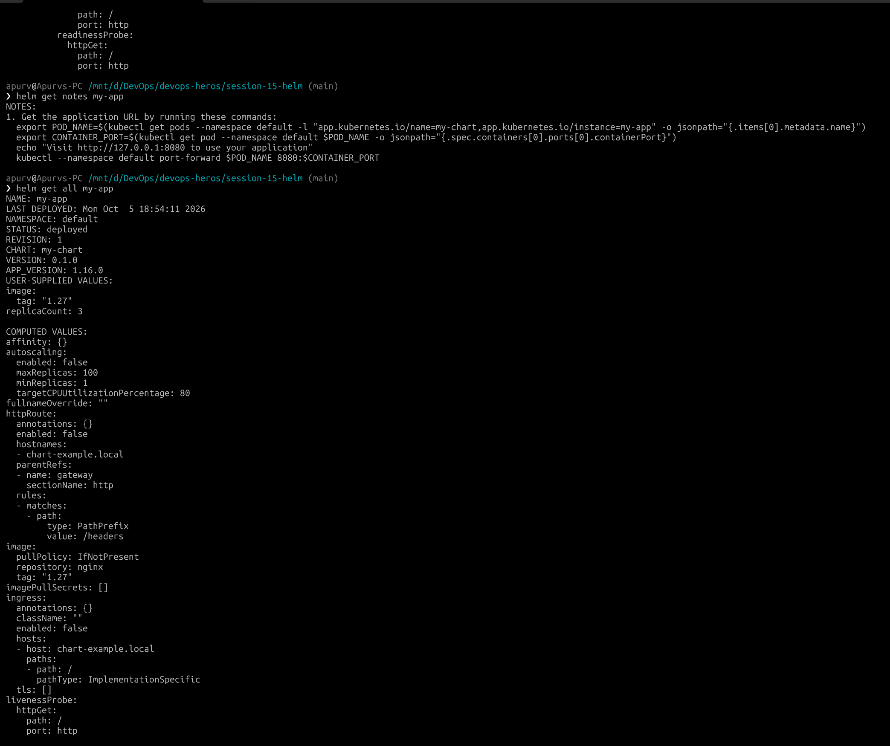

---

## 4. Upgrading, History & Rollback

### `helm upgrade`
Applies changes to an existing release, incrementing the revision number.

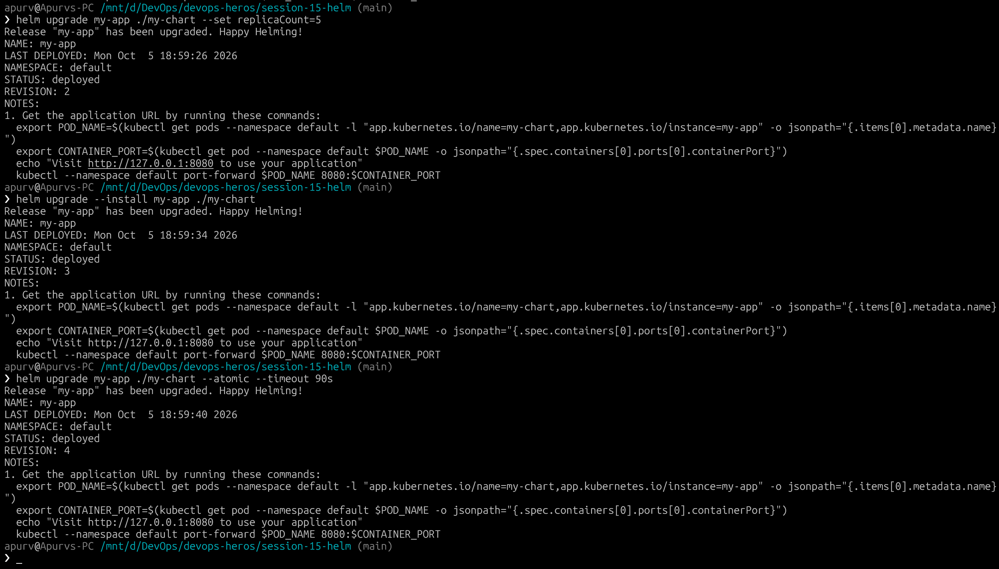

---

### `helm history`
Displays the chronological revision history of a release.

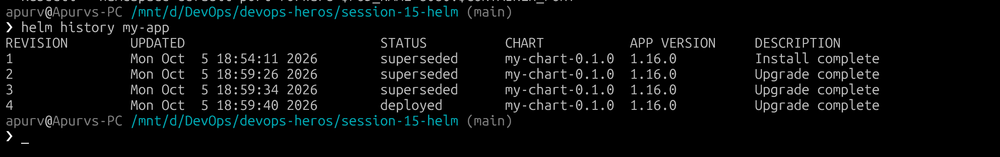   

---

### `helm rollback`
Reverts the release to a specific previous revision in seconds.

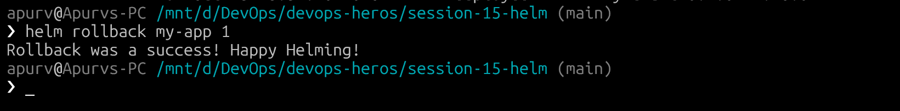

---

## 5. Deletion & Cleanup

### `helm uninstall`
Deletes the release and purges all associated Kubernetes resources (Deployments, Services, ConfigMaps, Secrets).

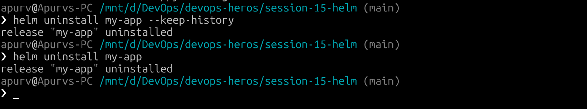

---

# Helm Rollback Workflow

Helm tracks every install and upgrade as a numbered **revision** stored in Kubernetes Secrets. If a new deployment fails or introduces regressions, `helm rollback` lets us restore the previous working state with a single command.

---

## Complete Rollback Workflow

```text
       ┌──────────────┐
       │   INSTALL    │  helm install rollback-demo ./my-chart (Revision 1)
       └──────┬───────┘
              ▼
       ┌──────────────┐
       │   UPGRADE    │  helm upgrade rollback-demo --set replicaCount=3 (Revision 2)
       └──────┬───────┘
              ▼
       ┌──────────────┐
       │    VERIFY    │  kubectl get pods (Verify 3 healthy replicas)
       └──────┬───────┘
              ▼
       ┌──────────────┐
       │UPGRADE AGAIN │  helm upgrade rollback-demo --set image.tag=broken-tag (Revision 3)
       └──────┬───────┘
              ▼
       ┌──────────────┐
       │    VERIFY    │  kubectl get pods (Pods fail: ImagePullBackOff)
       └──────┬───────┘
              ▼
       ┌──────────────┐
       │   ROLLBACK   │  helm rollback rollback-demo 2 (Creates Revision 4)
       └──────┬───────┘
              ▼
       ┌──────────────┐
       │    VERIFY    │  kubectl get pods (Pods return to healthy Running state)
       └──────────────┘
```

---

## Step-by-Step Implementation

### Step 1: Install the Initial Release (Revision 1)

Install a baseline release running 1 replica of `nginx:1.24`:

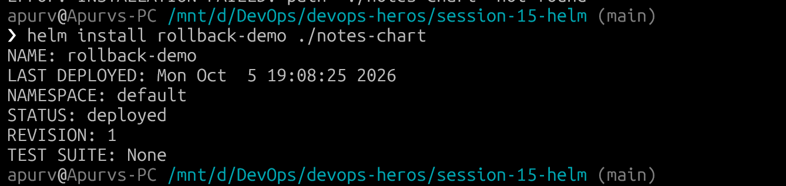
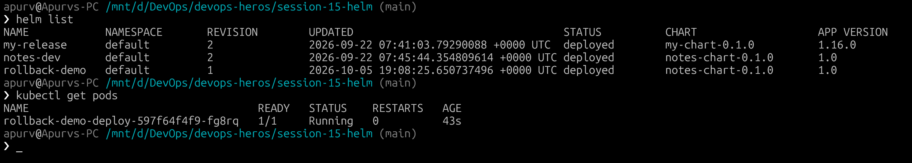

---

### Step 2: First Upgrade — Scale Workload (Revision 2)

Scale the application to 3 replicas with `nginx:1.25`:

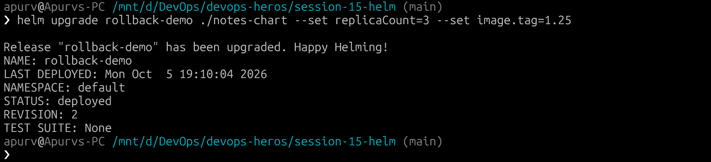

---

### Step 3: Verify Revision 2

Check that the upgrade succeeded and 3 pods are running:

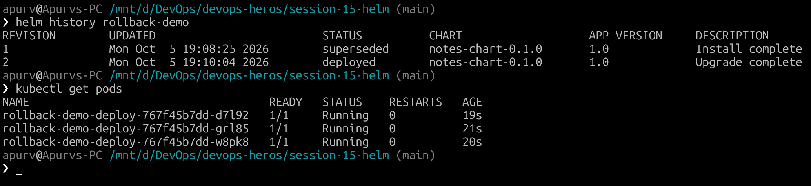

---

### Step 4: Second Upgrade — Simulate a Broken Release (Revision 3)

Introduce a failure by specifying a nonexistent container image tag:

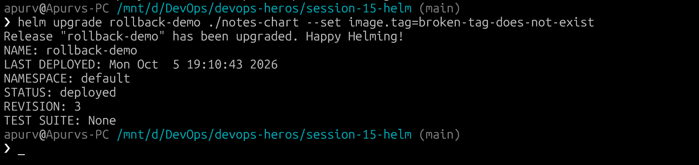

---

### Step 5: Verify the Failure

Inspect the pods to see the deployment failing:

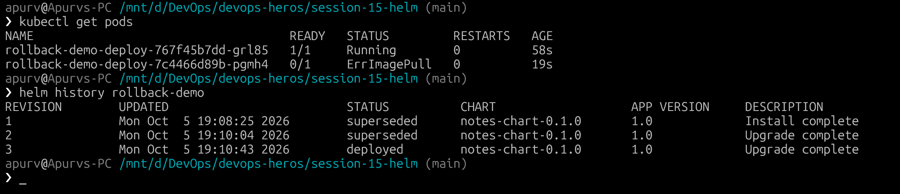

Revision 3 shows `deployed` from Helm's perspective, but Kubernetes cannot run the pods.

---

### Step 6: Rollback to Healthy Revision (Revision 2)

Revert the release back to the healthy state of Revision 2:

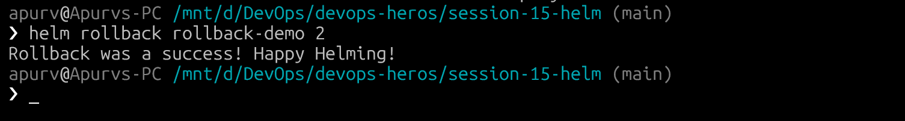

---

### Step 7: Verify Post-Rollback State

1. Verify pods are running healthy again: All 3 pods return to `Running` (1/1).

2. Check release history:

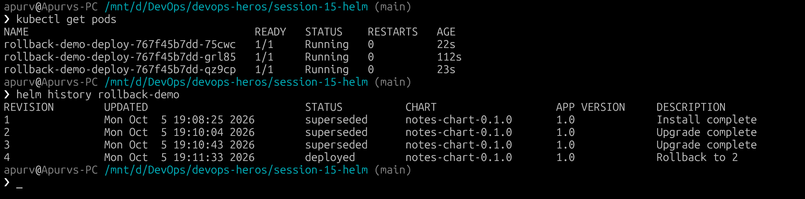

---

# Mini Project: Notes App Packaging & Deployment with Helm

In this mini project, we package a multi-environment web application using Helm. We create templates for Deployment, Service, and ConfigMap, parameterize them with `values.yaml` and `values-prod.yaml`, perform linting and template rendering, test installation, upgrade to production, simulate a failure, and perform a rollback.

---

## 1. What We Are Building

```text
notes-chart/
├── Chart.yaml              # Chart metadata (v0.1.0, appVersion 1.0)
├── values.yaml             # Dev defaults (1 replica, nginx:1.24)
├── values-prod.yaml        # Prod overrides (3 replicas, nginx:1.25)
└── templates/
    ├── configmap.yaml      # Dynamic environment variables
    ├── deployment.yaml     # Parameterized app deployment
    └── service.yaml        # NodePort service exposing port 80
```

---

## 2. Chart Architecture

```text
                          [ Client / Browser ]
                                   │
                                   ▼
                      [ NodePort Service: 30090 ]
                                   │
                    ┌──────────────┴──────────────┐
                    ▼                             ▼
          [ Pod: notes-deploy-1 ]       [ Pod: notes-deploy-2 ]
          ├─ Image: nginx:1.24          ├─ Image: nginx:1.24
          └─ Env: from ConfigMap        └─ Env: from ConfigMap
                    │                             │
                    └──────────────┬──────────────┘
                                   ▼
                     [ ConfigMap: notes-config ]
                     • APP_NAME: "notes-app"
                     • ENVIRONMENT: "development" / "production"
```

---

## 3. Step-by-Step Implementation

### Step 1: Create Chart Files & Structure

Create the chart directory layout:

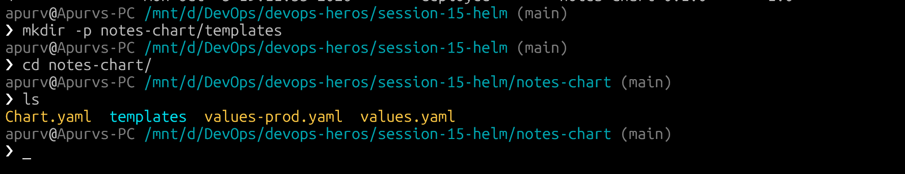

- **`Chart.yaml`**: Defines chart metadata
- **`values.yaml`**: Development environment defaults (1 replica, `nginx:1.24`)
- **`values-prod.yaml`**: Production configuration (3 replicas, `nginx:1.25`)

---

### Step 2: Define Templates

1. **`templates/configmap.yaml`**: Supplies `APP_NAME` and `ENVIRONMENT` using Helm variables.
2. **`templates/deployment.yaml`**: Manages replicas, container image, ports, and mounts the ConfigMap.
3. **`templates/service.yaml`**: Exposes the deployment as a NodePort service on port 80.

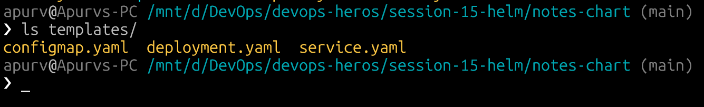

---

### Step 3: Lint & Validate Chart

Run Helm linter to catch syntax and indentation errors:

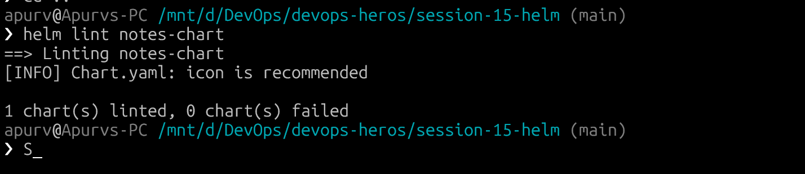
---

### Step 4: Render Templates Locally

Simulate template generation without talking to the Kubernetes cluster:

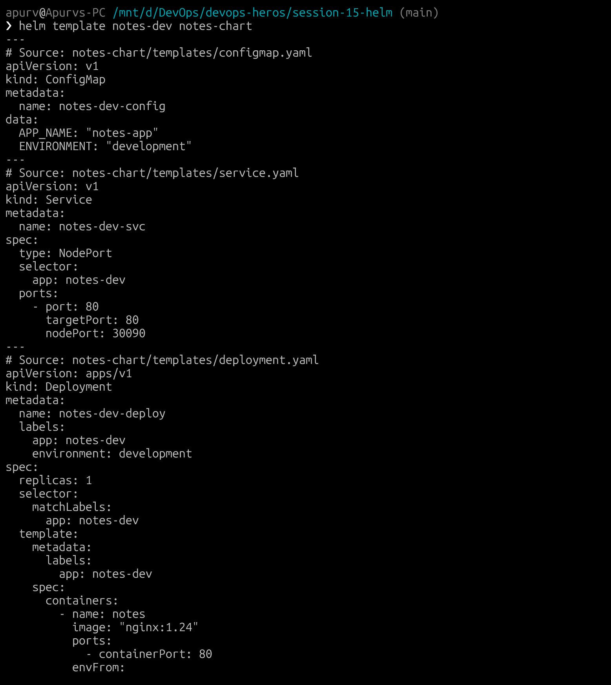

Verify that all `{{ .Values }}` expressions render clean Kubernetes YAML.

---

### Step 5: Install Development Release

Install the chart for development:

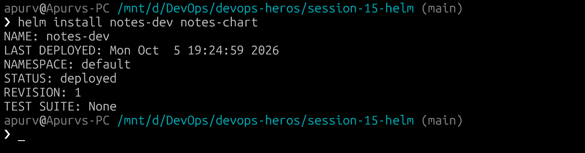

**Verify resources:**

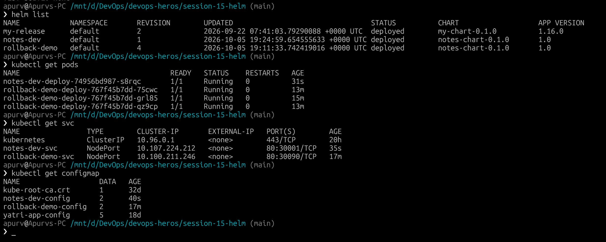

---

### Step 6: Upgrade to Production Values

Deploy production values with 3 replicas:

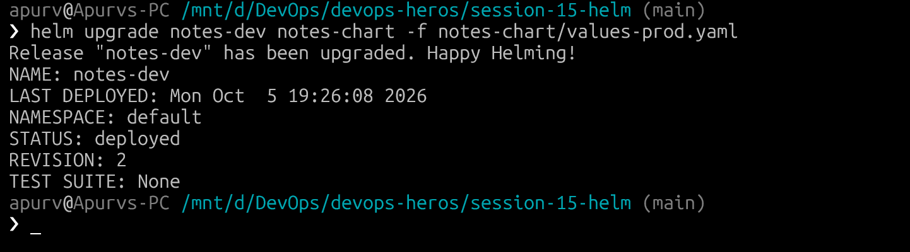

**Verify:**

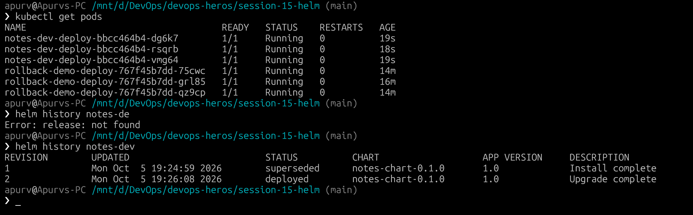

---

### Step 7: Simulate Failure & Rollback

Simulate an engineer deploying a broken image tag:

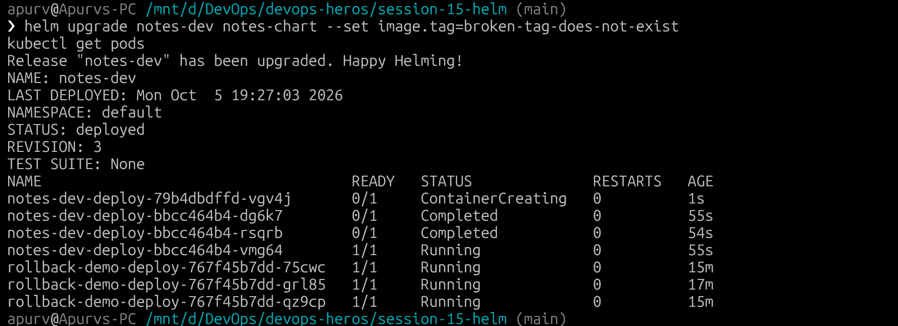

**Execute Rollback:**
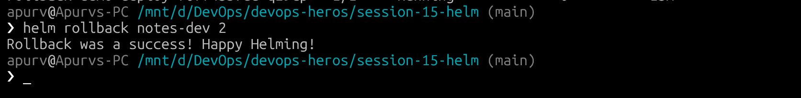

**Verify:**
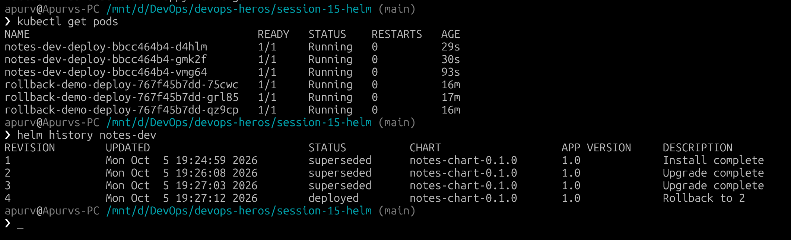

Pods immediately return to healthy `Running` state under Revision 4.

---

### Step 8: Clean Up

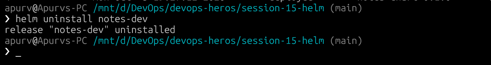
---
