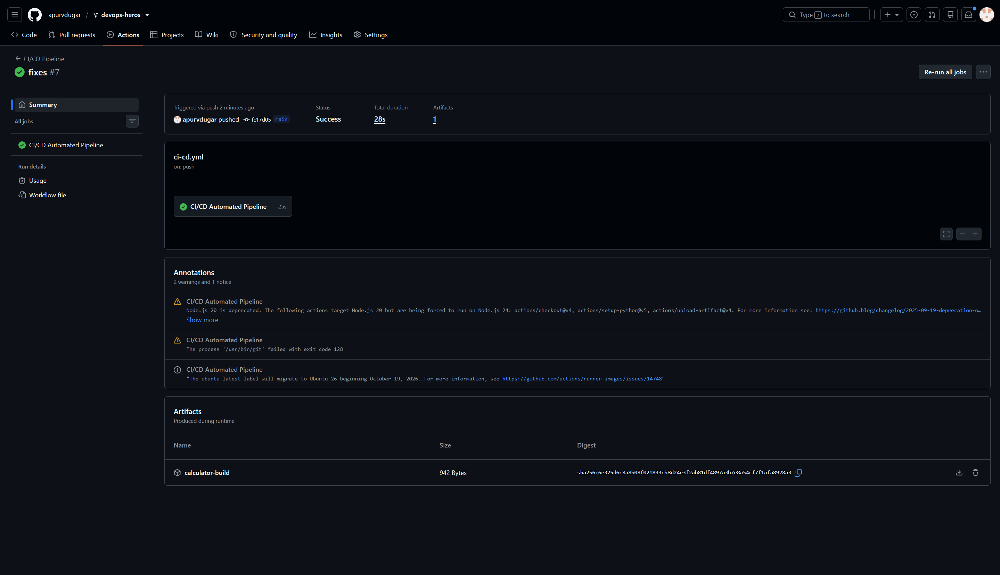
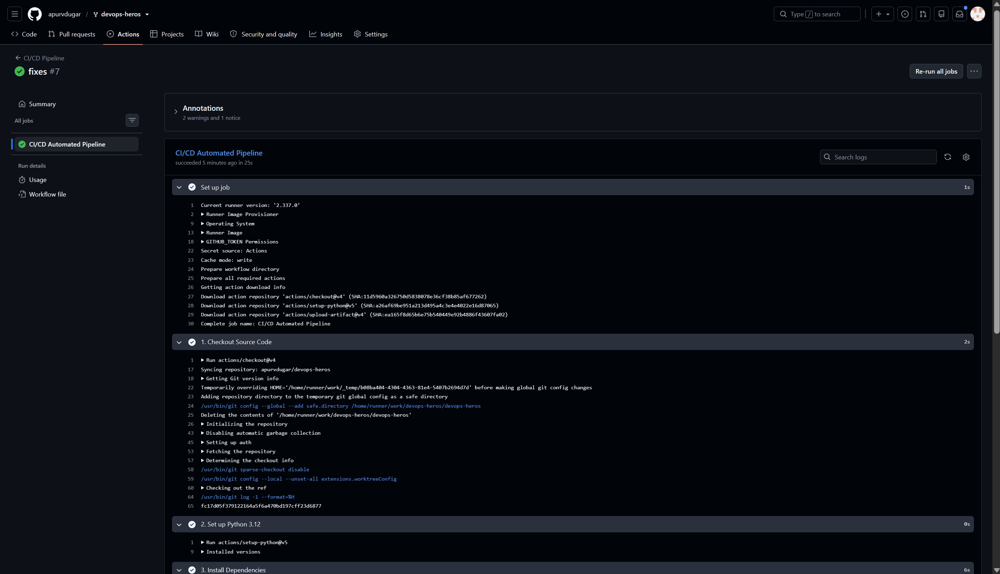

# CI/CD Demo Project with GitHub Actions

This project demonstrates a complete, automated **CI/CD pipeline** built using **GitHub Actions**. It tests, security-audits, packages, containerizes, and deploys a Python application using automated workflows.

---

## 1. Core Concepts: CI vs CD

```text
┌────────────────────────────────────────────────────────────────────────┐
│                        CI/CD Pipeline Flow                             │
├───────────────────────────────────┬────────────────────────────────────┤
│ Continuous Integration (CI)       │ Continuous Delivery / Deploy (CD)  │
├───────────────────────────────────┼────────────────────────────────────┤
│ • Automated linting & unit tests  │ • Container packaging (Docker)     │
│ • Security scanning (secrets leak)│ • Smoke testing container image    │
│ • Application build & packaging   │ • Release deployment to targets    │
│ • Uploading build artifacts       │ • Automated rollout to production  │
└───────────────────────────────────┴────────────────────────────────────┘
```

- **Continuous Integration (CI):** Developers commit and merge code frequently to a shared repository. Every push triggers automated builds, unit test suites, and code quality checks to detect integration issues immediately.
- **Continuous Delivery / Deployment (CD):** Once CI checks pass, the deployment phase automatically packages the validated code into deployable container artifacts and delivers them to staging or production environments.

---

## 2. GitHub Actions Building Blocks

```text
Repository Event (push / PR)
        │
        ▼
   [ Workflow ]  (.github/workflows/ci-cd.yml)
        │
        ├── [ Job 1: test ]             (runs on ubuntu-latest)
        │     └── Steps: Checkout ➔ Setup Python ➔ Install ➔ pytest
        │
        ├── [ Job 2: security-check ]   (runs on ubuntu-latest)
        │     └── Steps: Checkout ➔ Audit for leaked secrets / .env
        │
        ├── [ Job 3: build ]            (needs: [test, security-check])
        │     └── Steps: Checkout ➔ Build script ➔ Upload Artifact
        │
        └── [ Job 4: deploy ]           (needs: build, branch == main)
              └── Steps: Checkout ➔ Docker Build ➔ Smoke Test ➔ Deploy
```

- **Workflow:** Automated process configured in a YAML file in `.github/workflows/`.
- **Event:** A specific activity that triggers the workflow (e.g., `push`, `pull_request`, or manual `workflow_dispatch`).
- **Job:** A set of sequential steps that execute on the same runner. Jobs run in parallel by default, or sequentially using `needs:`.
- **Step:** An individual task within a job (executes a shell command or an action).
- **Action:** A reusable standalone unit of code (e.g., `actions/checkout@v4`, `actions/upload-artifact@v4`).
- **Runner:** A virtual machine hosted by GitHub (`ubuntu-latest`) or self-hosted that executes the job.
- **Secrets:** Encrypted environment variables securely injected at runtime (`${{ secrets.DEPLOY_TOKEN }}`).
- **Artifacts:** Persistent files generated during a build (like compiled binaries or zip files) that outlive the runner.

---

## 3. Project Architecture & Directory Layout

```text
assignments/session-16/
├── .github/
│   └── workflows/
│       └── ci-cd.yml         # GitHub Actions pipeline definition
├── app/
│   ├── __init__.py
│   └── calculator.py         # Application source code
├── tests/
│   └── test_calculator.py    # Pytest unit tests
├── Dockerfile                # Production multi-stage container file
├── build.sh                  # Application packaging script
├── requirements.txt          # Python dependencies
├── .gitignore                # Cache and secret filters
└── README.md                 # Project documentation
```

---

## 4. Pipeline Walkthrough

### Stage 1: Automated Testing (`test` job)
Runs automatically on every commit:
- Spins up an `ubuntu-latest` runner.
- Sets up Python 3.12 with dependency caching.
- Installs dependencies from `requirements.txt`.
- Runs the test suite via `pytest -v`.

---

### Stage 2: Security & Secrets Check (`security-check` job)
Audits the repository for common security oversights:
- Scans for inadvertently committed `.env`, `*.pem`, or private `.key` files.
- Fails the pipeline if sensitive files are discovered.

---

### Stage 3: Build & Package Artifacts (`build` job)
Executes **only after** both `test` and `security-check` pass successfully:
- Executes `build.sh` to package the application.
- Uses `actions/upload-artifact@v4` to store `calculator-build` for 7 days.

---

### Stage 4: Containerization & Deployment (`deploy` job)
Runs **only on the `main` branch** after the build completes:
- Sets up Docker Buildx.
- Builds a lightweight container image using the multi-stage `Dockerfile`.
- Executes a container smoke test to verify execution integrity.
- Simulates automated deployment using environment secrets (`${{ secrets.DEPLOY_TOKEN }}`).

---

## 5. Practical Implementation Outputs

1. **GitHub Actions Workflow Trigger & Jobs Graph:**





---

2. **Test & Security Check Execution:**


---

3. **Build & Artifact Upload:**


---

4. **Docker Container Build & Deployment:**


---

5. **Failure Scenario (Intentional Bug Stoppage):**

When a test is broken, the `test` job fails, stopping `build` and `deploy` from ever running:


---

6. **Fix & Green Pipeline Verification:**


---
