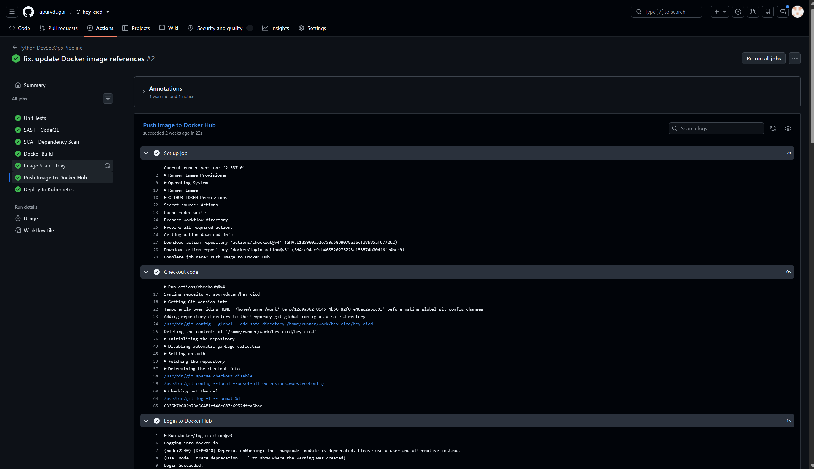
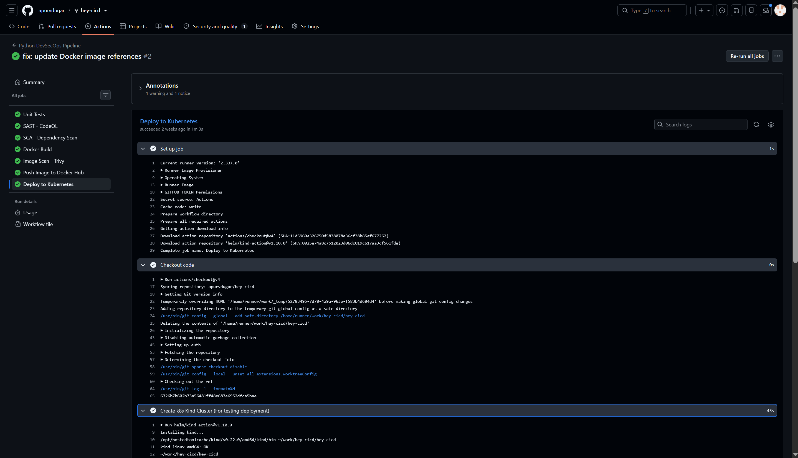

# Session 17: DevSecOps Demo Project

In modern software delivery, security is integrated directly into the CI/CD pipeline ("shifting security left"). This guarantees that every commit is built, tested, scanned for code vulnerabilities, checked for insecure dependencies, audited for leaked secrets, containerized, and scanned for CVEs before being allowed through automated Security Gates to Docker Hub and Kubernetes.

---

## Practical Implementation

### 1. GitHub Actions Workflow Trigger & Jobs Graph

---

### 2. Unit Testing & SAST (CodeQL) Execution

---

### 3. SCA (pip-audit) & Secret Scanning Execution

---

### 4. Docker Build & Trivy Image Security Scan

---

### 5. Docker Hub Push & Kubernetes Rollout Verification

---
