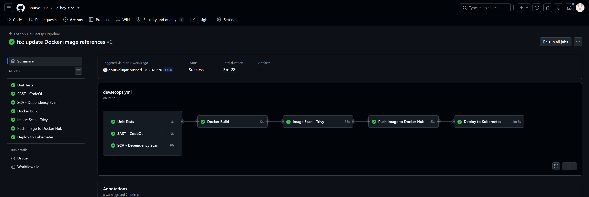
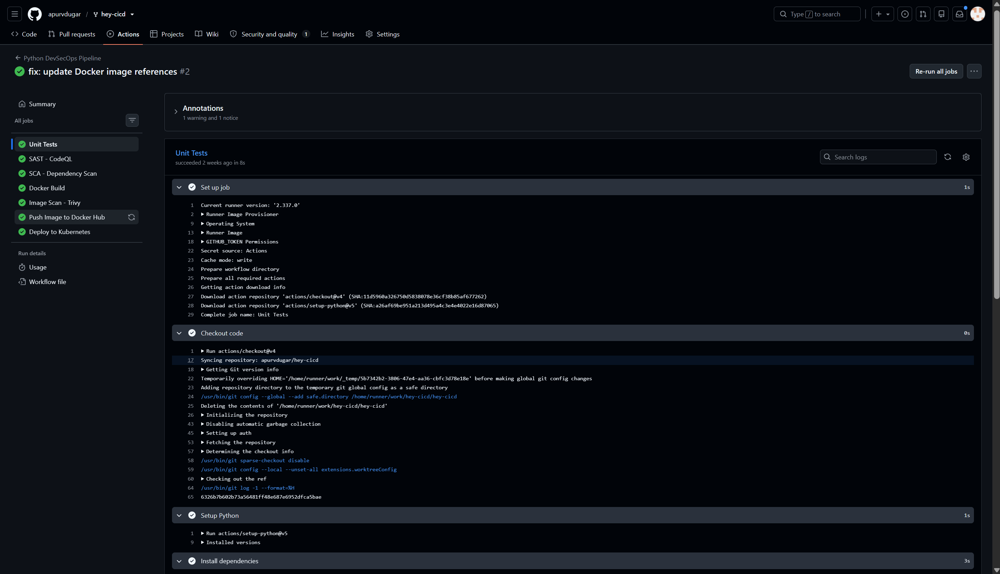
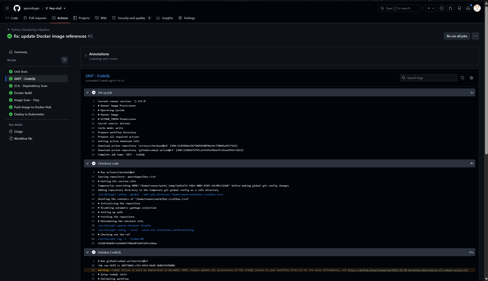
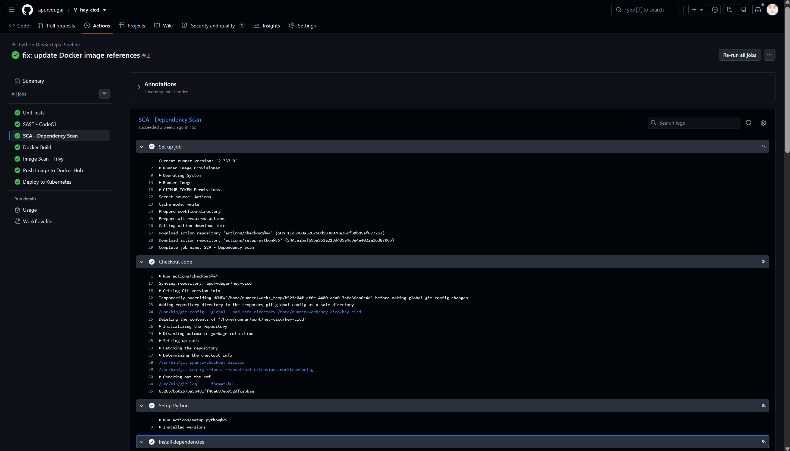
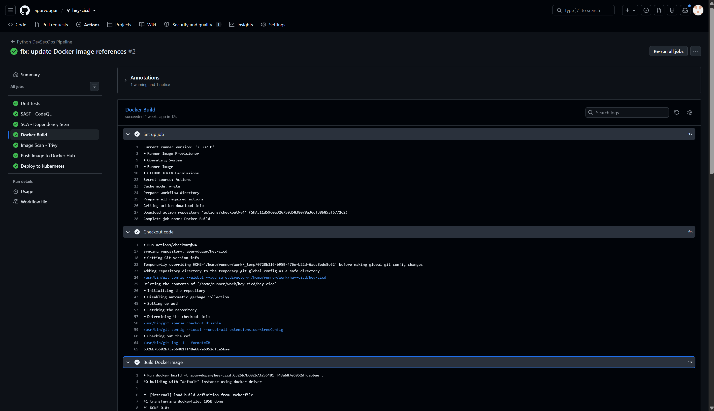
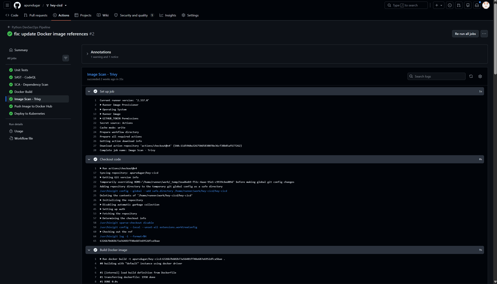

# Session 17: DevSecOps Demo Project

This project demonstrates a complete, automated **CI/CD + DevSecOps Pipeline** built using the project demo in [`session-17-devsecops/demo`](../../session-17-devsecops/demo).

In modern software delivery, security is integrated directly into the CI/CD pipeline ("shifting security left"). This guarantees that every commit is built, tested, scanned for code vulnerabilities, checked for insecure dependencies, audited for leaked secrets, containerized, and scanned for CVEs before being allowed through automated **Security Gates** to Docker Hub and Kubernetes.

---

## 1. Complete DevSecOps Pipeline Flow

```text
               ┌────────────────────────────────────────────────────────┐
               │              Developer Pushes Code to Git              │
               └───────────────────────────┬────────────────────────────┘
                                           │
                                           ▼
                                 ┌───────────────────┐
                       [CI]      │ Application Build │ (compileall & packaging check)
                                 └─────────┬─────────┘
                                           │
                                           ▼
                                 ┌───────────────────┐
                       [CI]      │   Unit Testing    │ (pytest + test coverage)
                                 └─────────┬─────────┘
                                           │
                                           ▼
                                 ┌───────────────────┐
                    [DevSecOps]  │     SAST Scan     │ (GitHub CodeQL code analysis)
                                 └─────────┬─────────┘
                                           │
                                           ▼
                                 ┌───────────────────┐
                    [DevSecOps]  │     SCA Audit     │ (pip-audit dependency CVE scan)
                                 └─────────┬─────────┘
                                           │
                                           ▼
                                 ┌───────────────────┐
                    [DevSecOps]  │    Secret Scan    │ (Audit for leaked keys & .env)
                                 └─────────┬─────────┘
                                           │
                                           ▼
                                 ┌───────────────────┐
                       [CI]      │   Docker Build    │ (Build container image)
                                 └─────────┬─────────┘
                                           │
                                           ▼
                                 ┌───────────────────┐
                    [DevSecOps]  │  Image Scan (CVE) │ (Trivy image vulnerability check)
                                 └─────────┬─────────┘
                                           │
                                           ▼
                                 ┌───────────────────┐
                    [DevSecOps]  │   Security Gate   │ (Policy: Fail on CRITICAL CVEs)
                                 └────┬─────────┬────┘
                                      │         │
                        Policy Passed │         │ Policy Violated (Exit Code 1)
                                      ▼         ▼
                                 ┌─────────┐ ┌─────────┐
                                 │ Continue│ │  STOP   │
                                 └────┬────┘ └─────────┘
                                      │
                                      ▼
                                 ┌───────────────────┐
                       [CD]      │ Push to Docker Hub│ (apurvdugar/hey-cicd:tag)
                                 └─────────┬─────────┘
                                           │
                                           ▼
                                 ┌───────────────────┐
                       [CD]      │ Kubernetes Deploy │ (Kind cluster rollout & smoke test)
                                 └───────────────────┘
```

---

## 2. DevSecOps Tooling Matrix

| Security Layer | Tool Used | Role in Pipeline | Enforcement / Gate Behavior |
|---|---|---|---|
| **Build & Packaging** | `compileall` & `tar` | Compiles Python bytecode to verify syntax ahead of packaging | Build failure stops pipeline |
| **Unit Testing** | `pytest` + `pytest-cov` | Runs 8 automated unit tests for health, API status, and math routes | Fails if any test breaks |
| **SAST** (Static Analysis) | **GitHub CodeQL** | Scans Python code for security flaws (e.g. injection, insecure bindings) | Flags security alerts in GitHub |
| **SCA** (Software Composition) | **pip-audit** | Cross-references third-party dependencies against PyPA/NVD advisory DB | Detects vulnerable packages |
| **Secret Scanning** | **Secret Audit** | Checks repository for exposed `.env`, `.pem`, `.key` files and API tokens | Zero-tolerance on leaked secrets |
| **Container Build** | **Docker** | Packages application into `apurvdugar/hey-cicd` | Builds deployable container image |
| **Container Scanning** | **Aqua Trivy** | Scans Docker image for OS-level and package-level CVEs | Identifies HIGH and CRITICAL risks |
| **Security Policy Gate** | **Trivy (`--exit-code 1`)** | Enforces organizational security policy before push | Strictly halts pipeline if CRITICAL vulnerabilities exist |
| **Container Registry** | **Docker Hub** | Stores versioned image (`apurvdugar/hey-cicd`) | Authenticated via `DOCKERHUB_TOKEN` secret |
| **Kubernetes CD** | **Kind & kubectl** | Spins up Kind cluster, applies manifests, verifies rollout & curls `/health` | Fails if rollout times out |

---

## 3. Project Structure

The project uses the demo codebase in `session-17-devsecops/demo/`:

```text
session-17-devsecops/demo/
├── .github/
│   └── workflows/
│       └── devsecops.yml       # 10-stage DevSecOps GitHub Actions workflow
├── app/
│   ├── __init__.py
│   ├── app.py                  # Production Flask application & REST API
│   ├── static/                 # Frontend assets (CSS & interactive JS)
│   └── templates/
│       └── index.html          # Interactive DevSecOps dashboard UI
├── tests/
│   └── test_app.py             # Pytest unit tests (8 passing tests)
├── k8s/
│   ├── deployment.yaml         # Kubernetes Deployment (apurvdugar/hey-cicd:__IMAGE_TAG__)
│   └── service.yaml            # NodePort Kubernetes Service (Port 30001)
├── Dockerfile                  # Containerfile (python:3.12-slim)
├── requirements.txt            # Runtime dependencies
├── requirements-dev.txt        # Test dependencies
├── SECURITY.md                 # Security policy
└── README.md                   # Demo overview

assignments/session-17/
├── README.md                   # This assignment documentation
└── screenshots/                # Pipeline execution screenshots
```

---

## 4. GitHub Secret Requirement

Before triggering the pipeline push to Docker Hub, ensure this secret is configured in your GitHub repository:

1. Navigate to: **GitHub Repo → Settings → Secrets and variables → Actions**
2. Click **New repository secret**
3. Add:
   - **Name:** `DOCKERHUB_TOKEN`
   - **Value:** Your Docker Hub Personal Access Token (PAT)

---

## 5. Practical Implementation Outputs

### 1. GitHub Actions Workflow Trigger & Jobs Graph


---

### 2. Unit Testing & SAST (CodeQL) Execution


---

### 3. SCA (pip-audit) & Secret Scanning Execution


---

### 4. Docker Build & Trivy Image Security Scan


---

### 5. Security Policy Gate Evaluation


---

### 6. Docker Hub Push & Kubernetes Rollout Verification


---

## 6. Key Takeaways

1. **Shift Left:** Security vulnerabilities are caught early in CI rather than being detected in production.
2. **Automated Gating:** Using `--exit-code 1` on Trivy transforms passive vulnerability reports into active policy enforcement.
3. **Immutable Tagging:** Tagging with the Git commit SHA guarantees complete traceability from running Kubernetes Pod back to the exact code commit.
