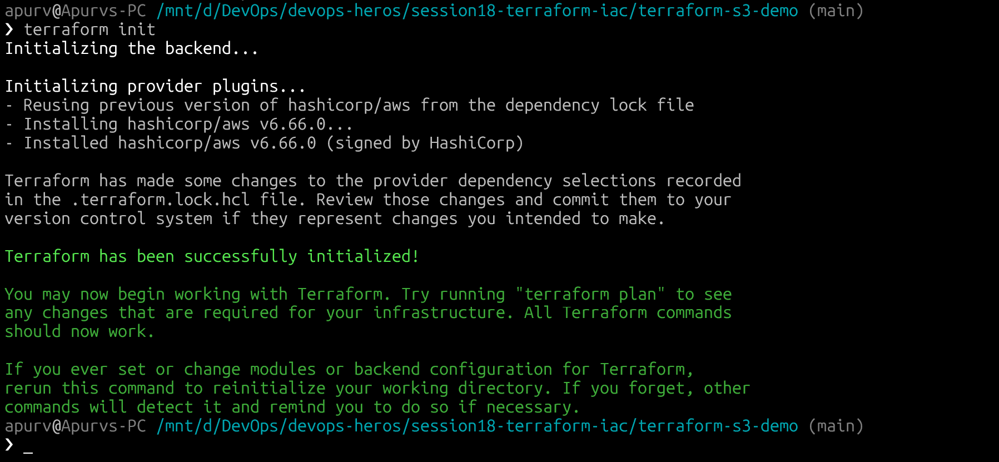
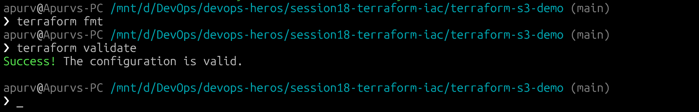
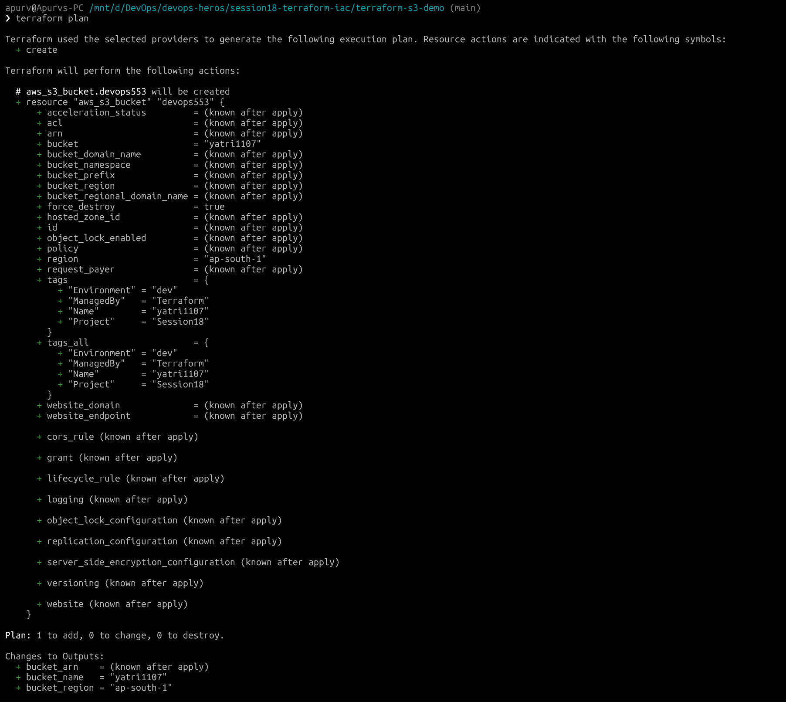
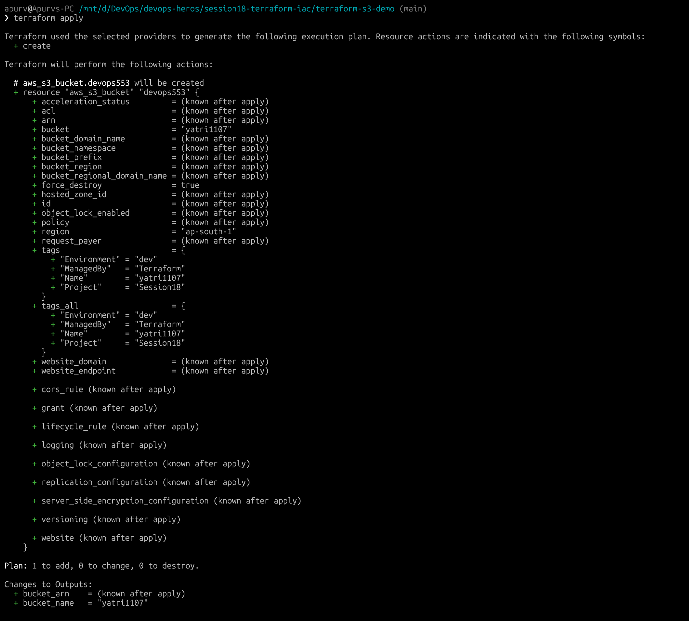
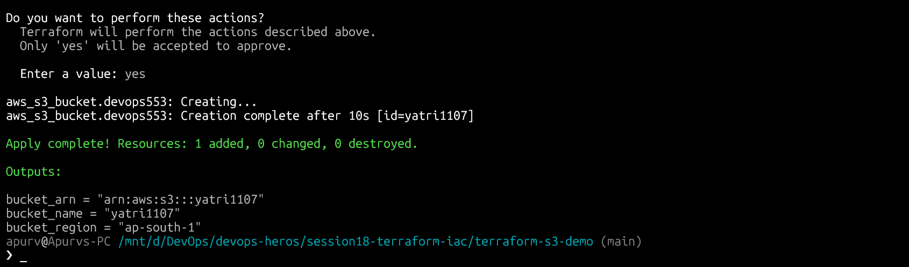
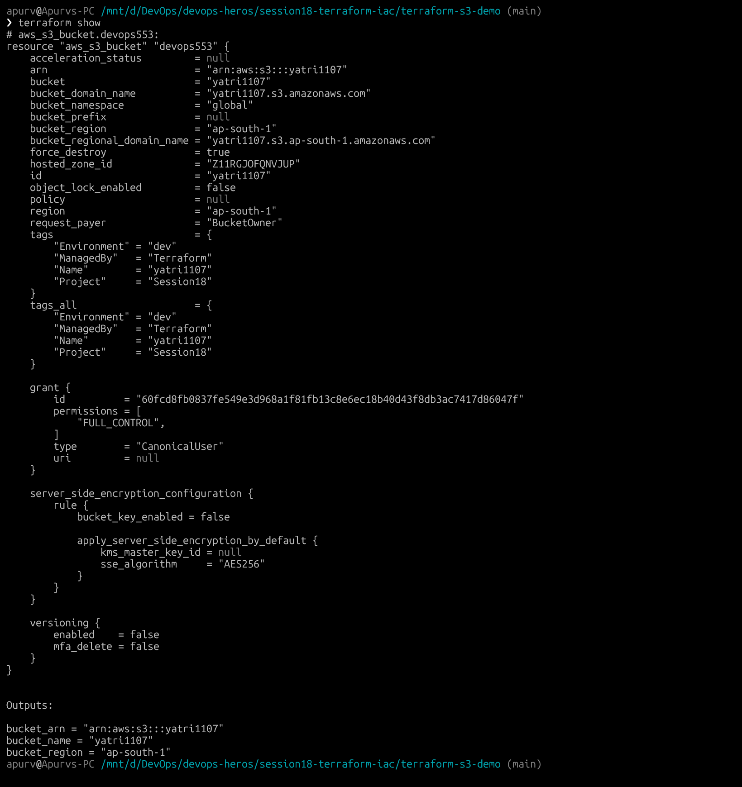
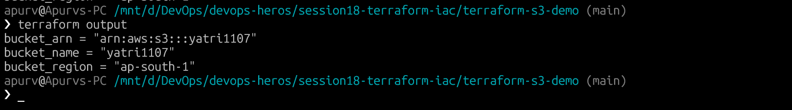
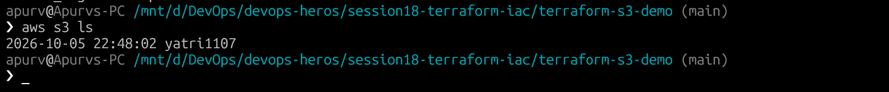
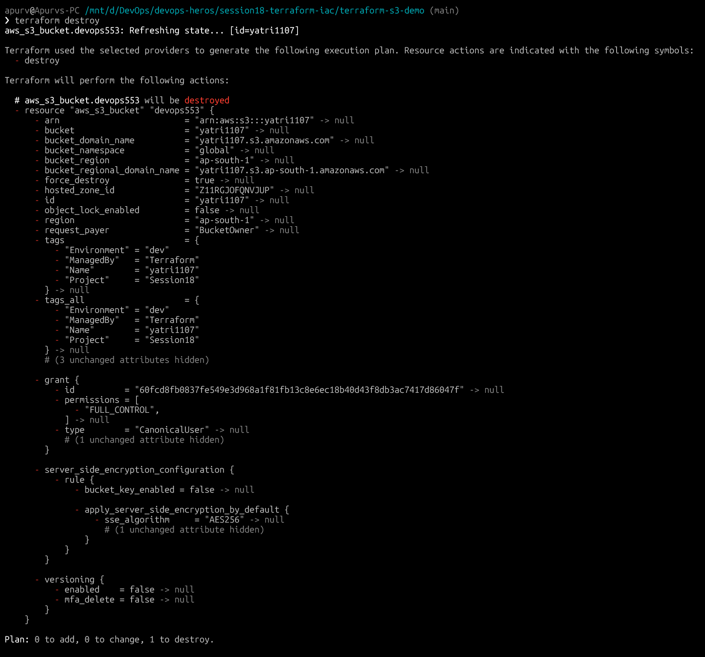
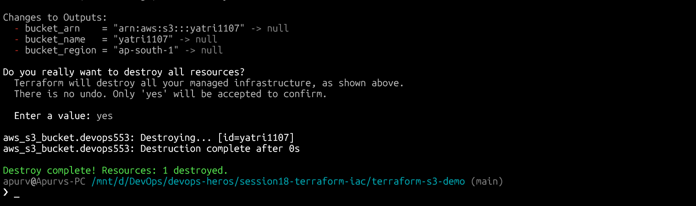

# Session 18: Terraform & Infrastructure as Code

Terraform lets you define cloud infrastructure in code (`.tf` files) instead of clicking through the AWS console. You declare the end state you want, and Terraform figures out how to get there — creating, updating, or deleting resources as needed.

---

## Task 1: Terraform S3 Demo

### Project Structure

```text
session18-terraform-iac/terraform-s3-demo/
├── provider.tf        # AWS provider + Terraform version requirements
├── variables.tf       # Input variable declarations (region, bucket name)
├── terraform.tf       # Terraform version constraint
├── main.tf            # S3 bucket resource definition
├── outputs.tf         # Outputs: bucket name, ARN, region
└── .gitignore         # Ignores state files and .terraform/ directory
```

### Complete Terraform Workflow

Run all commands from the `terraform-s3-demo/` directory:

```bash
cd session18-terraform-iac/terraform-s3-demo
```

---

#### 1. Initialize — Download the AWS provider plugin

```bash
terraform init
```



---

#### 2. Format + Validate — Check formatting and configuration

```bash
terraform fmt
terraform validate
```



---

#### 3. Plan — Preview what will be created

```bash
terraform plan
```



---

#### 4. Apply — Create the S3 bucket on AWS

```bash
terraform apply
```




---

#### 5. Show + Output — Inspect what was created

```bash
terraform show
terraform output
```




---

#### 6. Verify in AWS Console / CLI

```bash
aws s3 ls
```



---

#### 7. Destroy — Clean up resources when done

```bash
terraform destroy
```




---

## Task 2: AWS Services Overview

### IAM — Identity and Access Management

IAM controls "who can do what" in AWS account. Instead of sharing your root password, you create separate identities with only the permissions they need.

| Concept | What it is |
|---|---|
| User | A person or application with long-term credentials |
| Group | A collection of users sharing the same permissions |
| Role | A temporary identity assumed by services, apps, or users |
| Policy | A JSON document defining allowed/denied actions |
| Least Privilege | Only grant the minimum permissions actually needed |

Best Practice: Never use root for daily work, enable MFA, use roles over users for AWS services.

---

### EC2 — Elastic Compute Cloud

EC2 gives you virtual machines in the cloud. You pick the OS, CPU, memory, and storage — AWS runs the hardware.

| Concept | What it is |
|---|---|
| AMI | Pre-built OS image (e.g. Ubuntu 22.04) used to launch instances |
| Instance Type | CPU + RAM spec (e.g. t2.micro = 1 vCPU, 1 GB RAM) |
| Key Pair | SSH key for secure remote access |
| Security Group | A firewall — controls inbound/outbound traffic by port |
| EBS | Persistent block storage attached to an instance |

Instance Lifecycle: `Pending → Running → Stopping → Stopped → Terminated`


---

### S3 — Simple Storage Service

S3 stores files (objects) inside containers called buckets — globally accessible, highly durable, infinitely scalable.

| Concept | What it is |
|---|---|
| Bucket | Top-level container (must be globally unique) |
| Object | A file + its metadata |
| Storage Class | Tiered pricing by access frequency (Standard, IA, Glacier) |
| Versioning | Keeps every version of an object |
| Lifecycle Policy | Auto-moves or deletes objects after X days |
| Bucket Policy | JSON rules controlling access to the bucket |


---

### VPC — Virtual Private Cloud

A VPC is your own isolated network inside AWS — you control the IP ranges, subnets, routing, and internet access.

| Concept | What it is |
|---|---|
| CIDR | IP address range for your network (e.g. `10.0.0.0/16`) |
| Subnet | A subdivision of the VPC; can be public or private |
| Internet Gateway | Connects public subnets to the internet |
| NAT Gateway | Lets private subnets reach the internet (outbound only) |
| Security Group | Stateful firewall at the instance level |
| Network ACL | Stateless firewall at the subnet level |

- Public subnet — has a route to the Internet Gateway → reachable from the internet
- Private subnet — no direct internet route → internal only or via NAT


---

### DynamoDB & RDS — Database Services

#### DynamoDB — NoSQL

Serverless NoSQL database. No schema, auto-scales, single-digit millisecond latency.

| Concept | What it is |
|---|---|
| Table | Top-level container for items |
| Item | A single record |
| Partition Key | Unique identifier that determines where data is stored |
| Sort Key | Optional secondary key to sort items within a partition |

Best for: Session stores, shopping carts, IoT data, high-throughput APIs.

---

#### RDS — Relational Database

Fully managed SQL database — AWS handles patching, backups, and failover.

| Concept | What it is |
|---|---|
| Supported Engines | MySQL, PostgreSQL, MariaDB, Oracle, SQL Server, Aurora |
| Multi-AZ | Standby replica in another AZ — automatic failover |
| Read Replica | A copy for read-heavy workloads |
| Automated Backups | Daily snapshots + transaction logs |

Best for: User accounts, transactional systems, anything needing joins and ACID compliance.

---