# Session 19: Cloud & Terraform in Action

## Architecture

```text
                         Internet
                            |
                            v
                   Internet Gateway
                            |
               +------------+------------+
               |          VPC            |
               |      10.20.0.0/16       |
               |                         |
               |   +-----------------+   |
               |   |  Public Subnet  |   |
               |   |  10.20.1.0/24   |   |
               |   |                 |   |
               |   |  Route Table    |   |
               |   |       |         |   |
               |   |  Security Group |   |
               |   |  (port 80/443)  |   |
               |   |       |         |   |
               |   |    EC2 Instance |   |
               |   +-----------------+   |
               |                         |
               |   S3 Bucket             |
               +-------------------------+
```

---

## Project Structure

```text
session19-cloud-terraform/08-mini-project/
├── versions.tf          # Terraform + AWS provider version constraints
├── variables.tf         # Input variables (region)
├── main.tf              # VPC, Subnet, IGW, Route Table, Security Group, EC2, S3
├── outputs.tf           # Output values
├── terraform.tfvars     # Variable values (copy from .example)
└── .gitignore
```

---

## Resources Created

| Resource | Name | Purpose |
|---|---|---|
| `aws_vpc` | session19-mini-vpc | Isolated network `10.20.0.0/16` |
| `aws_subnet` | session19-mini-public-subnet | Public subnet `10.20.1.0/24` |
| `aws_internet_gateway` | session19-mini-igw | Internet access for the VPC |
| `aws_route_table` | session19-mini-public-rt | Route 0.0.0.0/0 → IGW |
| `aws_security_group` | session19-mini-web-sg | Allow HTTP (80) + HTTPS (443) inbound |
| `aws_instance` | session19-mini-ec2 | t2.micro EC2 in the public subnet |
| `aws_s3_bucket` | session19-mini-bucket-* | S3 bucket for storage |

---

## Terraform Commands

```bash
cd session19-cloud-terraform/08-mini-project

# Copy vars
cp terraform.tfvars.example terraform.tfvars

terraform init      # Download AWS provider
terraform fmt       # Auto-format code
terraform validate  # Check for errors
terraform plan      # Preview changes
terraform apply     # Create resources (type: yes)
terraform output    # See output values
terraform state list  # List managed resources
terraform destroy   # Delete everything (type: yes)
```

---

## Screenshots

### terraform init
> 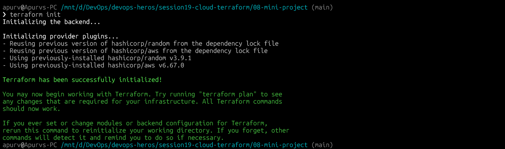

### terraform validate
> 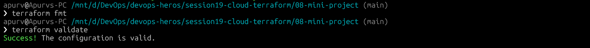

### terraform plan
> 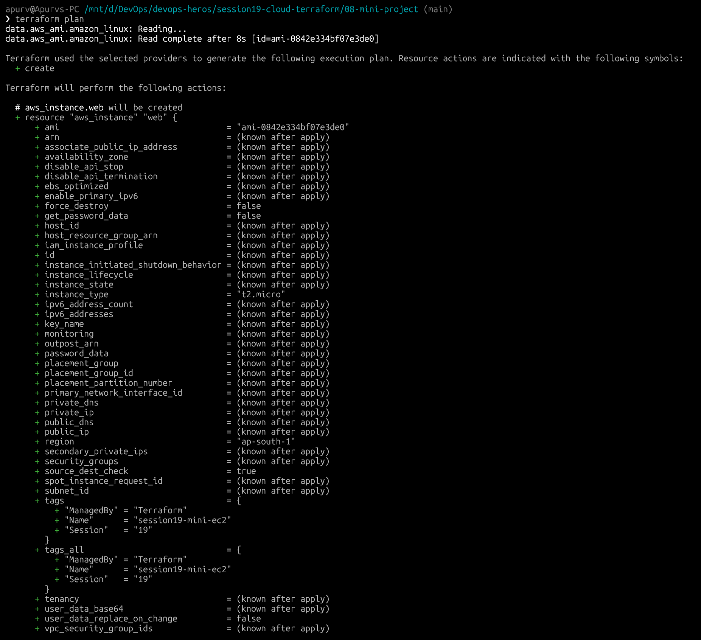

### terraform apply
> 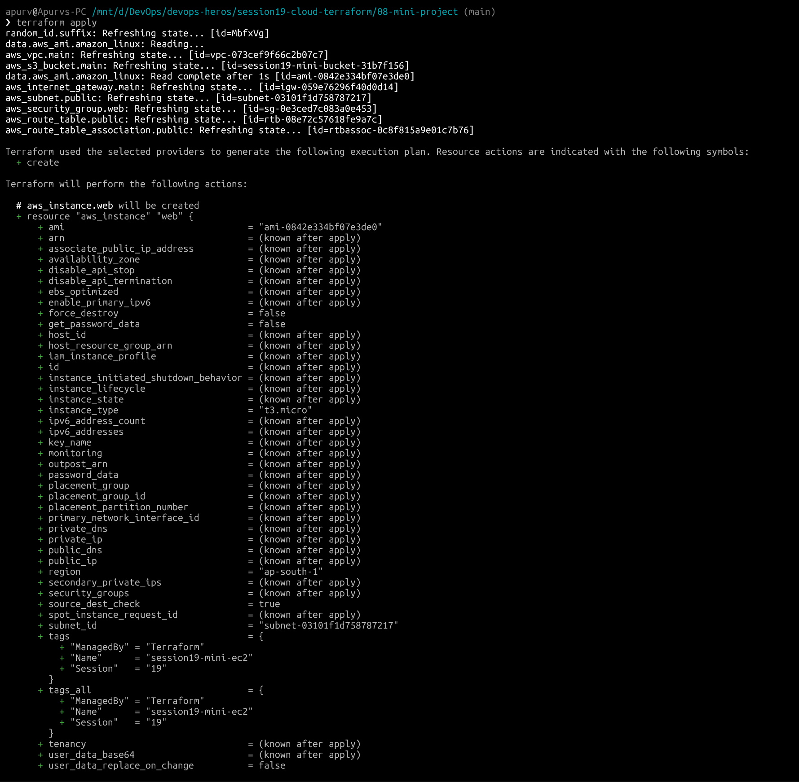
> 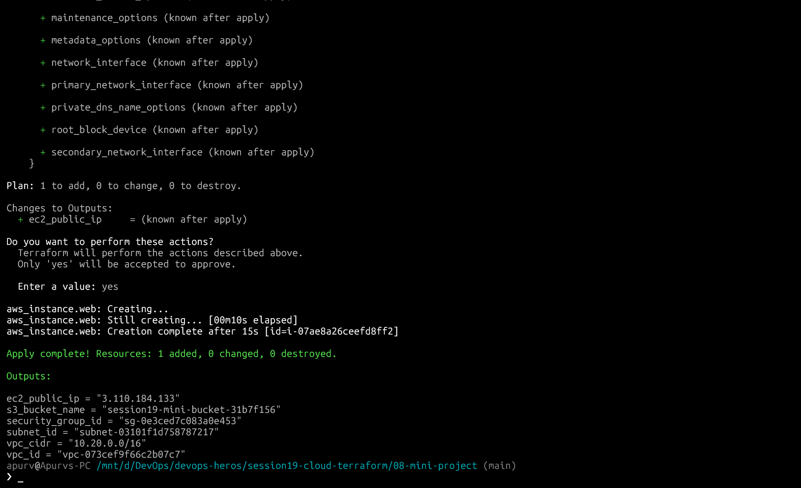

### terraform output
> 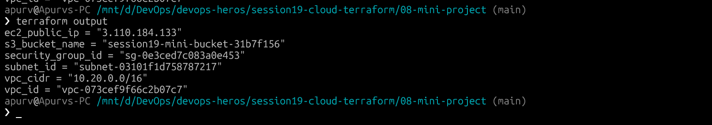

### terraform state list
> 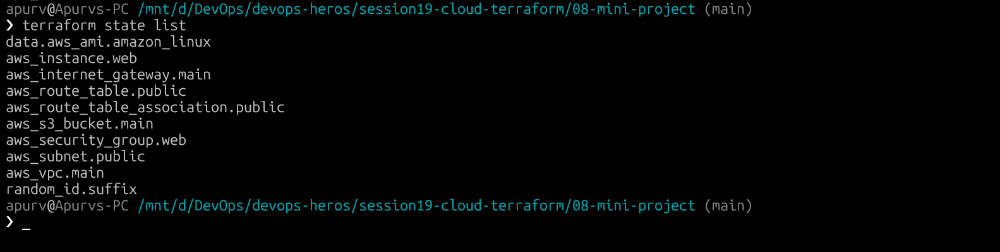

### AWS Console — VPC
> 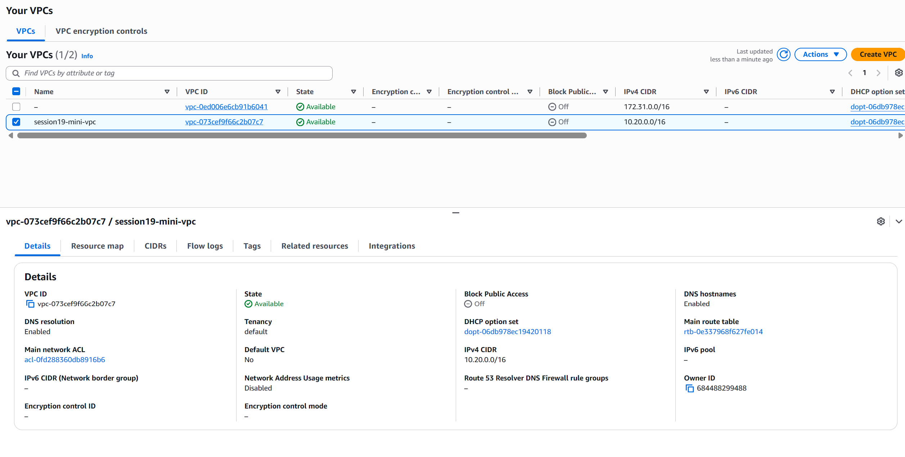

### AWS Console — EC2
> 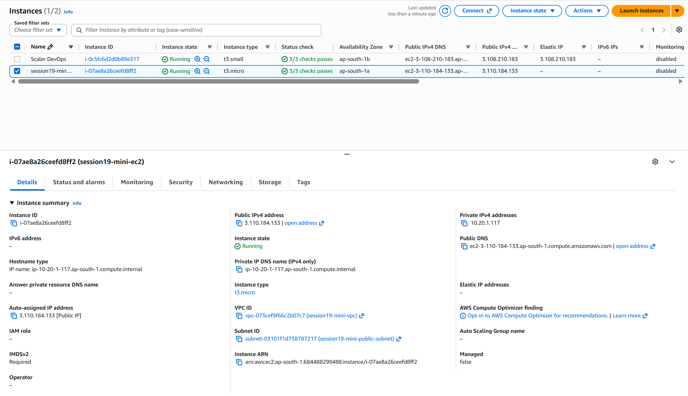

### AWS Console — S3
> 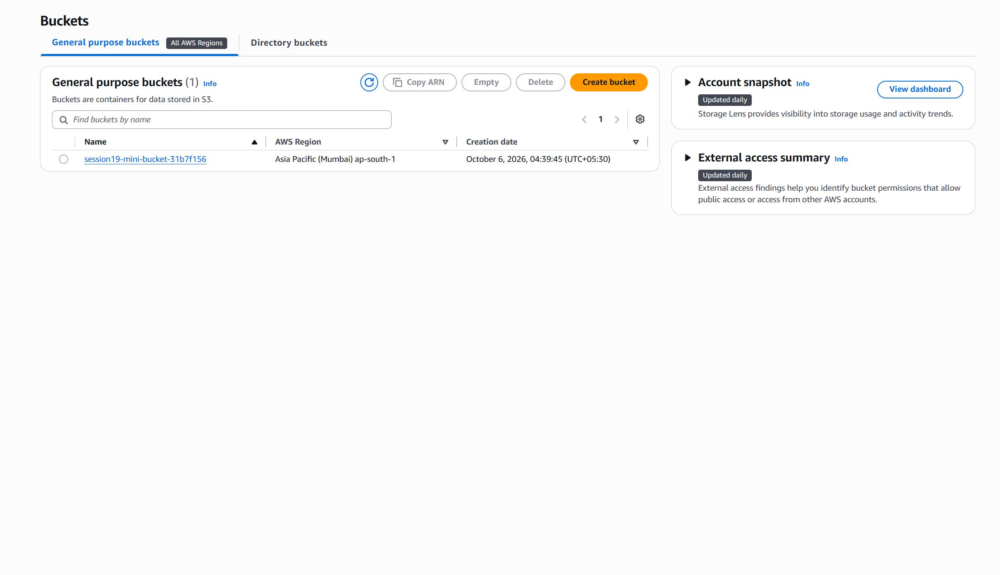

### terraform destroy
> 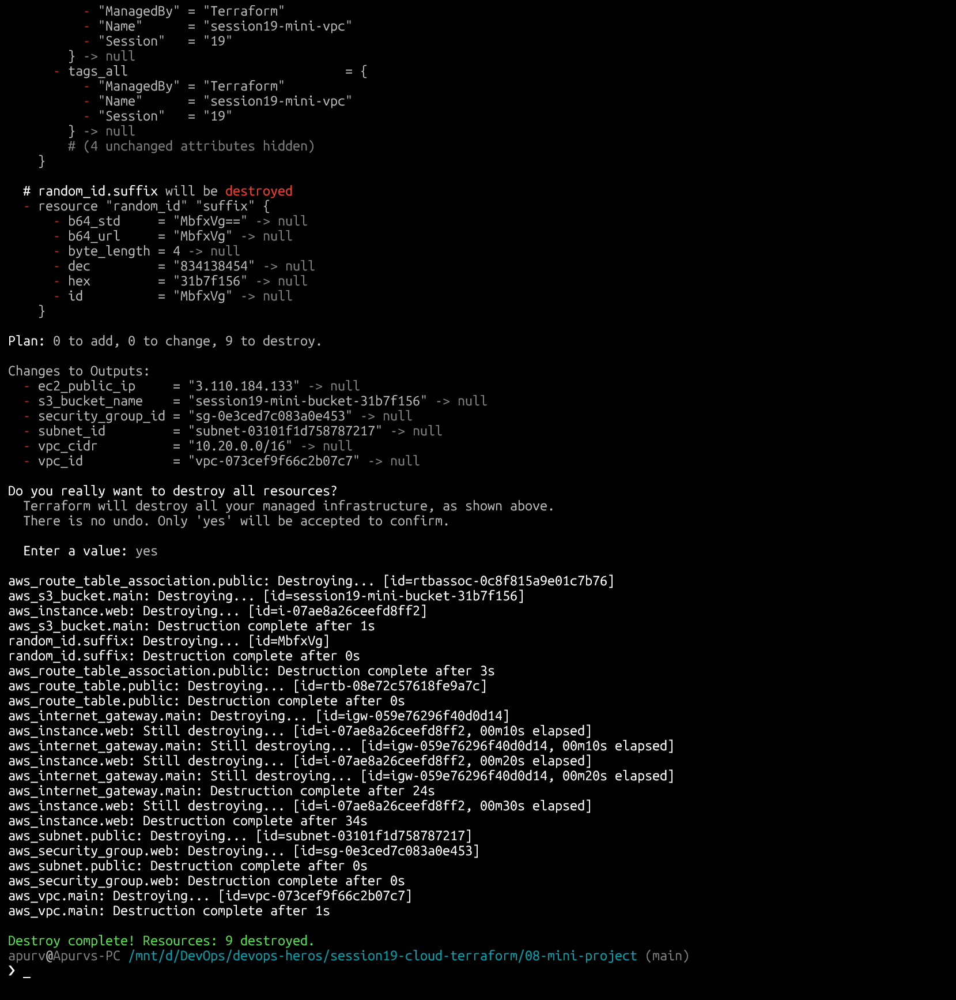

---

## Key Terraform Concepts Demonstrated

| Concept | Where used |
|---|---|
| Provider | `versions.tf` — `hashicorp/aws ~> 6.0` |
| Variables | `var.aws_region` used across all resources |
| Resources | VPC, Subnet, IGW, Route Table, SG, EC2, S3 |
| Dependencies | Subnet depends on VPC → SG depends on VPC → EC2 depends on Subnet + SG |
| Outputs | VPC ID, Subnet ID, SG ID, EC2 public IP, S3 bucket name |
| State | `terraform state list` shows all managed resources |
| **plan → apply → destroy** | Full lifecycle run documented with screenshots above |

---