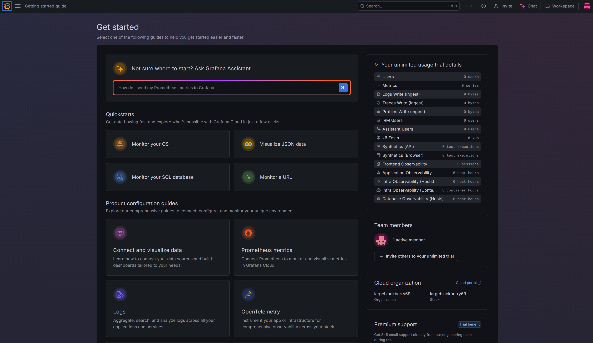
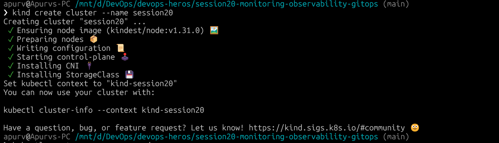
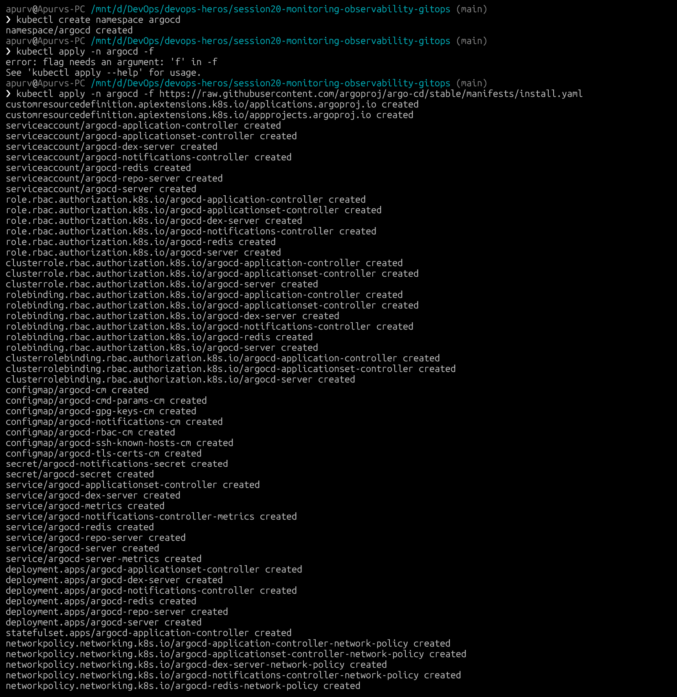
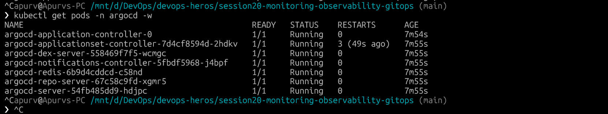
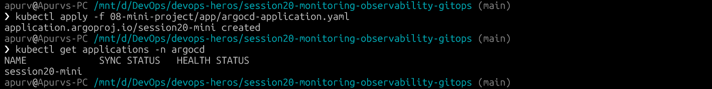
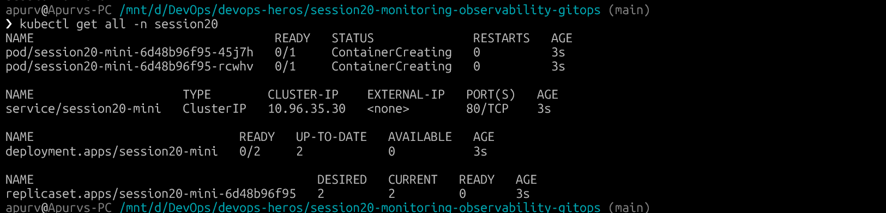
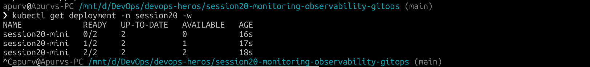
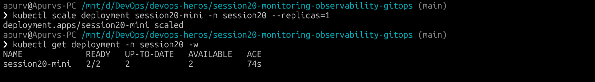
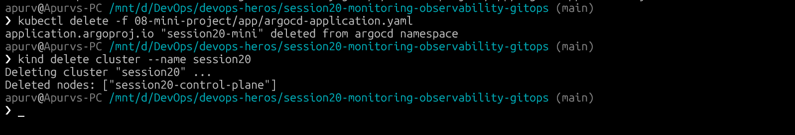

# Session 20: Monitoring, Observability & GitOps

---

## Task 1 & 2: Monitoring vs Observability

### Monitoring

Monitoring is watching "known" things. You define what metrics matter upfront and alert when thresholds are crossed.

| What | Example |
|---|---|
| Metrics | CPU %, memory usage, request rate, error rate |
| Logs | Application events, errors, access logs |
| Alerts | "Notify me when CPU > 80% for 5 minutes" |

Tools: Prometheus (metrics), Loki (logs), Grafana (dashboards + alerts).

---

### Observability

Observability is the ability to understand "unknown" failures from the outside by looking at the system's outputs. It answers "why is this broken?" not just "is this broken?".

#### The Three Pillars

| Pillar | What it captures | Example tool |
|---|---|---|
| Metrics | Numeric measurements over time (CPU, latency, RPS) | Prometheus |
| Logs | Discrete events with timestamps and context | Loki, ELK Stack |
| Traces | The full journey of a single request across services | Jaeger, Tempo, Zipkin |

**Why observability is required:**
- Modern systems are distributed (microservices, Kubernetes) — a single request touches dozens of services
- You can't predict every failure mode in advance
- Observability lets you debug issues you've never seen before

**Kubernetes observability:**
- `kubectl logs` / `kubectl describe` — basic log + event access
- Prometheus + Grafana — cluster-wide metrics and dashboards
- Resource requests/limits + HPA — capacity observability

> 

---

## Task 3: GitOps

GitOps is a way of running cloud infrastructure and applications where Git is the only source of truth. You don't "kubectl apply" manually — you push to Git, and an operator syncs the cluster to match.

### Core Principles

| Principle | What it means |
|---|---|
| Git as source of truth | The desired state of everything lives in Git |
| Declarative configuration | You describe *what* you want, not *how* to get there |
| Continuous reconciliation | An agent (Argo CD) constantly compares desired vs actual and fixes drift |
| Self-healing | If someone manually changes a resource, Argo CD reverts it |

### GitOps Workflow

```text
Developer
    |
    | git push
    v
  Git Repo ──── desired state ────> Argo CD
                                        |
                                   reconcile
                                        |
                                        v
                                  Kubernetes
                                  actual state
```

### Kubernetes + GitOps (Argo CD)

Argo CD watches a Git repo path, compares it to the cluster state, and syncs automatically. With `selfHeal: true`, any manual `kubectl` change is overwritten back to what Git says.

---

## GitOps Demo (Mini Project)

The demo project lives in [`session20-monitoring-observability-gitops/08-mini-project/`](../../session20-monitoring-observability-gitops/08-mini-project).

### App Manifests

```text
08-mini-project/app/
├── namespace.yaml          # Creates the session20 namespace
├── deployment.yaml         # 2-replica nginx deployment
├── service.yaml            # ClusterIP service
└── argocd-application.yaml # ArgoCD Application pointing to this repo
```

### Step-by-Step Demo

#### 1. Create a local Kubernetes cluster

```bash
kind create cluster --name session20
```

> 

---

#### 2. Install Argo CD

```bash
kubectl create namespace argocd
kubectl apply -n argocd \
  -f https://raw.githubusercontent.com/argoproj/argo-cd/stable/manifests/install.yaml

kubectl get pods -n argocd -w
```

> 
> 

---

#### 3. Apply the Argo CD Application

```bash
kubectl apply -f session20-monitoring-observability-gitops/08-mini-project/app/argocd-application.yaml

kubectl get applications -n argocd
```

> 

---

#### 4. Verify the app is running in Kubernetes

```bash
kubectl get all -n session20
```

> 

---

#### 5. Demonstrate GitOps — push a change

Edit [`app/deployment.yaml`](../../session20-monitoring-observability-gitops/08-mini-project/app/deployment.yaml) — change `replicas: 2` to `replicas: 3`:

```bash
kubectl get deployment -n session20 -w
```

> 

---

#### 6. Demonstrate Self-Healing

```bash
kubectl scale deployment session20-mini -n session20 --replicas=1

kubectl get deployment -n session20 -w
```

> 

---

#### 7. Cleanup

```bash
kubectl delete -f session20-monitoring-observability-gitops/08-mini-project/app/argocd-application.yaml
kind delete cluster --name session20
```

> 

---

## Key Mental Model

```text
METRICS → numbers over time      (Prometheus)
LOGS    → discrete events        (Loki)
TRACES  → request journey        (Jaeger/Tempo)

GIT     → desired state
ARGO CD → reconciliation engine
K8S     → actual state
```
