# Session 21: Final DevOps Project — TaskBoard

A complete end-to-end DevOps project built on a Python (FastAPI) backend, React frontend, and PostgreSQL database, deployed on Kubernetes with Helm, secured through a DevSecOps pipeline, and managed via GitOps.

---

## Architecture

```text
Developer
    │
    │ git push
    ▼
GitHub (source of truth)
    │
    ├───► GitHub Actions CI/CD Pipeline
    │         │
    │         ├── Test (pytest + npm build)
    │         ├── DevSecOps Gates (Gitleaks + Bandit)
    │         ├── Docker Build (Backend + Frontend)
    │         ├── Security Scan (Trivy CVE scanner)
    │         └── Push to GHCR
    │
    └───► Argo CD (GitOps Continuous Reconciliation)
              │
              ▼
         Kubernetes (Minikube / EKS)
              │
    +---------+---------+
    │                   │
  Backend            Frontend
  (FastAPI)          (React)
    │
  PostgreSQL (PVC Storage)
    │
  Prometheus + Grafana (Monitoring)

Infrastructure:
  Terraform ──► AWS VPC + EKS
```

---

## Project Structure

All deliverables are available in [`final-devops-project/`](../../final-devops-project) and [`session21-python/`](../../session21-python).

```text
final-devops-project/
├── application/              # Full-stack microservices (FastAPI backend + React frontend)
├── docker/                   # Dockerfiles and docker-compose orchestration
├── kubernetes/               # Raw manifests (Namespace, ConfigMap, Secret, PVC, Deployments, Services, HPA, Ingress)
├── helm/                     # Parameterized Helm charts (taskboard chart with dev/prod values)
├── terraform/                # AWS VPC + EKS infrastructure provisioning
├── .github/workflows/        # Automated CI/CD pipeline with security gates
├── security/                 # DevSecOps configs: SAST (Bandit), Secrets (Gitleaks), Trivy
├── monitoring/               # Prometheus Operator, ServiceMonitor, Grafana dashboards
├── gitops/                   # Argo CD Application manifests & continuous reconciliation
├── troubleshooting/          # Kubernetes diagnostic scenarios (broken image & service selector)
└── README.md                 # Comprehensive project guide and reference
```

---

## Technologies Used

| Category | Technology |
|---|---|
| Application | Python 3.12, FastAPI, React, PostgreSQL |
| Containerization | Docker, Docker Compose, GHCR (GitHub Container Registry) |
| Orchestration | Kubernetes (Minikube / EKS), Ingress-Nginx, HPA |
| Package Manager | Helm 3 |
| Infrastructure as Code | Terraform (AWS VPC, Subnets, EKS cluster) |
| CI/CD | GitHub Actions |
| DevSecOps | Trivy (Vulnerabilities), Gitleaks (Secrets), Bandit (SAST) |
| Monitoring | Prometheus, Grafana, ServiceMonitor |
| GitOps | Argo CD |

---

## 1. Local Application Setup (Docker Compose)

The full microservices stack consists of:
- **Database:** PostgreSQL 16 Alpine with health check and persistent storage
- **Backend:** FastAPI with Alembic migrations and automatic database readiness check (`wait_for_db.py`)
- **Frontend:** React + Vite served via Nginx Alpine

```bash
# Navigate to the project directory
cd /mnt/d/DevOps/devops-heros/session21-python

# Start the full stack
docker compose up --build
```

Access points:
- Frontend: `http://localhost:3001`
- Backend API Docs: `http://localhost:8001/docs`
- Health check: `http://localhost:8001/health`

> 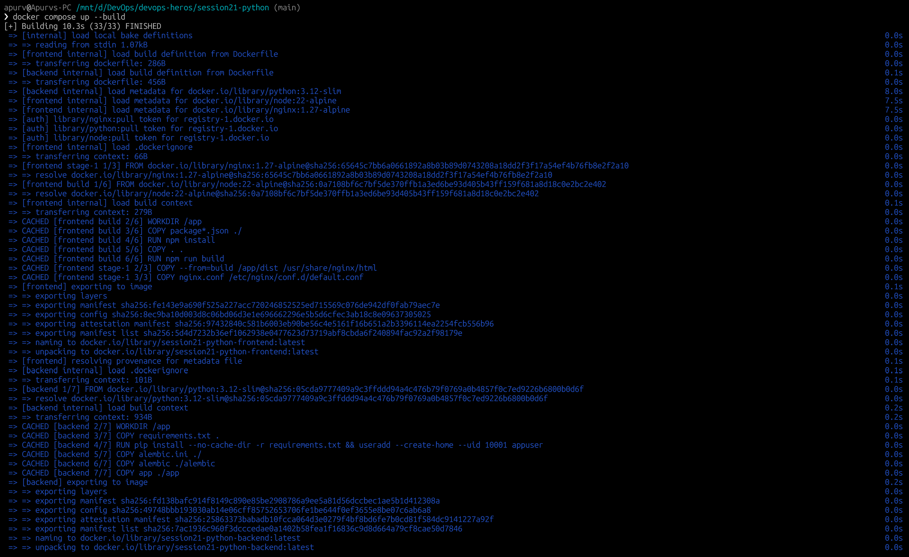
> 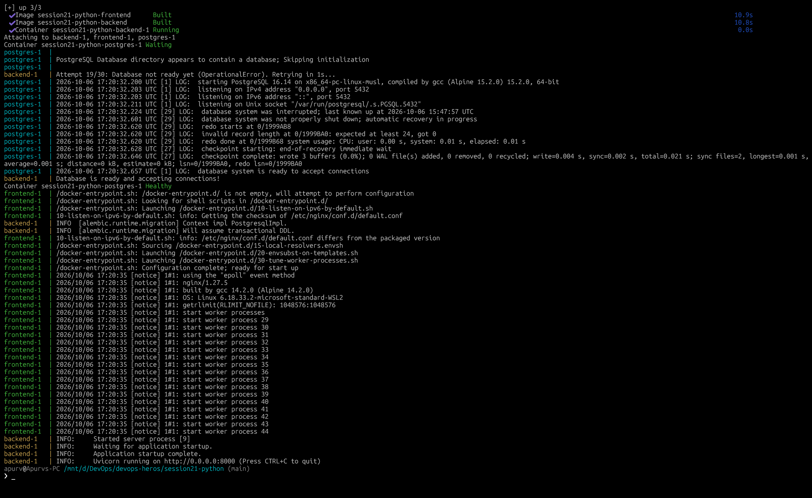


---

## 2. Docker Images (Build & Standalone Run)

Build standalone Docker images and run an isolated container:

```bash
cd /mnt/d/DevOps/devops-heros/session21-python

# 1. Build images
docker build -t taskboard-backend:local ./backend
docker build -t taskboard-frontend:local ./frontend

# 2. Run standalone container
docker run -d -p 3001:80 taskboard-frontend:local

# Verify running container
docker ps
```

> 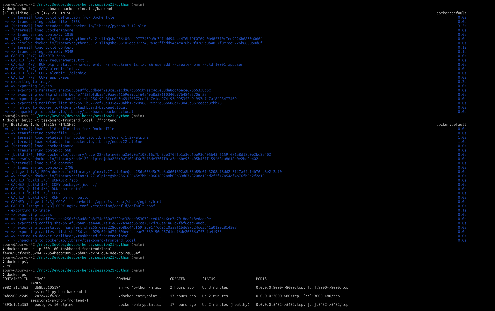

---

## 3. Kubernetes Deployment (Helm)

### Step 1: Ensure Minikube Context & Load Images
```bash
# Ensure Minikube is active
kubectl config use-context minikube

# Apply the taskboard namespace
kubectl apply -f k8s/namespace.yaml

# Load local Docker images directly into Minikube
minikube image load taskboard-backend:local taskboard-frontend:local
```

### Step 2: Deploy with Helm
```bash
cd /mnt/d/DevOps/devops-heros/session21-python

helm upgrade --install taskboard helm/taskboard \
  -n taskboard --create-namespace \
  -f helm/taskboard/values-dev.yaml
```

> 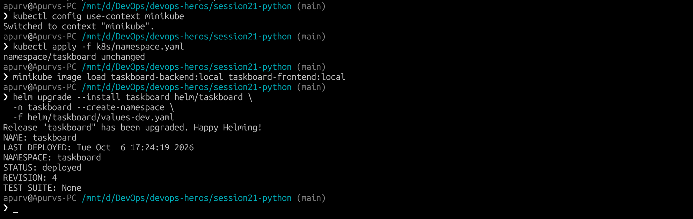

### Step 3: Verify Deployed Resources
```bash
kubectl get all -n taskboard
```

Expected output: All pods (`frontend`, `postgres`, `backend`) in `1/1 Running` state.

> 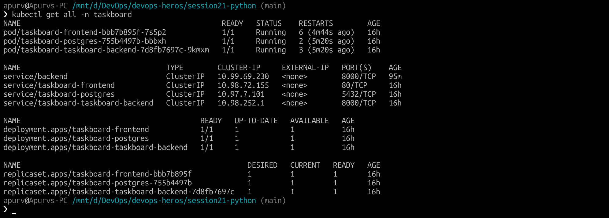

### Kubernetes Resources Included:
| Resource | Purpose |
|---|---|
| Deployment | Backend (FastAPI), Frontend (React), PostgreSQL |
| Service | ClusterIP for backend (`backend` & `taskboard-taskboard-backend`), frontend, and postgres |
| Ingress | Route external traffic to frontend (`/`) and backend (`/api`) |
| HPA | Auto-scale backend based on CPU utilization |
| ConfigMap | Non-sensitive configuration |
| Secret | Database credentials |
| PersistentVolumeClaim | 5Gi volume for PostgreSQL persistence |
| Probes | Startup, Liveness, and Readiness probes on workloads |

---

## 4. Terraform Cloud Infrastructure

Provisions **VPC + EKS** on AWS (`ap-south-1`):

```bash
cd terraform

# Initialize Terraform providers and modules
terraform init

# Validate configuration
terraform validate

# Review execution plan
terraform plan

# Apply
terraform apply
```

> 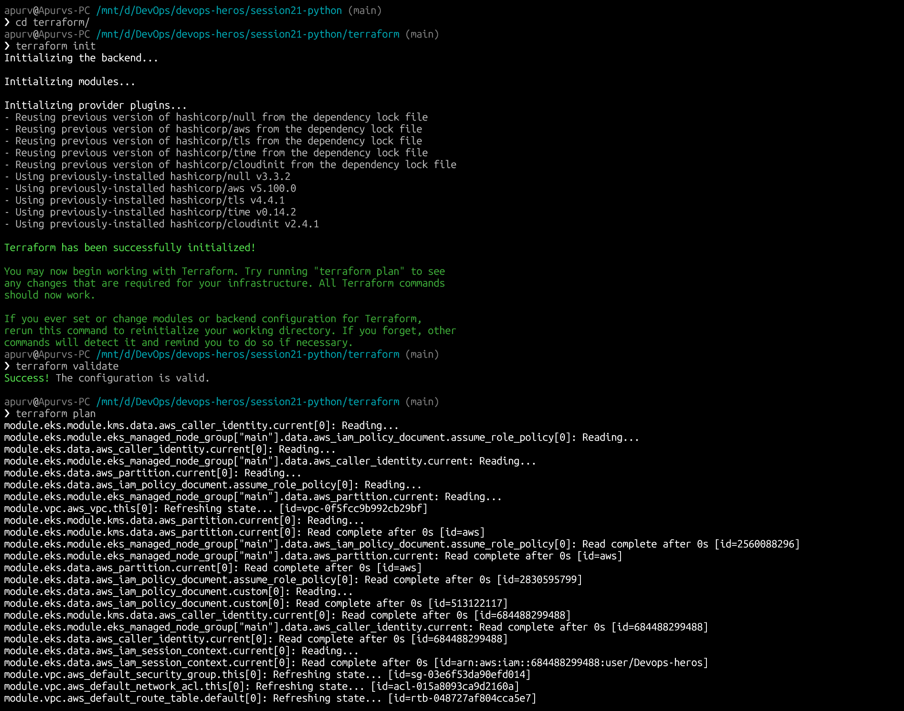
> 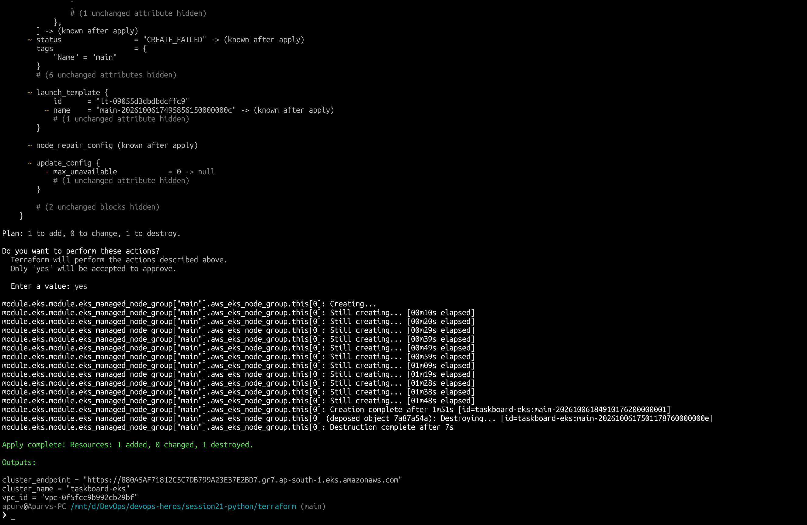

---

## 5. CI/CD Pipeline (GitHub Actions)

The pipeline ([`.github/workflows/session21-ci-cd.yml`]) runs on push to `main` and pull requests:

```text
push to main
    │
    ▼
Job 1: test
    ├── pytest (backend)
    └── npm build (frontend)
    │
    ▼
Job 2: build-scan-push
    ├── docker build (backend + frontend)
    ├── trivy vulnerability scan (exits 1 on HIGH/CRITICAL)
    └── docker push ──► ghcr.io
    │
    ▼
Job 3: deploy (main branch only)
    └── helm upgrade --install ──► Kubernetes (EKS)
```

> 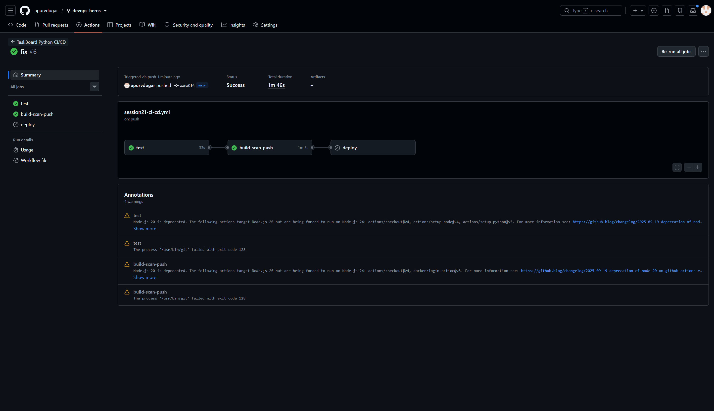
---

## 6. DevSecOps — Security Gates & Vulnerability Scanning

Security checks enforce quality and vulnerability thresholds:

| Gate | Tool | Action |
|---|---|---|
| Secret Scanning | Gitleaks | Blocks API keys, passwords, private keys |
| SAST | Bandit | Scans Python code for injection, weak crypto |
| Container Scanning | Trivy | Scans container images for HIGH/CRITICAL CVEs |

```bash
cd /mnt/d/DevOps/devops-heros/session21-python

# Run full security gate suite
bash security/scan.sh

# Or scan an individual container directly with Trivy
trivy image taskboard-backend:local
```

> 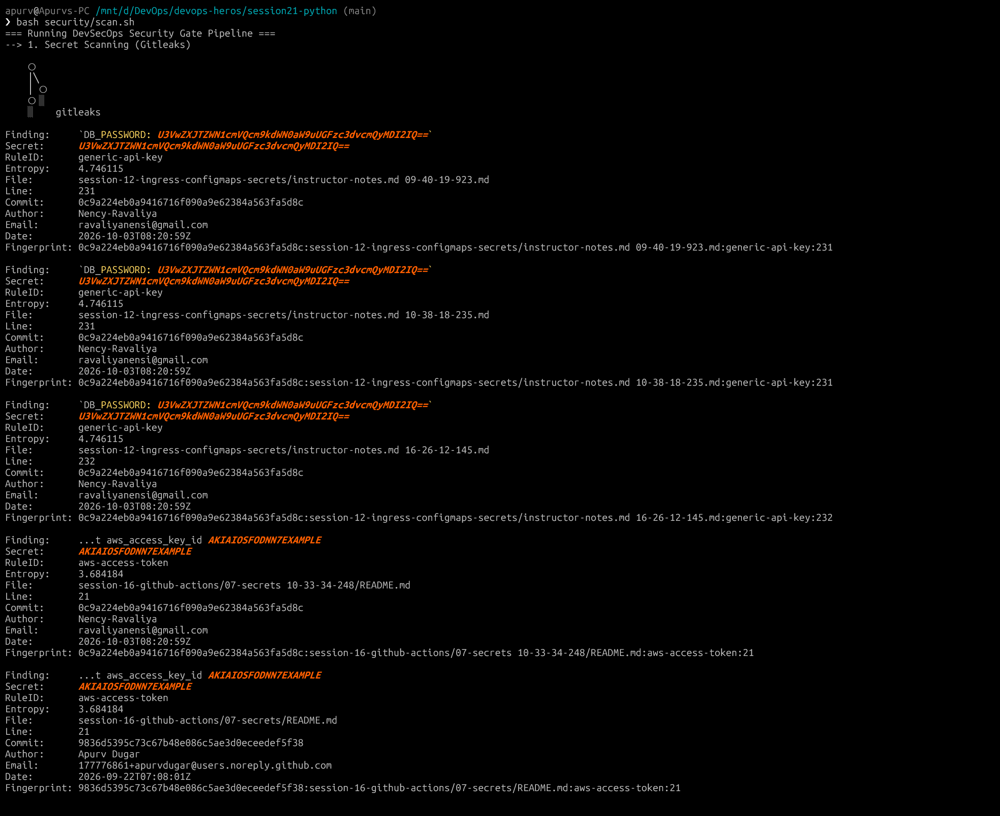
> 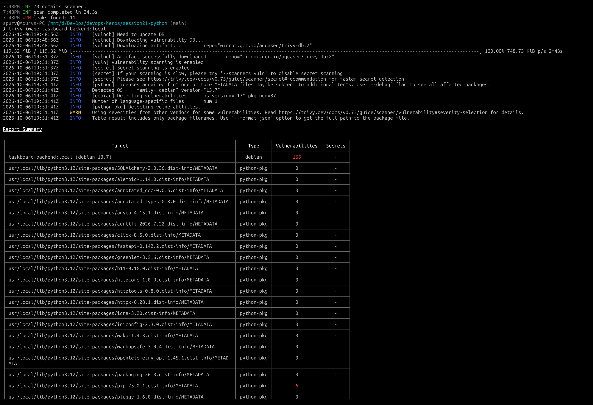

---

## 7. Monitoring & Observability

### Step 1: Install Prometheus & Grafana via Helm
```bash
helm repo add prometheus-community https://prometheus-community.github.io/helm-charts
helm repo update

helm upgrade --install monitoring prometheus-community/kube-prometheus-stack \
  -n monitoring --create-namespace \
  -f monitoring/prometheus-values.yaml

kubectl get pods -n monitoring
```

### Step 2: Access Grafana Dashboard
```bash
kubectl port-forward svc/monitoring-grafana -n monitoring 3002:80
```
Open browser at `http://localhost:3002` 

> 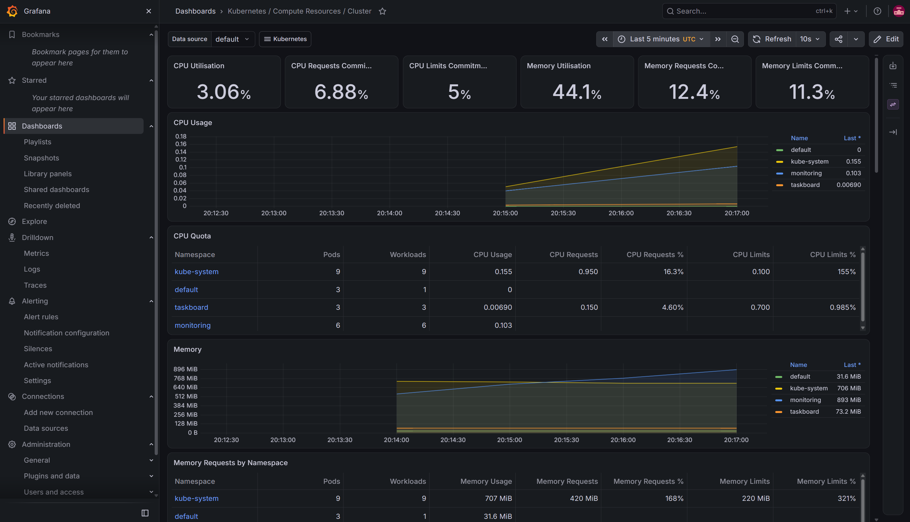
---

## 8. GitOps Workflow (Argo CD)

Declarative continuous delivery using Git as the single source of truth:

```bash
# 1. Install Argo CD
kubectl create namespace argocd
kubectl apply -n argocd -f https://raw.githubusercontent.com/argoproj/argo-cd/stable/manifests/install.yaml

# 2. Wait for Argo CD server
kubectl wait --for=condition=ready pod -l app.kubernetes.io/name=argocd-server -n argocd --timeout=300s

# 3. Apply the TaskBoard Application CRD
kubectl apply -f gitops/application.yaml

# 4. Check synchronization status
kubectl get applications -n argocd
```

> 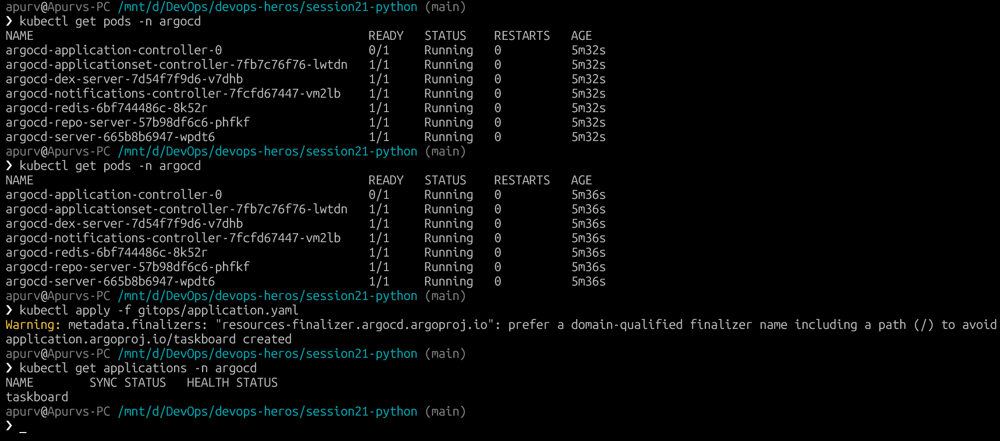
---

## 9. Troubleshooting Challenges & Solutions

Two diagnostic challenge scenarios are provided under [`troubleshooting/`](../../session21-python/troubleshooting):

### Challenge 1 — ErrImagePull / ImagePullBackOff

**1. Apply the broken deployment:**
```bash
kubectl apply -f session21-python/troubleshooting/broken-image.yaml
kubectl get pods -n taskboard -l app=broken-image
```
*Symptom:* Pod status displays `ErrImagePull` or `ImagePullBackOff`.

**2. Investigate:**
```bash
kubectl describe pod -l app=broken-image -n taskboard
```
*Root Cause:* In the `Events` section: `Failed to pull image "ghcr.io/example/taskboard-backend:does-not-exist"`. The image tag does not exist.

**3. Fix:**
```bash
kubectl set image deployment/taskboard-broken-image backend=taskboard-backend:local -n taskboard
```

**4. Verify:**
```bash
kubectl rollout status deployment/taskboard-broken-image -n taskboard
kubectl get pods -l app=broken-image -n taskboard
```
*Result:* Pod transitions to `Running` (1/1).

> 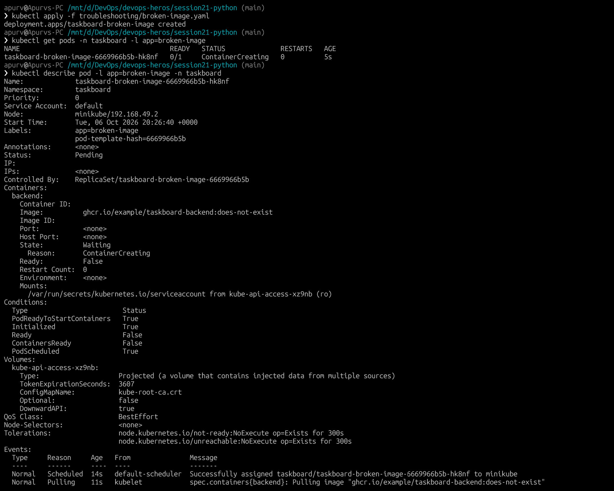
> 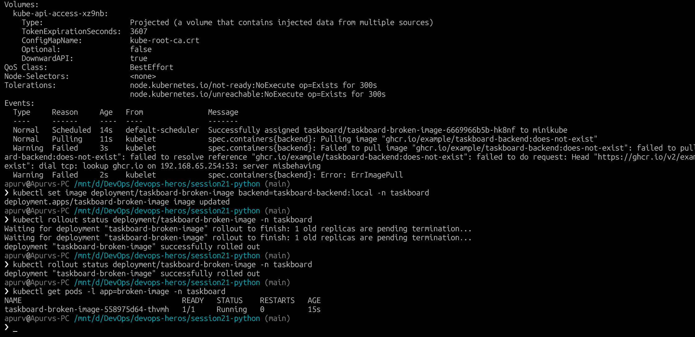

---

### Challenge 2 — Service Selector Mismatch

**1. Apply the broken service:**
```bash
kubectl apply -f troubleshooting/broken-service.yaml
```

**2. Investigate:**
```bash
# Check service endpoints
kubectl get endpoints broken-service -n taskboard

kubectl describe svc broken-service -n taskboard
```
*Root Cause:* The Service selector does not match the actual pod label (`app: taskboard-backend`), causing Kubernetes to route traffic nowhere.

**3. Fix:**
```bash
kubectl set selector svc broken-service "app=taskboard-backend" -n taskboard
```

**4. Verify:**
```bash
kubectl get endpoints broken-service -n taskboard
```
*Result:* `ENDPOINTS` now populates with the backend pod IP (e.g. `10.244.0.x:8000`).

> 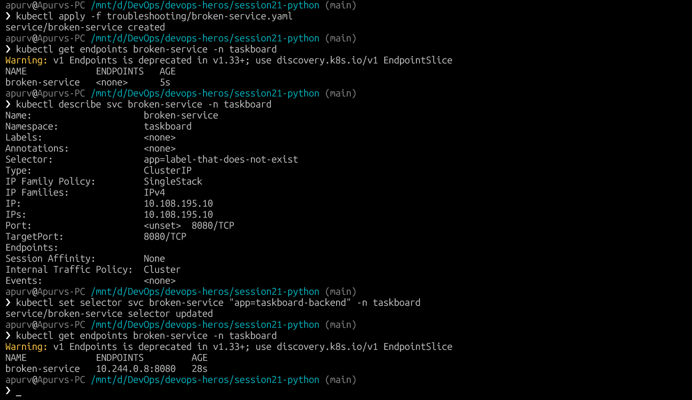
---

## 10. Lessons Learned

| Topic | Key Takeaway |
|---|---|
| **Shift Left Security** | Enforcing Trivy, Gitleaks, and Bandit in CI prevents vulnerable containers and credentials from reaching production. |
| **GitOps** | Argo CD ensures the live Kubernetes cluster always mirrors Git, eliminating configuration drift and providing an automated audit trail. |
| **Helm** | Reusable templates with separate `values-dev.yaml` and `values-prod.yaml` simplify multi-environment management. |
| **Resilience & Probes** | Combining database readiness checks (`wait_for_db.py`), startup probes, and liveness probes prevents cascade failures during cold starts. |
| **Systematic Troubleshooting** | The 5-step methodology (`get` ➔ `describe` ➔ `logs` ➔ `fix` ➔ `verify`) solves complex Kubernetes issues methodically. |
