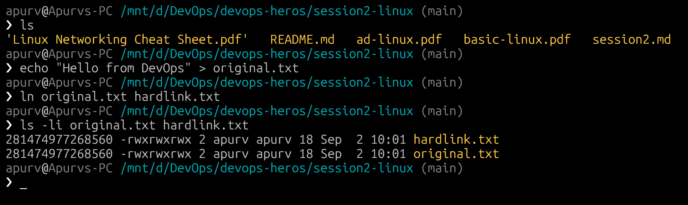
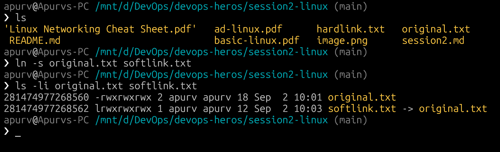
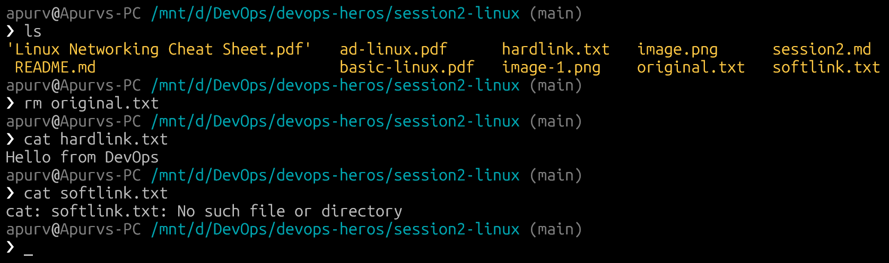
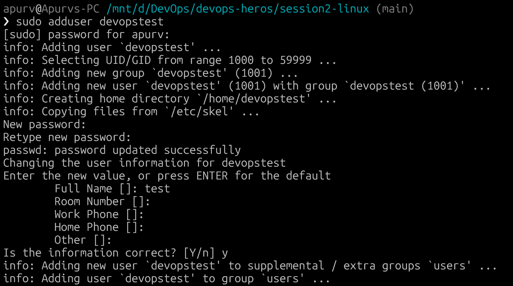
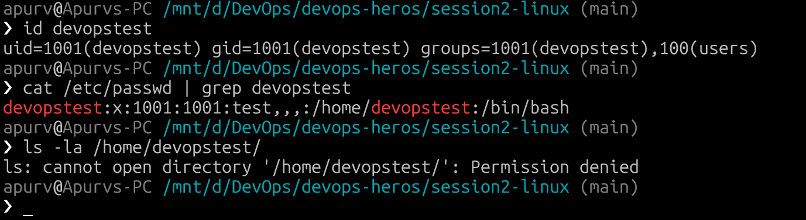
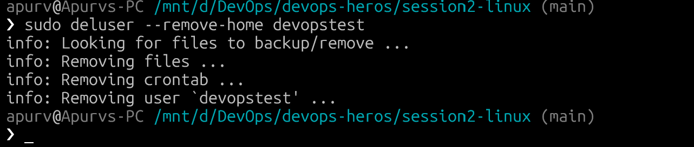
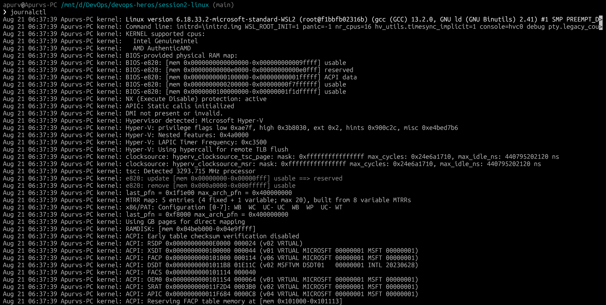
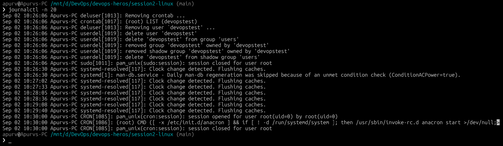
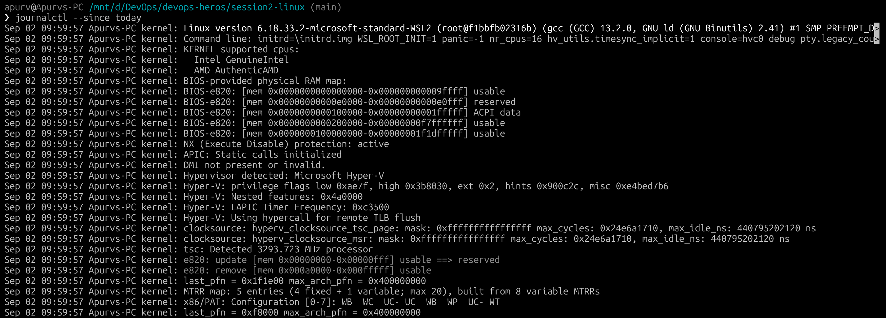

# Linux Fundamentals

## Task 1: Soft Link & Hard Link

### What is a Link in Linux?

A link in Linux is a reference (pointer) to a file. Linux supports two types of links — hard links and soft links (symbolic links).

### Hard Link

A hard link is a direct reference to the data on disk (same inode). It is essentially another name for the same file.

**Key Properties:**
- Shares the same inode number as the original file.
- If the original file is deleted, the hard link still works (data persists until all hard links are removed).
- Cannot span across different filesystems/partitions.
- Cannot be created for directories (to prevent circular references).
- Changes to one hard link are reflected in all others (they point to the same data).

Command to create a hard link:
```bash
ln <original_file> <hard_link_name>
```

### Soft Link (Symbolic Link)

A soft link is a shortcut/pointer to the original file's path. It stores the path to the target file rather than pointing to the inode directly.

**Key Properties:**
- Has a different inode number than the original file.
- If the original file is deleted, the soft link breaks (becomes a dangling link).
- Can span across different filesystems/partitions.
- Can be created for directories.
- The soft link file has its own permissions, but access depends on the target file's permissions.

Command to create a soft link:
```bash
ln -s <original_file> <soft_link_name>
```

---

### Comparison Table

| Feature | Hard Link | Soft Link |
|---|---|---|
| Inode Number | Same as original | Different from original |
| Works if original is deleted? | Yes | No (dangling link) |
| Cross-filesystem? | No | Yes |
| Link to directories? | No | Yes |
| File size | Same as original | Small (stores path only) |
| Command | `ln file link` | `ln -s file link` |

---

### Creating and Deleting Links

#### Creating a Hard Link

```bash
# Create a test file
echo "Hello from DevOps" > original.txt
# Create a hard link
ln original.txt hardlink.txt
# Verify — both have the same inode number
ls -li original.txt hardlink.txt
```


#### Creating a Soft Link

```bash
# Create a soft link
ln -s original.txt softlink.txt
# Verify — soft link has a different inode and shows -> pointing to original
ls -li original.txt softlink.txt
```


#### Deleting the Original File

```bash
# Delete the original file
rm original.txt
# Hard link still works
cat hardlink.txt  
# Soft link is broken (dangling)
cat softlink.txt 
```



---

## Task 2: `adduser` vs `useradd`

### `useradd`

`useradd` is a low-level binary command available on all Linux distributions.

- Does not create a home directory by default (unless `-m` flag is used).
- Does not set a password.
- Does not copy skeleton files (.bashrc, .profile, etc.) by default.
- Requires manual configuration of all user properties via flags.

```bash
# Basic usage (no home directory created by default)
sudo useradd testuser1
# With home directory
sudo useradd -m testuser1
# Set password separately
sudo passwd testuser1
```

### `adduser`

`adduser` is a higher-level Perl script(wrapper around `useradd`) available on Ubuntu systems.

- Automatically creates the home directory.
- Prompts for a password interactively.
- Copies skeleton files to the home directory.
- Prompts for additional info (full name, phone, etc.).
- More user-friendly and interactive.

```bash
# Interactive — prompts for password and details
sudo adduser testuser2
```

### Comparison Table

| Feature | `useradd` | `adduser` |
|---|---|---|
| Type | Low-level binary | High-level Perl script |
| Home directory | Not created by default | Created automatically |
| Password | Must set separately | Prompted during creation |
| Skeleton files | Not copied by default | Copied automatically |
| Interactivity | Non-interactive | Interactive |
| Availability | All Linux distros | Debian/Ubuntu primarily |

### Which is Preferred on Ubuntu?

**`adduser` is preferred on Ubuntu/Debian** because it handles all the common setup steps automatically — creating the home directory, copying skeleton files, setting a password, and filling in user details. It reduces the chance of misconfiguration.

### Creating a Test User

```bash
# Create a test user using the recommended command (adduser)
sudo adduser devopstest
```



```bash
# Verify the user was created
id devopstest
cat /etc/passwd | grep devopstest
ls -la /home/devopstest/
```


```bash
# Cleanup — remove the test user
sudo deluser --remove-home devopstest
```


---

## Task 3: `journalctl`

### What is `journalctl`?

`journalctl` is a command-line utility for querying and viewing logs collected by systemd's journal (`systemd-journald`). It provides a centralized way to view all system and service logs.

**Key features:**
- Views logs from the current boot or previous boots.
- Filters logs by service, time range, priority, and more.
- Replaces the need to manually read `/var/log/syslog` or other log files.

### Viewing System Logs

```bash
# View all system logs (most recent first)
journalctl
# View logs in reverse order (newest first)
journalctl -r
# View only the last 20 lines
journalctl -n 20
# Follow logs in real-time (like tail -f)
journalctl -f
```



### Viewing Logs for a Specific Service

```bash
# View logs for a specific service (e.g., SSH)
journalctl -u ssh
# View logs for nginx
journalctl -u nginx
# View logs for docker
journalctl -u docker
# Follow real-time logs for a service
journalctl -u ssh -f
``

### Filtering by Time

```bash
# Logs since today
journalctl --since today
# Logs from a specific date/time
journalctl --since "2025-09-01 00:00:00"
# Logs between two timestamps
journalctl --since "2025-09-01" --until "2025-09-02"
```


---

## Task 4: Linux Command Cheat Sheet

### Few Important Commands

| Command | Description | Example |
|---|---|---|
| `ls` | List directory contents | `ls -la` |
| `cd` | Change directory | `cd /var/log` |
| `pwd` | Print working directory | `pwd` |
| `mkdir` | Create a directory | `mkdir my_folder` |
| `rmdir` | Remove empty directory | `rmdir my_folder` |
| `rm` | Remove files/directories | `rm -rf folder/` |
| `cp` | Copy files/directories | `cp file1.txt file2.txt` |
| `mv` | Move/rename files | `mv old.txt new.txt` |
| `touch` | Create empty file / update timestamp | `touch newfile.txt` |
| `cat` | Display file contents | `cat file.txt` |
| `chmod` | Change file permissions | `chmod 755 script.sh` |
| `chown` | Change file owner | `chown user:group file.txt` |
| `chgrp` | Change group ownership | `chgrp developers file.txt` |
| `umask` | Set default permissions | `umask 022` |
| `whoami` | Show current username | `whoami` |
| `id` | Show user ID and groups | `id username` |
| `adduser` | Add user (interactive) | `sudo adduser newuser` |
| `useradd` | Add user (low-level) | `sudo useradd -m newuser` |
| `passwd` | Change password | `sudo passwd username` |
| `usermod` | Modify user account | `sudo usermod -aG sudo user` |
| `deluser` | Delete a user | `sudo deluser username` |
| `groups` | Show user's groups | `groups username` |
| `su` | Switch user | `su - username` |
| `sudo` | Execute as superuser | `sudo apt update` |
| `ps` | Show running processes | `ps aux` |
| `top` / `htop` | Real-time process viewer | `top` |
| `kill` | Kill a process by PID | `kill 1234` |
| `killall` | Kill processes by name | `killall nginx` |
| `systemctl` | Manage systemd services | `systemctl status nginx` |
| `ip addr` | Show IP addresses | `ip addr show` |
| `ifconfig` | Show network interfaces (legacy) | `ifconfig` |
| `ping` | Test network connectivity | `ping google.com` |
| `curl` | Transfer data from URL | `curl https://example.com` |
| `wget` | Download files | `wget https://example.com/file.zip` |
| `netstat` | Network statistics (legacy) | `netstat -tulnp` |
| `ss` | Socket statistics | `ss -tulnp` |
| `nslookup` | DNS lookup | `nslookup google.com` |
| `dig` | DNS lookup (detailed) | `dig google.com` |
| `traceroute` | Trace packet route | `traceroute google.com` |
| `hostname` | Show/set system hostname | `hostname` |
| `df` | Disk space usage | `df -h` |
| `du` | Directory/file space usage | `du -sh /var/log` |
| `lsblk` | List block devices | `lsblk` |
| `mount` | Mount a filesystem | `mount /dev/sdb1 /mnt` |
| `fdisk` | Partition management | `sudo fdisk -l` |
| `grep` | Search text patterns | `grep "error" logfile.txt` |
| `sort` | Sort lines | `sort file.txt` |
| `uniq` | Remove duplicate lines | `sort file.txt \| uniq` |
| `wc` | Count lines/words/characters | `wc -l file.txt` |
| `tee` | Read from stdin, write to file & stdout | `echo "hi" \| tee file.txt` |
| `tar` | Archive files | `tar -czvf archive.tar.gz folder/` |
| `zip` / `unzip` | Create/extract ZIP archives | `zip archive.zip file.txt` |

---