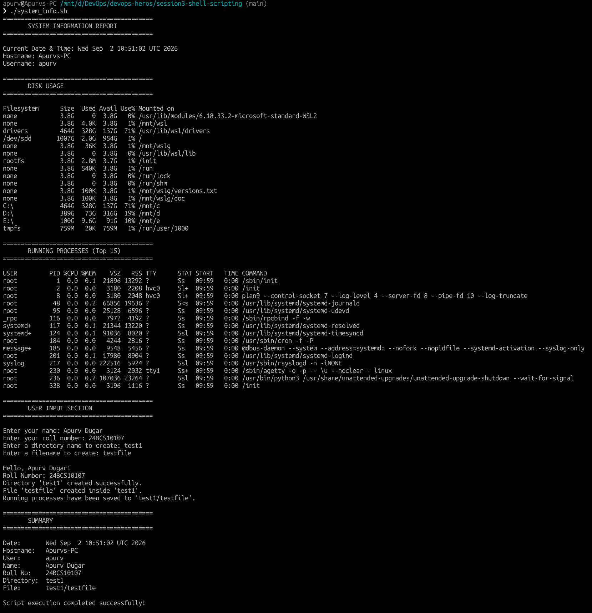

# Shell Scripting — System Information Script

## Overview

This script (`system_info.sh`) collects and displays system information, takes user input, creates files and directories, and stores process data — all using fundamental shell scripting concepts.

---

## Script Features

| Feature | Command Used |
|---|---|
| Print current date | `date` |
| Print hostname | `hostname` |
| Print username | `whoami` |
| Print disk usage | `df -h` |
| Print running processes | `ps aux` |
| Use variables | `current_date=$(date)`, etc. |
| Take user input | `read -p` |
| Create a directory | `mkdir -p` |
| Create a file | `touch` |
| Store process info in file | `ps aux > file` (output redirection) |

---

## Screenshot

---