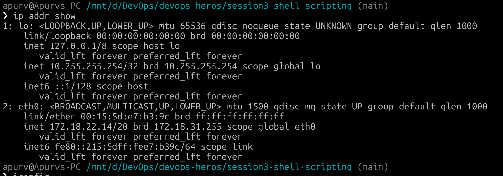
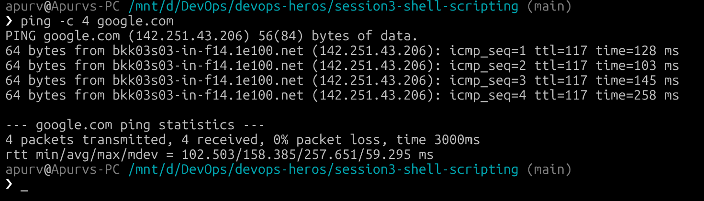
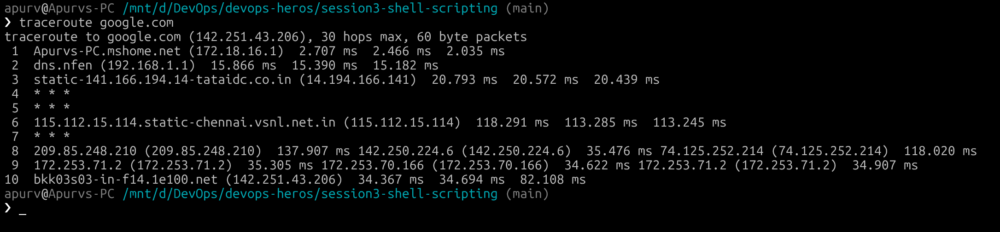
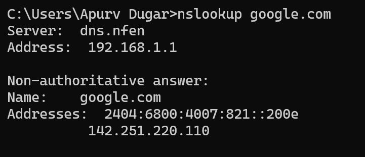
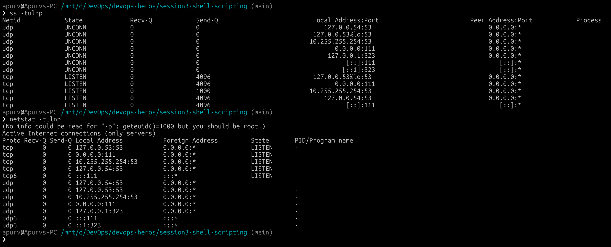
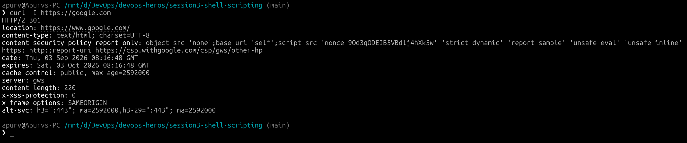
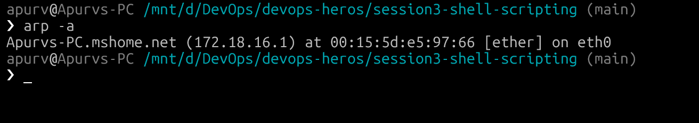
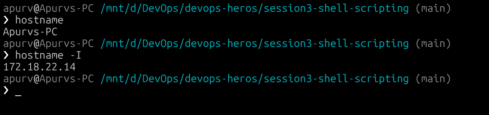
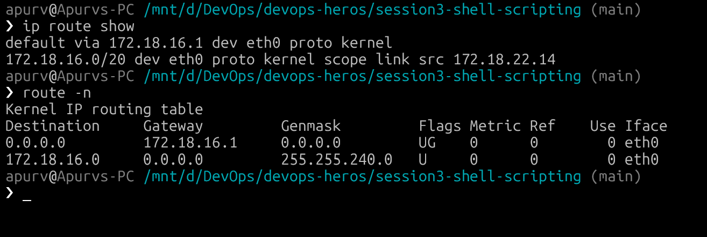
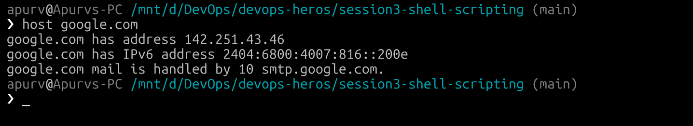

# Networking Fundamentals

## Networking Commands — Output & Explanation

### 1. `ip addr` / `ifconfig` — Show Network Interfaces

**Explanation:**
`ip addr show` displays all network interfaces on the system along with their IP addresses, MAC addresses, and status (UP/DOWN). This is the modern replacement for `ifconfig`.

---

### 2. `ping` — Test Network Connectivity

**Explanation:**
`ping` sends ICMP Echo Request packets to a target host and measures the round-trip time. It's used to check if a host is reachable and to measure network latency. The `-c 4` flag limits it to 4 packets.

---

### 3. `traceroute` / `tracepath` — Trace Packet Route

**Explanation:**
`traceroute` shows the path (sequence of routers/hops) that packets take from your machine to the destination. Each line represents a hop with the IP address and round-trip time. This is useful for diagnosing where network delays or failures occur. `* * *` indicates a hop that didn't respond.

---

### 4. `nslookup` — DNS Lookup

**Explanation:**
`nslookup` queries DNS servers to resolve a domain name into an IP address (or vice versa). It shows which DNS server was used and the resolved IP addresses (both IPv4 and IPv6). "Non-authoritative answer" means the result came from a cached response rather than directly from Google's authoritative DNS server.

---

### 5. `netstat` / `ss` — Network Statistics

**Explanation:**
`ss` (Socket Statistics) shows active network connections, listening ports, and which processes are using them. The flags mean:
- `-t` — TCP connections
- `-u` — UDP connections
- `-l` — Listening sockets only
- `-n` — Show port numbers (not service names)
- `-p` — Show the process using each socket

This is essential for checking which services are running and on which ports.

---

### 6. `curl` — Transfer Data from URL

**Explanation:**
`curl` is a command-line tool to transfer data to/from a server using various protocols (HTTP, HTTPS, FTP, etc.). The `-I` flag fetches only the HTTP headers.

---

### 7. `arp` — Address Resolution Protocol

**Explanation:**
`arp` displays and manages the ARP (Address Resolution Protocol) table, which maps IP addresses to MAC (hardware) addresses on the local network. This is useful for identifying devices on the same network segment and troubleshooting network connectivity at Layer 2 (Data Link Layer).

---

### 8. `hostname` — Display Hostname

**Explanation:**
`hostname` displays the system's network hostname. The `-I` flag shows all IP addresses assigned to the host.

---

### 9. `route` / `ip route` — Routing Table

**Explanation:**
`ip route show` displays the kernel routing table, which determines how network packets are forwarded. The `default` route is the gateway used for all traffic not matching a specific route.

---

### 10. `host` — DNS Lookup (Simple)

**Explanation:**
`host` is a simple DNS lookup utility that resolves domain names to IP addresses. It also shows mail server (MX) records. It's simpler than `dig` and good for quick lookups.

---

## Summary of Commands

| Command | Purpose |
|---|---|
| `ip addr show` | View network interface IPs and status |
| `ping` | Test host reachability and latency |
| `traceroute` | Trace the route packets take to a host |
| `nslookup` | DNS name resolution |
| `ss -tulnp` | List listening ports and processes |
| `curl` | HTTP requests / download data |
| `arp -a` | View IP-to-MAC mappings |
| `hostname` | Display system hostname |
| `ip route show` | View routing table |
| `host` | Simple DNS lookup |
