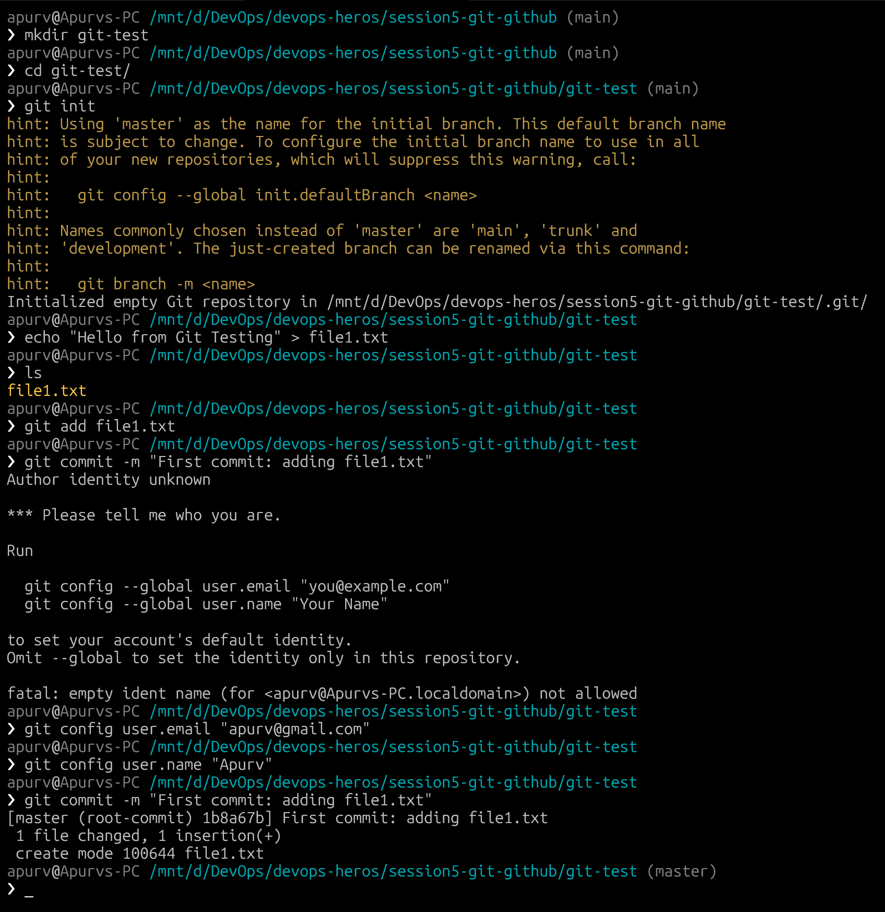
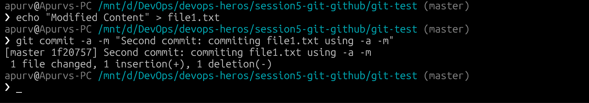
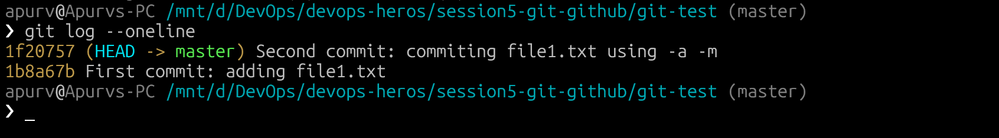
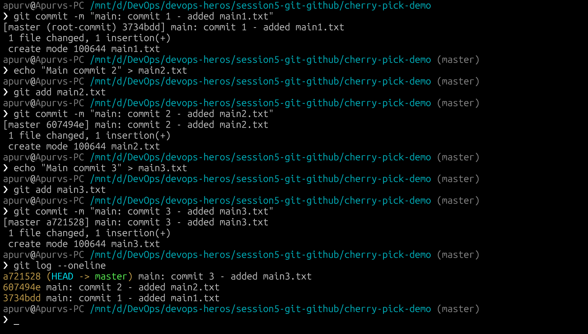
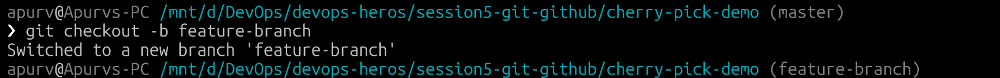
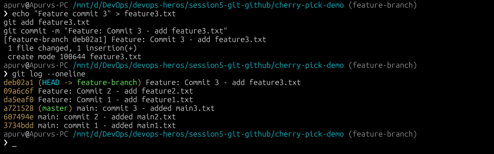
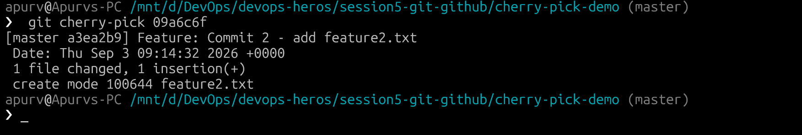
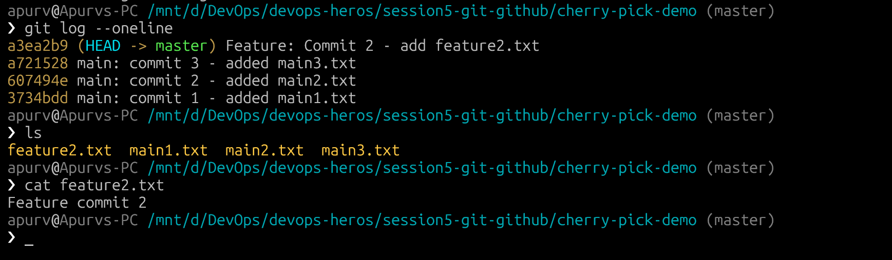

# Git / GitHub

## Task 1: `git commit -a -m`

### What is `git commit -a -m`?

The `-a` flag in `git commit -a -m "message"` automatically stages **all modified and deleted tracked files** before committing. It skips the `git add` step for files that Git is already tracking.

### Difference Between `git commit -a -m` and `git commit -m`

| Feature | `git commit -m "msg"` | `git commit -a -m "msg"` |
|---|---|---|
| Stages files automatically? |  No — requires `git add` first | Yes — stages tracked modified/deleted files |
| New (untracked) files? | Not included | Not included (still need `git add`) |
| Use case | Full control over what's committed | Quick commit of all tracked changes |

`git commit -a -m` does not add new untracked files. It only auto-stages files that are already being tracked by Git.

---

### Practice & Demonstration

#### View the commit log

---

## Task 2: Git Cherry-Pick

### What is Cherry-Pick?

`git cherry-pick` applies the changes from a **specific commit** from one branch onto another branch. Unlike merge (which brings all commits), cherry-pick lets you selectively pick individual commits.

---

### Step-by-Step Implementation

The cherry-picked commit (Feature: Commit 2) is now available on the `main` branch, while Feature Commit 1 and Commit 3 remain only on the feature branch.**

---

## Summary

| Concept | Description |
|---|---|
| `git commit -a -m` | Auto-stages tracked modified/deleted files and commits in one step |
| `git commit -m` | Commits only explicitly staged changes (`git add` required first) |
| `git cherry-pick <hash>` | Applies a specific commit from one branch onto the current branch |
| `git log --oneline` | Compact view of commit history |
| `git checkout -b <branch>` | Create and switch to a new branch |
