# Docker Fundamentals — Hello World Applications

## 1. Node.js Application (Express)

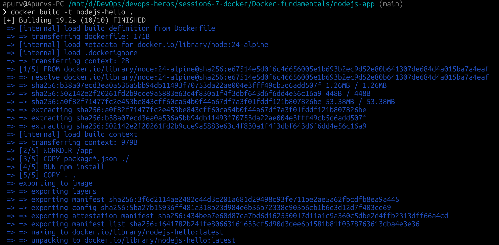

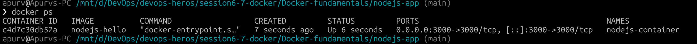

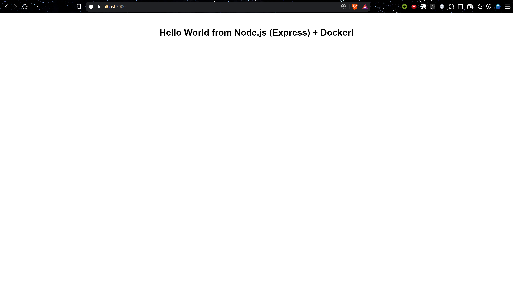

---

## 2. Python Application (Flask)

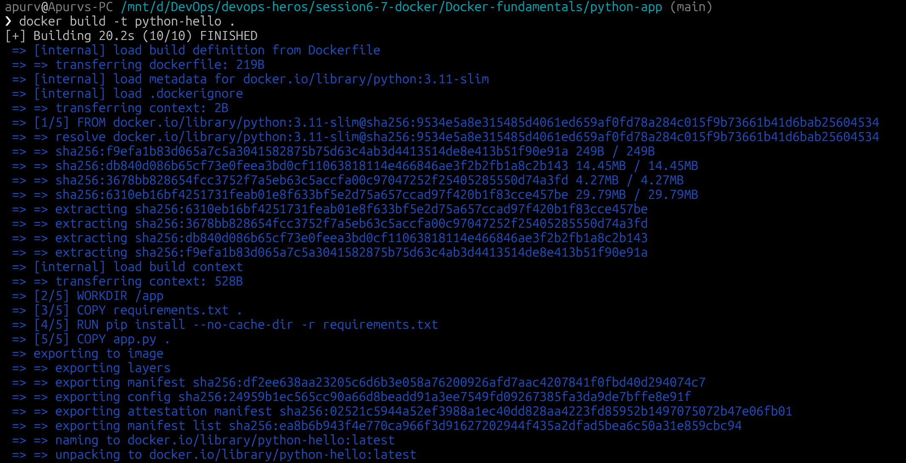
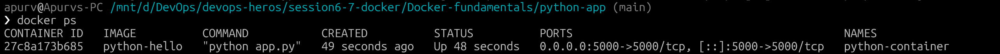

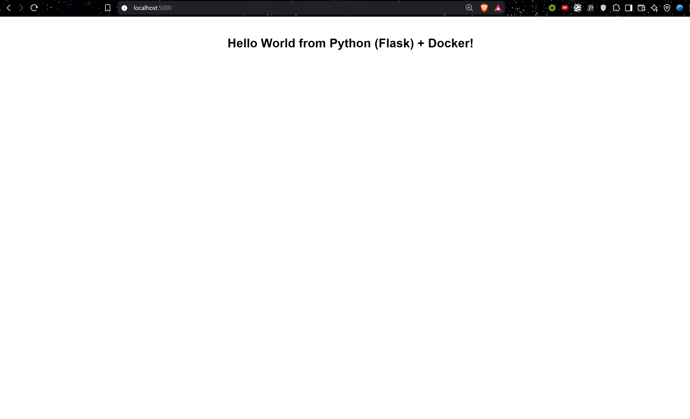

---

## 3. Java Application

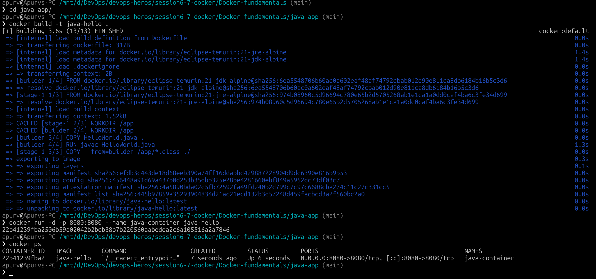

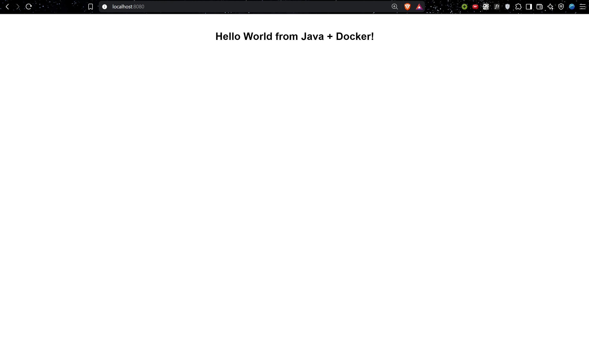

---

## 4. Apache Web Server

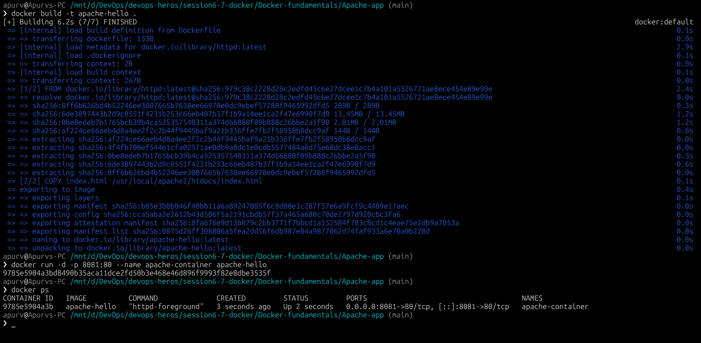

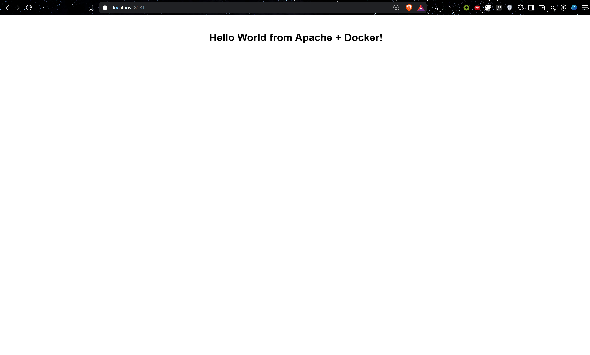

---

## 5. Nginx Application

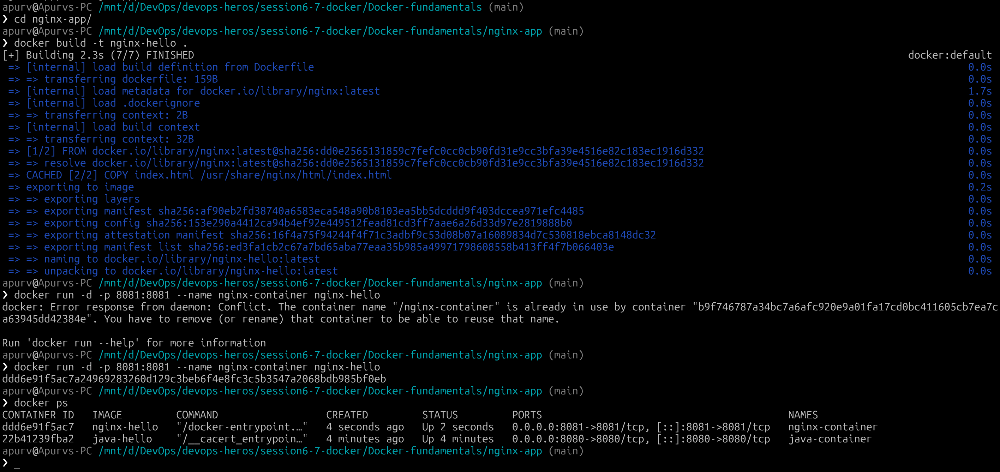

---
