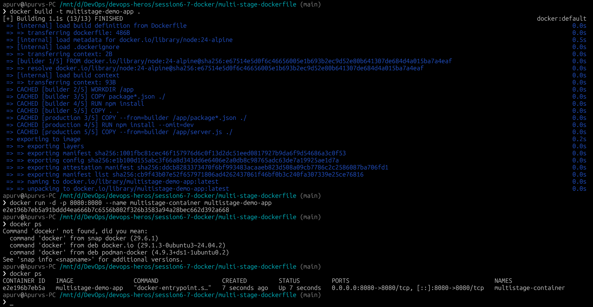
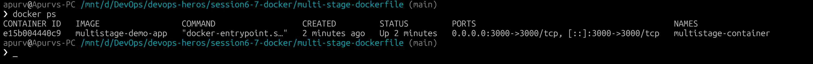

# Docker Multi-Stage Build & Image Management

## Student Details
- **Name:** `Apurv Dugar` 
- **Enrollment Number:** `24BCS10107` 

---

## Task 1: Run Multi-Stage Dockerfile

### What is a Multi-Stage Docker Build?
A multi-stage build uses multiple `FROM` instructions in a single `Dockerfile`. Each `FROM` instruction begins a new stage of the build. You can selectively copy artifacts from one stage to another, leaving behind everything you don't need in the final image (such as compilers, test dependencies, and temporary build files).

**Benefits:**
1. Drastically reduced final image size.
2. Improved security (fewer packages/tools in production image).
3. Simpler maintenance without needing separate build and runtime scripts.

---

### Step-by-Step Execution

---

## Task 2: Documentation 

### Application Verification

### Container Status (`docker ps`)

---

## Task 3: Docker Application Deployment (3 Different Types)

Below are three different types of applications containerized and deployed with Docker:

---

### Application 1: Node.js (Express API)

---

### Application 2: Python (Flask Web App)

---

### Application 3: Java (HTTP Microservice)

---
