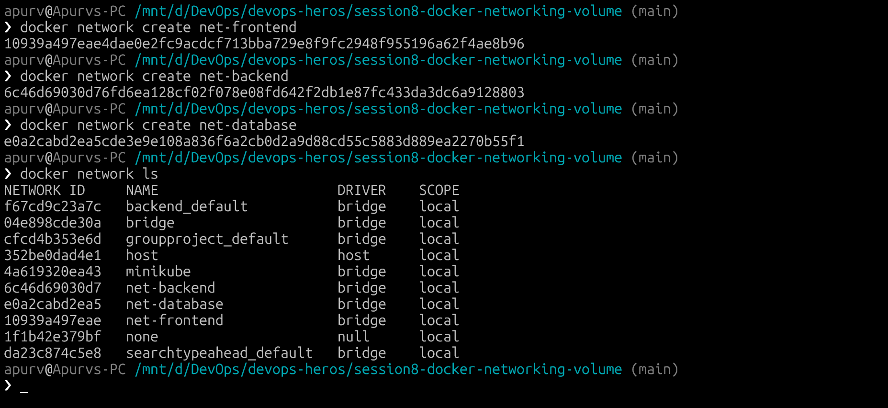
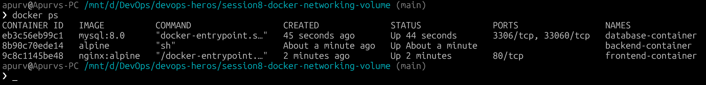
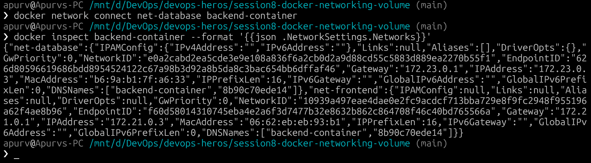
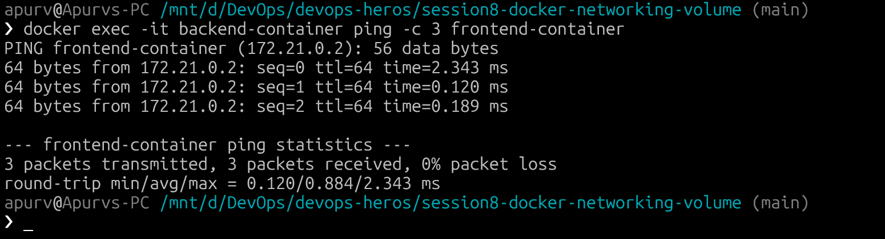
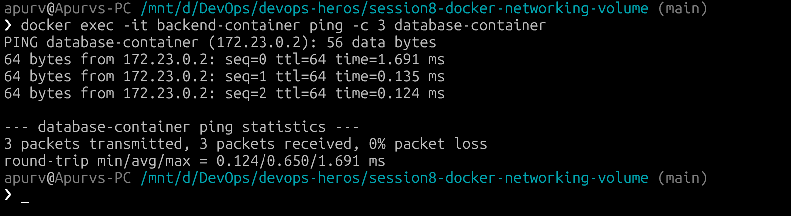
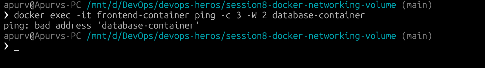
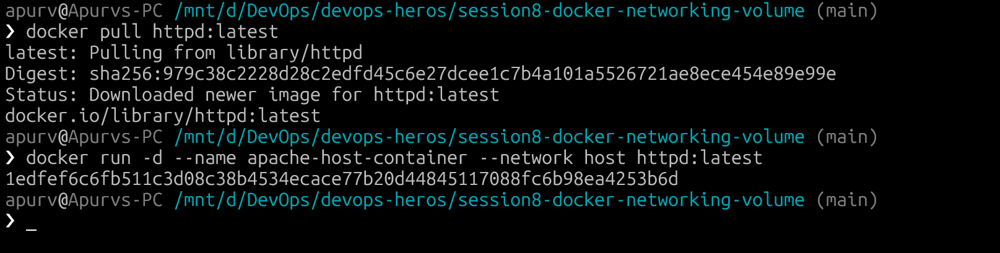
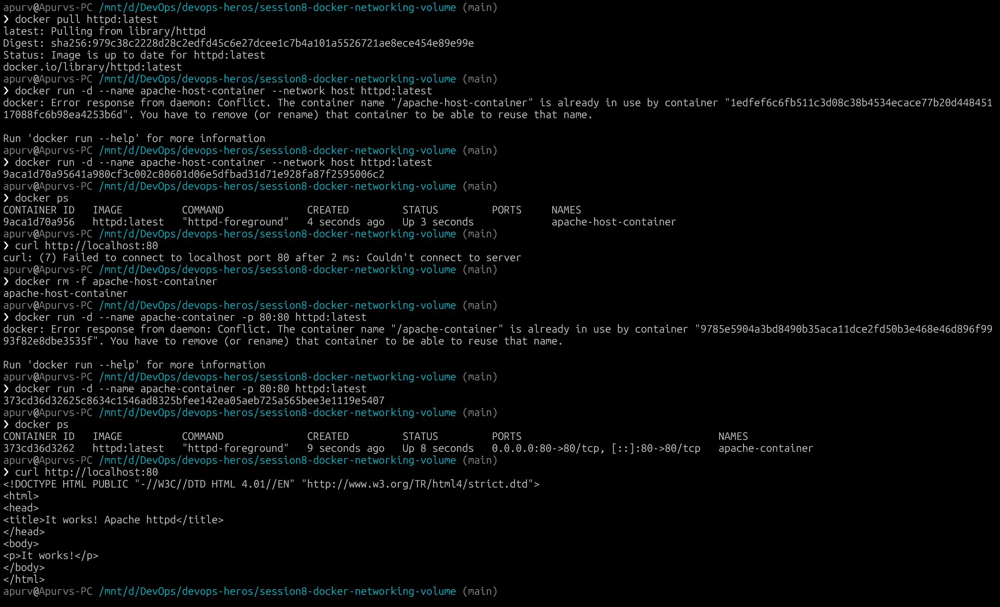
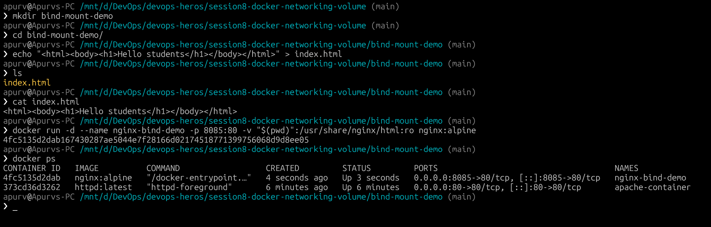
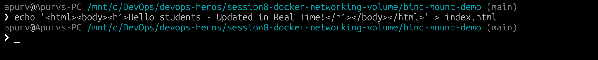

# Docker Networking & Volume Homework

## Overview
This section covers Docker container networking, custom bridge networks, multi-network container attachments, host networking mode, bind mounts with live file updates, and overlay networking concepts.

---

## Task 1: Docker Container Networking (Multi-Network Architecture)

### Step-by-Step Execution

#### Step 1: Create 3 Docker Custom Bridge Networks


---

#### Step 2: Create the 3 Containers

1. **Frontend Container (Nginx / Alpine)** on `net-frontend`:
```bash
docker run -d --name frontend-container --network net-frontend nginx:alpine
```

2. **Backend Container (Alpine)** on `net-frontend`:
```bash
docker run -d -it --name backend-container --network net-frontend alpine sh
```

3. **Database Container (MySQL)** on `net-database`:
```bash
docker run -d --name database-container --network net-database -e MYSQL_ROOT_PASSWORD=mysecretpwd mysql:8.0
```

---

#### Step 3: Connect Backend Container to the Database Network
Connect `backend-container` to `net-database` as its second network:
```bash
docker network connect net-database backend-container
```

Verify `backend-container` is connected to both networks:
```bash
docker inspect backend-container --format '{{json .NetworkSettings.Networks}}'
```



---

#### Step 4: Check Connectivity

##### Test 1: Backend can communicate with Frontend
```bash
docker exec -it backend-container ping -c 3 frontend-container
```


##### Test 2: Backend can communicate with Database
```bash
docker exec -it backend-container ping -c 3 database-container
```


##### Test 3: Frontend CANNOT communicate with Database (Isolation Test)
```bash
docker exec -it frontend-container ping -c 3 -W 2 database-container
```



---

## Task 2: Host Network

### What is Host Networking?
In `host` network mode, a container shares the host machine's network stack directly, bypassing Docker's network isolation and virtual bridge. The container does not get its own IP address; instead, its listening ports are directly bound to the host IP.

---

### Step-by-Step Execution






---

## Task 3: Bind Mount & Live Updates

### What is a Bind Mount?
A **bind mount** mounts a file or directory on the host machine directly into a container at a specified target path. 

---

### Step-by-Step Execution







---

## Task 4: Research — Docker Overlay Networks

### 1. What is an Overlay Network?
An **overlay network** is a distributed software-defined network (SDN) that enables containers running on different physical or virtual Docker daemon hosts to communicate with each other securely and transparently, as if they were on the same local bridge network.

---

### 2. Key Use Cases
1. Docker Swarm Clusters
2. Multi-Host Container Microservices
3. Encrypted Inter-Host Traffic
4. Zero-Trust Network Segmentation

---

### 3. How Overlay Networks Work Across Multiple Docker Hosts

| Mechanism | Description |
|---|---|
| VXLAN Encapsulation | Overlay networks encapsulate Layer 2 Ethernet frames into Layer 3 UDP packets (default port `4789`). This allows container traffic to traverse any intermediate IP network. |
| Control Plane Gossip Protocol | Swarm nodes exchange network topology, container IPs, and MAC addresses using an efficient peer-to-peer gossip protocol based on the Raft consensus algorithm. |
| Virtual Switch (Bridge) | Each Docker host creates an overlay bridge interface and assigns virtual IP addresses (VIPs) to containers within the overlay subnet. |
| Routing Mesh (Ingress) | Docker Swarm's ingress overlay network routes external requests arriving on any swarm node to the target service container, regardless of which host it is running on. |

---

### Overlay Network CLI Commands
```bash
# Initialize Swarm (prerequisite for overlay networks)
docker swarm init

# Create an attachable overlay network
docker network create -d overlay --attachable my-overlay-net

# Create an encrypted overlay network
docker network create -d overlay --opt encrypted my-secure-net

# Run a container attached to the overlay network
docker run -d --name worker1 --network my-overlay-net alpine sleep 3600
```

---